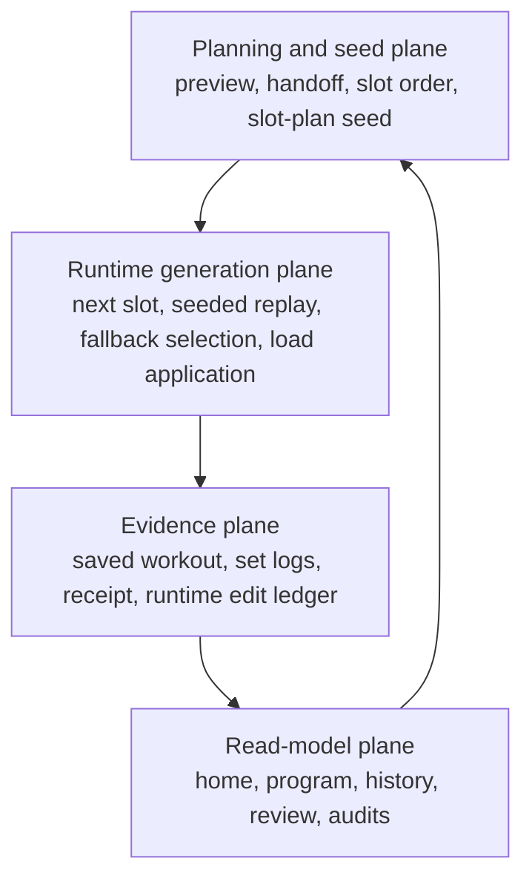
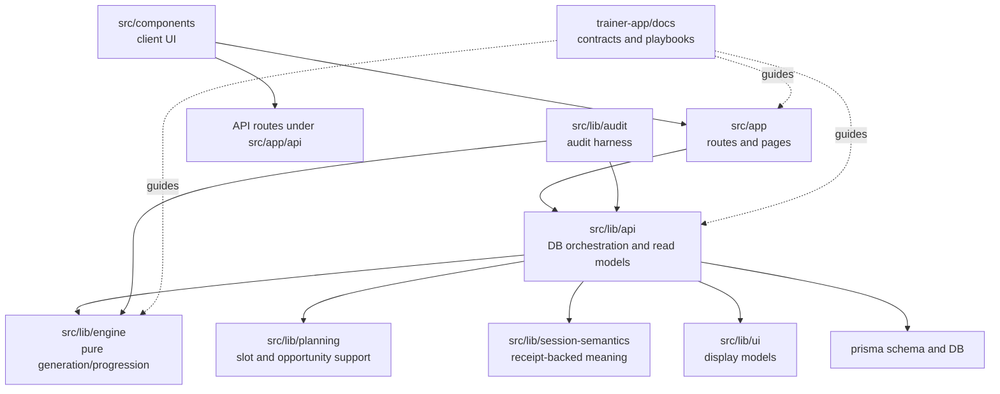
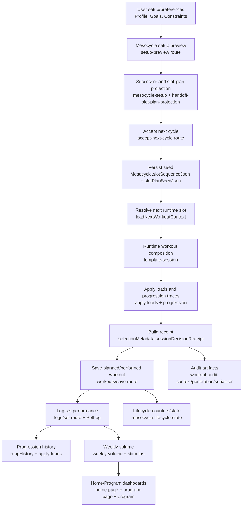
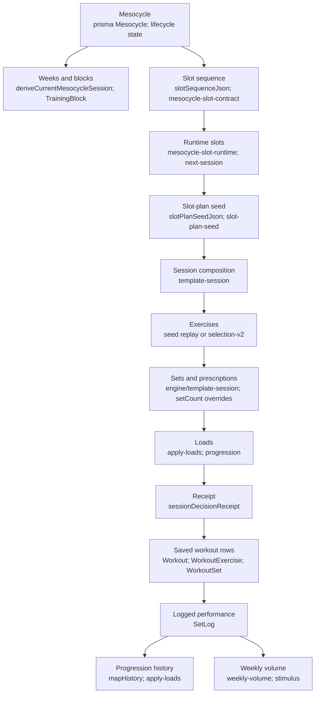
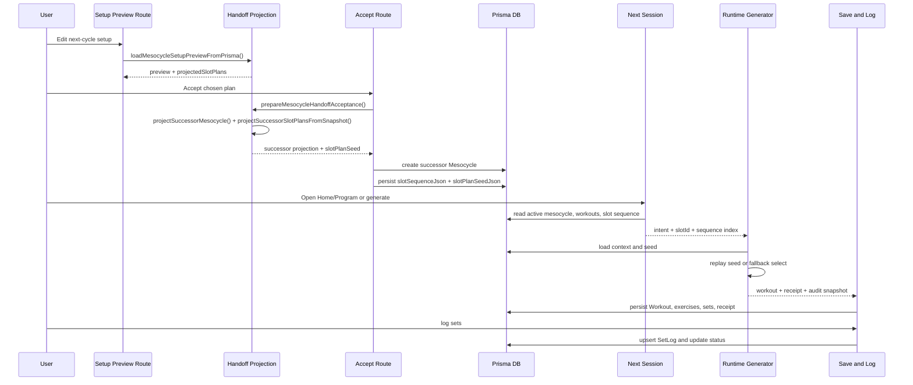
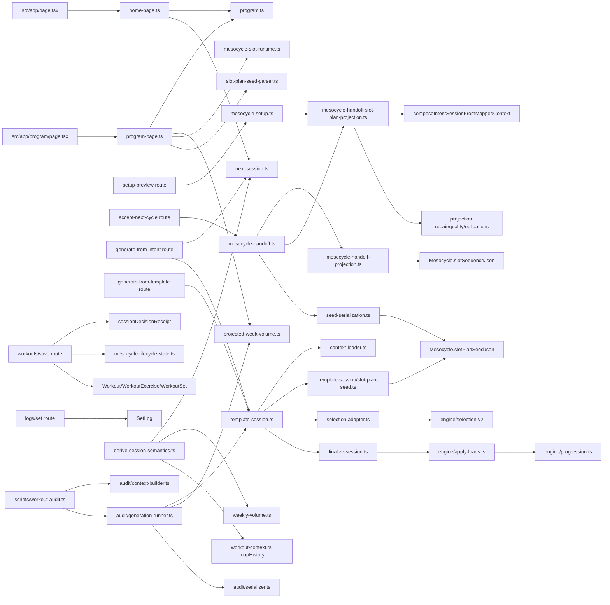
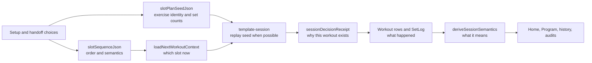

# Trainer App System Map

Generated: 2026-04-28  
Scope: read-only architecture map of `trainer-app`; no production code changes.  
Evidence base: canonical docs, targeted `rg` searches, Prisma schema inspection, route/read-model/generation/audit files, and nearby test names.  

## 1. Executive Summary

### The Mental Model

The app is easiest to understand as three stacked systems:

| Plane | Main Question | Canonical Storage or Function | Important Warning |
| --- | --- | --- | --- |
| Planning and seed | What should this mesocycle/week/session look like? | `Mesocycle.slotSequenceJson`, `Mesocycle.slotPlanSeedJson` | Preview projection is not stored truth until accept persists it. |
| Runtime generation | What workout should be generated now? | `loadNextWorkoutContext()`, `generateSessionFromMappedContext()` | Seeded accepted mesocycles should replay `slotPlanSeedJson`; fallback selection exists but is not the preferred path. |
| Evidence | What actually happened and why was it generated? | `Workout`, `WorkoutExercise`, `WorkoutSet`, `SetLog`, `selectionMetadata.sessionDecisionReceipt` | The receipt is canonical meaning; do not infer session meaning directly from UI labels. |
| Read models and audit | How should saved/planned data be interpreted? | `deriveSessionSemantics()`, `loadProgramDashboardData()`, audit serializers | Some audit diagnostics intentionally look like planner logic but are read-only unless accepted through explicit flows. |

### One-Sentence Architecture

User setup and mesocycle handoff produce a persisted slot order and optional slot-plan seed; runtime generation resolves the next slot and either replays that seed or falls back to selection; save/logging persists a receipt plus set-level performance; home/program/history/audit surfaces reconstruct meaning from the receipt and canonical semantic helpers.

### What Appears Canonical

| Concern | Canonical Files |
| --- | --- |
| Runtime owner/user identity | `trainer-app/src/lib/api/workout-context.ts` |
| Slot order and slot semantics | `trainer-app/src/lib/api/mesocycle-slot-contract.ts`, `trainer-app/src/lib/api/mesocycle-slot-runtime.ts` |
| Accepted runtime composition seed | `trainer-app/src/lib/api/template-session/slot-plan-seed.ts`, `trainer-app/src/lib/api/mesocycle-handoff-slot-plan-projection.seed-serialization.ts`, `trainer-app/src/lib/api/slot-plan-seed-parser.ts` |
| Runtime session generation | `trainer-app/src/lib/api/template-session.ts`, `trainer-app/src/lib/api/template-session/context-loader.ts`, `trainer-app/src/lib/api/template-session/finalize-session.ts` |
| Receipt-backed session meaning | `trainer-app/src/lib/session-semantics/derive-session-semantics.ts` |

### What Appears Noisy or Transitional

| Area | Why It Feels Hard |
| --- | --- |
| Handoff slot-plan projection | Many repair, redistribution, quality, and diagnostics passes compensate after generation. |
| Multiple plan representations | Preview DTO, projection slot plan, accepted seed, generated workout, saved workout, receipt, and audit snapshot are related but not interchangeable. |
| Fallback runtime paths | Legacy weekly schedule fallback, unseeded composition, BODY_PART fallback, identity-only seed compatibility, and role registry fallback all coexist. |
| `MesocycleExerciseRole` | Still important for carry-forward/projection/fallback, but no longer the canonical seeded runtime source. |
| Weekly volume | Planning, performed DB reads, projection, logging guidance, and program display all compute related but different volume views. |

## 2. Repo Map

### Major Areas

| Area | Purpose | Important Files | What Calls Into It | What It Calls Downstream | Classification |
| --- | --- | --- | --- | --- | --- |
| `trainer-app/src/app` | Next.js App Router pages and route handlers. Routes validate requests, resolve owner, and call `src/lib/*`. Pages compose read models into UI. | `src/app/page.tsx`, `src/app/program/page.tsx`, `src/app/api/workouts/generate-from-intent/route.ts`, `src/app/api/workouts/generate-from-template/route.ts`, `src/app/api/workouts/save/route.ts`, `src/app/api/logs/set/route.ts`, `src/app/api/mesocycles/[id]/setup-preview/route.ts`, `src/app/api/mesocycles/[id]/accept-next-cycle/route.ts` | Browser/UI and API clients | `src/lib/api`, `src/lib/ui`, Prisma through lib APIs | Surface layer; canonical entrypoints, not ideal business-logic owner |
| `trainer-app/src/components` | React UI widgets and client-side interaction. Logging UI owns local form/session state but not domain truth. | `src/components/LogWorkoutClient.tsx`, `src/components/log-workout/useWorkoutSessionFlow.ts`, `src/components/DashboardGenerateSection.tsx`, `src/components/post-workout/*`, `src/components/explainability/*` | Pages under `src/app` | API routes, UI helpers | UI-only/support; downstream consumer |
| `trainer-app/src/lib/api` | DB-backed orchestration, write workflows, read models, runtime composition, lifecycle, projected reports. | `workout-context.ts`, `template-session.ts`, `template-session/*`, `mesocycle-handoff.ts`, `mesocycle-setup.ts`, `mesocycle-slot-contract.ts`, `mesocycle-slot-runtime.ts`, `next-session.ts`, `program.ts`, `program-page.ts`, `home-page.ts`, `weekly-volume.ts`, `projected-week-volume.ts`, `mesocycle-lifecycle*.ts` | Routes, pages, audit harness | Prisma, `src/lib/engine`, `src/lib/session-semantics`, `src/lib/planning`, `src/lib/ui` | Mostly canonical orchestration and read-model layer |
| `trainer-app/src/lib/engine` | Pure-ish generation, selection, load, progression, stimulus, volume, periodization logic. Should not own persistence. | `selection-v2/*`, `apply-loads.ts`, `progression.ts`, `volume.ts`, `volume-landmarks.ts`, `volume-targets.ts`, `stimulus.ts`, `template-session.ts`, `session-types.ts` | `src/lib/api/template-session*`, projection, audit paths | In-memory types/helpers | Canonical engine layer |
| `trainer-app/src/lib/audit` | Audit harness, artifact construction, operational diagnostics, regression fixtures. | `workout-audit/context-builder.ts`, `workout-audit/generation-runner.ts`, `workout-audit/serializer.ts`, `workout-audit/types.ts`, `workout-audit/mesocycle-explain.ts`, `workout-audit/active-mesocycle-slot-reseed.ts`, `workout-audit/weekly-retro.ts`, `workout-audit/historical-week.ts` | `scripts/workout-audit.ts`, tests | API read/generation seams, serializer, audit helpers | Audit-only except explicit reseed/apply mode |
| `trainer-app/src/lib/ui` | UI-safe parsing, session summaries, display metadata, workout list models. | `selection-metadata.ts`, `session-summary.ts`, `workout-list-items.ts`, `session-badges.ts` | Pages/components/read models | Receipt parsers, UI types | Support/read-side display layer |
| `trainer-app/src/lib/deload` | Deload semantics and policy helpers. | `semantics.ts`, `policy.ts` | Deload generation, session semantics, lifecycle/read models | Engine/API helpers | Canonical deload support |
| `trainer-app/src/lib/planning` | Planning support for session opportunities, slot profiles, accessory lane, remaining-week reasoning. | `session-opportunities.ts`, `session-slot-profile.ts`, `accessory-lane.ts`, related helpers | Selection adapter, handoff projection, projected-week volume | Engine selection inputs | Canonical support layer for planner semantics |
| `trainer-app/src/lib/progression` | Canonical progression input helpers beyond raw engine math. | `canonical-progression-input.ts` | Generation/explainability/progression views | Engine progression helpers | Support/canonical bridge |
| `trainer-app/src/lib/session-semantics` | Converts persisted workout/receipt fields into canonical read-side meaning. | `derive-session-semantics.ts` | Next-session, weekly volume, history, audits, workout context | Receipt/UI classifiers | Canonical read-side semantics |
| `trainer-app/prisma` | Schema, migrations, seed, one-off repair/backfill scripts. | `schema.prisma`, `migrations/*`, repair/backfill scripts | Prisma client, tests, scripts | Database | Canonical persistence schema |
| `trainer-app/docs` | Current contract docs and playbooks. Archive docs are historical. | `00_START_HERE.md`, `01_ARCHITECTURE.md`, `02_DOMAIN_ENGINE.md`, `03_DATA_SCHEMA.md`, `04_API_CONTRACTS.md`, `05_UI_FLOWS.md`, `08_AUDIT_CLI_DB_VALIDATION.md`, `09_AUDIT_PLAYBOOK.md` | Humans and coding agents | Codebase conventions | Canonical documentation |
| tests/specs | Contract evidence. Tests reveal which paths are intentionally protected. | `template-session.test.ts`, `mesocycle-handoff*.test.ts`, `next-session.test.ts`, `derive-session-semantics.test.ts`, `program-page.test.ts`, `workout-audit/*test.ts` | Vitest | Source files under test | Contract evidence |

### Directory Relationship

## 3. Top-Level App Flow

### Where Each Major Step Lives

| Question | Observed Answer |
| --- | --- |
| Where setup data enters | Onboarding/settings/API surfaces persist `Profile`, `Goals`, `Constraints`, injuries, preferences, and equipment. Next-cycle setup enters through `src/app/mesocycles/[id]/setup` and `src/app/api/mesocycles/[id]/setup-preview/route.ts` / `draft/route.ts`. |
| Where mesocycle preview is generated | `src/lib/api/mesocycle-setup.ts` loads the source handoff and calls `buildMesocycleSetupPreview()`, which uses `buildSuccessorMesocyclePreview()` and `projectSuccessorSlotPlansFromSnapshot()`. |
| Where accepted successor mesocycle is created | `src/lib/api/mesocycle-handoff.ts` through `acceptMesocycleHandoff()`, `prepareMesocycleHandoffAcceptance()`, and `acceptPreparedMesocycleHandoffInTransaction()`. |
| Where slot sequence/order is decided | `src/lib/api/mesocycle-handoff-projection.ts` builds successor structure; `src/lib/api/mesocycle-slot-contract.ts` serializes/resolves the ordered slot sequence. |
| Where slot plans are persisted | `src/lib/api/mesocycle-handoff-slot-plan-projection.seed-serialization.ts` serializes seed; `acceptPreparedMesocycleHandoffInTransaction()` writes `Mesocycle.slotPlanSeedJson`. |
| Where runtime next slot is chosen | `src/lib/api/next-session.ts` and `src/lib/api/mesocycle-slot-runtime.ts`. Incomplete workouts are considered first; otherwise persisted slot sequence drives rotation. |
| Where runtime workouts are composed | `src/lib/api/template-session.ts`, with support from `template-session/context-loader.ts`, `slot-plan-seed.ts`, `selection-adapter.ts`, `finalize-session.ts`, and `template-session/deload-session.ts`. |
| Where exercise selection happens | Preferred seeded path replays `slotPlanSeedJson`. Fallback path uses `buildSelectionObjective()` and `src/lib/engine/selection-v2`. Handoff projection uses the standard composition path plus repair/shaping. |
| Where loads/progression are computed | `src/lib/engine/apply-loads.ts`, `src/lib/engine/progression.ts`, and progression input helpers under `src/lib/progression`. |
| Where weekly volume is calculated | Performed DB read: `src/lib/api/weekly-volume.ts`. Planning context: `src/lib/engine/volume.ts`. Future projection: `src/lib/api/projected-week-volume.ts`. Shared effective-set weighting: `src/lib/engine/stimulus.ts`. |
| Where Program page gets data | `src/lib/api/program-page.ts`, which composes `loadProgramDashboardData()`, current-week slot plan, projected volume, and next-session context. |
| Where Home page gets data | `src/lib/api/home-page.ts`, which composes pending handoff, recent activity, `loadProgramDashboardData()`, and `loadHomeProgramSupport()`. |
| Where audit harness reads/generates | `scripts/workout-audit.ts` imports `src/lib/audit/workout-audit/context-builder.ts`, `generation-runner.ts`, and `serializer.ts`; generation modes call canonical API helpers. |

## 4. Mesocycle Engine Top-Down Model

### Plain-English Concepts

| Concept | Plain-English Meaning | Main Files |
| --- | --- | --- |
| Mesocycle | A multi-week training cycle with a state, counters, blocks, slot sequence, seed, and workouts. | `prisma/schema.prisma`, `src/lib/api/mesocycle-lifecycle*.ts` |
| Week | Current position inside the mesocycle; used for volume targets, RIR, and lifecycle transitions. | `src/lib/api/mesocycle-lifecycle-math.ts`, `src/lib/api/generation-phase-block-context.ts` |
| Slot | A planned training day in the week, such as `upper_a`, `lower_b`, `push`, or `legs`; more specific than intent when duplicate intents exist. | `src/lib/api/mesocycle-slot-contract.ts`, `src/lib/api/mesocycle-slot-runtime.ts` |
| Session | One generated/saved workout instance. It may be advancing, gap-fill, supplemental, deload, closeout, or non-advancing. | `src/lib/api/template-session.ts`, `src/lib/session-semantics/derive-session-semantics.ts` |
| Exercise role/lane | Planner meaning for an exercise: core compound vs accessory, primary/support lane, slot-owned anchor, supplemental/secondary coverage. | `src/lib/api/template-session/role-budgeting.ts`, `src/lib/planning/session-slot-profile.ts`, `src/lib/planning/accessory-lane.ts` |
| Muscle targets | The muscles a session/slot/week tries to cover. | `src/lib/planning/session-opportunities.ts`, `src/lib/api/template-session/selection-adapter.ts` |
| MEV/MAV/MRV/target ranges | Volume landmarks and weekly targets used to shape volume. | `src/lib/engine/volume-landmarks.ts`, `src/lib/engine/volume-targets.ts`, `src/lib/api/mesocycle-lifecycle-math.ts` |
| Primary/support/secondary/implicit muscles | Different weights of contribution from an exercise to a muscle. | `src/lib/engine/stimulus.ts`, `src/lib/engine/volume.ts`, `src/lib/api/weekly-volume.ts` |
| Seeded plan | Accepted, persisted per-slot exercise identity and set counts. | `Mesocycle.slotPlanSeedJson`, `src/lib/api/template-session/slot-plan-seed.ts` |
| Runtime workout | The concrete generated workout for now, with exercises, sets, loads, receipt, and audit data. | `src/lib/api/template-session.ts`, `src/lib/api/template-session/finalize-session.ts` |
| Receipt/logged performance | Receipt explains generation context; logs capture actual set performance. | `selectionMetadata.sessionDecisionReceipt`, `SetLog`, `src/app/api/logs/set/route.ts` |
| Progression history | Filtered historical performance used for next load decisions. | `src/lib/api/workout-context.ts`, `src/lib/engine/apply-loads.ts`, `src/lib/engine/progression.ts` |

### Concept Map

### Data Ownership Table

| Concept | Source of Truth | Main Files | Notes |
| --- | --- | --- | --- |
| Slot order | `Mesocycle.slotSequenceJson` for accepted mesocycles | `src/lib/api/mesocycle-slot-contract.ts`, `src/lib/api/mesocycle-slot-runtime.ts`, `src/lib/api/next-session.ts` | `Constraints.weeklySchedule` is compatibility fallback when no persisted sequence exists. |
| Slot semantics | Authored semantics inside the slot sequence | `mesocycle-slot-contract.ts`, `src/lib/planning/session-slot-profile.ts` | Legacy semantics fallback exists for older sequence shapes. |
| Session composition | `slotPlanSeedJson` for seeded supported mesocycles; otherwise runtime selection | `src/lib/api/template-session.ts`, `template-session/slot-plan-seed.ts`, `template-session/selection-adapter.ts` | Seed replay should be deterministic for supported accepted mesocycles. |
| Exercise selection | Accepted seed first; `selection-v2` fallback | `template-session/slot-plan-seed.ts`, `src/lib/engine/selection-v2/*`, `template-session/selection-adapter.ts` | Handoff projection also calls composition/selection, then applies repair/shaping. |
| Weekly volume | Performed DB rows interpreted with canonical semantics | `src/lib/api/weekly-volume.ts`, `src/lib/engine/stimulus.ts` | Planning/projection have separate volume views; they should not be confused with performed actuals. |
| Projected weekly volume | Generated future projections from current runtime context | `src/lib/api/projected-week-volume.ts`, `src/lib/api/projected-week-volume-shared.ts` | It chains synthetic projected workouts to estimate the rest of the week. |
| Progression/load | Historical performance filtered by semantic eligibility | `src/lib/api/workout-context.ts`, `src/lib/engine/apply-loads.ts`, `src/lib/engine/progression.ts` | Deload/supplemental/closeout rules affect eligibility. |
| Deload behavior | Mesocycle state plus deload generation semantics | `src/lib/api/template-session/deload-session.ts`, `src/lib/deload/semantics.ts`, `src/lib/api/mesocycle-lifecycle-state.ts` | Deload can use the persisted seed, then reduce/shape work before load assignment. |
| Program dashboard | Server read model | `src/lib/api/program.ts`, `src/lib/api/program-page.ts` | Program page also uses seed for current-week exercise display when available. |
| Home next session | Server read model plus next-session context | `src/lib/api/home-page.ts`, `src/lib/api/program.ts`, `src/lib/api/next-session.ts` | Pending handoff blocks normal generation flow. |
| Audit harness | Canonical API helpers plus stable serialized artifacts | `src/lib/audit/workout-audit/context-builder.ts`, `generation-runner.ts`, `serializer.ts`, `scripts/workout-audit.ts` | Audit can run generation/projection without being runtime policy. |

## 5. Generation, Preview, Accept, Runtime Integrity

### Sequence Diagram

### Path Trace Table

| Path | Entry | Key Intermediate Files/Functions | Final Output | Persisted Fields Touched | Uses `slotPlanSeedJson`? | Reselects or Replays? | Legacy/Fallback Behavior |
| --- | --- | --- | --- | --- | --- | --- | --- |
| Preview generation | `src/app/api/mesocycles/[id]/setup-preview/route.ts` | `loadMesocycleSetupPreviewFromPrisma()`, `buildMesocycleSetupPreview()`, `buildSuccessorMesocyclePreview()`, `projectSuccessorSlotPlansFromSnapshot()` | Preview response with projected structure and display slot plans | None in preview route | Produces projected slot plans but does not persist seed | Projects/selects and repairs for preview | Draft fallback design, projection diagnostics, unsupported seed cases |
| Draft save | `src/app/api/mesocycles/[id]/draft/route.ts` | `saveNextCycleSeedDraft()` in handoff API | Mutable pending draft | `Mesocycle.nextSeedDraftJson` | No runtime seed yet | No runtime replay | Draft shape validation/normalization |
| Accept/persist | `src/app/api/mesocycles/[id]/accept-next-cycle/route.ts` | `acceptMesocycleHandoff()`, `prepareMesocycleHandoffAcceptance()`, `buildAcceptedMesocycleSlotPlanSeed()`, `acceptPreparedMesocycleHandoffInTransaction()` | New active successor mesocycle | `slotSequenceJson`, optional `slotPlanSeedJson`, `TrainingBlock`, carried `MesocycleExerciseRole`, `Constraints`, source state | Yes, creates/persists it when projection supports it | Projects once and serializes seed; runtime later replays | Accept may permit unsupported cases without seed; repair successor seed path exists |
| Standard runtime generation | `src/app/api/workouts/generate-from-intent/route.ts` or `generate-from-template/route.ts` | `loadNextWorkoutContext()`, `loadRequestedAdvancingSlotSnapshot()`, `generateSessionFromIntent()`, `loadMappedGenerationContext()`, `generateSessionFromMappedContext()` | Generated workout response with selection, receipt, audit | None until save | Yes if active mesocycle has supported valid seed | Seed replay via `composeSeededIntentSessionFromMappedContext()` | Fallback selection if unseeded or unsupported; hard error if seeded required but unresolvable |
| Deload runtime | Generation routes detect `ACTIVE_DELOAD` | `generateDeloadSessionFromIntent()`, `template-session/deload-session.ts`, `finalizeDeloadSessionResult()` | Generated deload workout | None until save | Yes when valid seed exists | Replays seed, then applies deload shaping/reductions | Accumulation-history fallback for unseeded cases; no legacy fallback if seeded deload seed is unresolvable |
| Save planned/performed | `src/app/api/workouts/save/route.ts` | `extractSessionDecisionReceipt()`, `normalizeSelectionMetadataWithReceipt()`, `reconcileRuntimeEditSelectionMetadata()`, lifecycle helpers | Persisted workout structure and receipt | `Workout`, `WorkoutExercise`, `WorkoutSet`, `FilteredExercise`, lifecycle counters/state, week close | Reads receipt/metadata, not seed directly | Persists generated structure; does not reselect | Compatibility fields `wasAutoregulated`/`autoregulationLog`; route is large because it owns write contract |
| Set logging | `src/app/api/logs/set/route.ts` | Set validation, closed-mesocycle fence, load quantization | `SetLog` upsert/delete | `SetLog`, workout status to `IN_PROGRESS` | No | Logs actuals | Closed mesocycle fence protects completed history |
| Runtime fallback when seed missing/invalid | `generateSessionFromMappedContext()` | `resolveRequiredSeededSlotPlan()`, fallback to `composeIntentSessionFromMappedContext()` when allowed | Generated workout or error | None until save | Attempted | Fallback selection only for allowed unseeded/unsupported paths | `BODY_PART` stays fallback; identity-only seed missing `setCount` is compatibility path; persisted sequence fallback to weekly schedule exists |

### Alignment Read

Observed alignment is strongest when:

- Preview and accept both use the handoff projection source.
- Accept serializes the final repaired projection into `slotPlanSeedJson`.
- Runtime receives a matching `slotId` from `loadNextWorkoutContext()`.
- `resolveRequiredSeededSlotPlan()` finds that slot and all seed exercises.
- Runtime uses set-count overrides from the seed.
- Save persists the generated receipt and does not invent session meaning elsewhere.

Alignment is weaker or more conditional when:

- The mesocycle has no seed or has legacy identity-only seed rows.
- Runtime is `BODY_PART`, gap-fill, supplemental, or another non-standard path.
- A seed references missing exercises.
- `slotSequenceJson` is missing and the app falls back to `Constraints.weeklySchedule`.
- Projection diagnostics/repairs become so complex that it is hard to see whether the planner or the repair layer owns the outcome.

## 6. Engine Responsibility Boundaries

| Seam | Supposed to Own | Should Not Own | Files | Observed Duplication or Compensation | Status |
| --- | --- | --- | --- | --- | --- |
| Mesocycle generation | Successor structure, duration, split, blocks, draft application | Runtime workout replay or saved workout interpretation | `mesocycle-handoff-projection.ts`, `mesocycle-genesis-policy.ts`, `mesocycle-handoff.ts` | Shares source with preview/accept, which is good; complexity appears in projection after structure is selected | Canonical |
| Handoff projection | Candidate slot plans for next mesocycle and accepted seed material | Post-save performance interpretation | `mesocycle-handoff-slot-plan-projection.ts`, `*.repair-engine.ts`, `*.program-quality.ts`, `*.weekly-obligations.ts`, `*.planning-reality.ts` | Heavy downstream repair and diagnostics; many tests indicate this is intentionally protected but hard to reason about | Canonical but high-complexity |
| Slot contract / slot semantics | Ordered slots and authored slot semantics | Exercise selection or load decisions | `mesocycle-slot-contract.ts`, `mesocycle-slot-runtime.ts`, `session-slot-profile.ts` | Legacy schedule fallback and legacy authored semantics fallback | Canonical with compatibility fallback |
| Selection adapter | Convert mapped DB context into engine selection objective | Persisting workouts or mutating mesocycle lifecycle | `template-session/selection-adapter.ts`, `selection-v2/*` | Contains many policy inputs: continuity, remaining week, slot policy, caps, preferences, soreness | Canonical adapter/support |
| Role budgeting | Keep anchor/support/accessory work meaningful in a slot/week | DB persistence or UI display logic | `template-session/role-budgeting.ts`, `role-anchor-policy.ts`, `MesocycleExerciseRole` reads | Role registry is fallback/continuity while seed is runtime truth for accepted mesocycles | Transitional support |
| Session shaping | Final exercise list cleanup, closure, rescue inventory, caps | Long-term program state | `template-session.ts`, `post-closure-cleanup.ts`, `intent-filters.ts`, `remaining-week-planner.ts` | Several cleanup layers can obscure why an exercise survived | Canonical but dense |
| Repair engine | Improve projected slot plans after initial projection | Runtime replay beyond accepted seed | `mesocycle-handoff-slot-plan-projection.repair-engine.ts` and related projection files | Clear downstream compensation signal; repairs may hide upstream planner weaknesses | Canonical projection support, simplification candidate |
| Accessory lane | Lane-specific accessory insertion/coverage | Persisted seed schema or load math | `src/lib/planning/accessory-lane.ts`, selection/projection callsites | Can look like selection policy because it supplies candidates/constraints | Canonical planning support |
| Load application | Choose target loads and progression traces from history/context | Exercise selection or slot order | `src/lib/engine/apply-loads.ts`, `src/lib/engine/progression.ts` | Deload backoff and history confidence make it more than simple math, but boundary is clean | Canonical engine |
| Progression | Double progression decision and next-load math | UI-only history descriptions | `src/lib/engine/progression.ts`, `src/lib/progression/canonical-progression-input.ts` | Eligibility depends on semantic filtering elsewhere | Canonical engine/helper |
| Deload semantics | Deload session generation, reductions, progression exclusions | Accumulation selection policy | `template-session/deload-session.ts`, `src/lib/deload/*`, `derive-session-semantics.ts` | Seed replay plus deload simplification plus load backoff is multi-stage | Canonical with specialized path |
| Weekly volume projection | Estimate remaining/current week volume | Treat projections as performed actuals | `projected-week-volume.ts`, `projected-week-volume-shared.ts`, `weekly-volume.ts`, `engine/volume.ts` | Multiple volume views with similar names; easy to mix planning, actuals, projection, and display | Canonical but naming-sensitive |
| Program page read model | Server-owned current-week program display | Domain policy mutation | `program-page.ts`, `program.ts` | Uses seed, linked workouts, projected volume; display can look like generation logic | Canonical read model |
| Home page read model | Primary action, handoff block, recent activity, optional summaries | Runtime slot mutation | `home-page.ts`, `program.ts`, `next-session.ts` | Has advisory summaries that must not override next-session truth | Canonical read model |
| Audit harness | Reproduce/generate/report system behavior with stable artifacts | Runtime production mutation except explicit reseed apply mode | `src/lib/audit/workout-audit/*`, `scripts/workout-audit.ts` | Audit-only diagnostics and planner-only dry runs look like policy but should remain diagnostic | Audit-only/read-only mostly |

## 7. Visual Dependency Map

## 8. Complexity and Noise Inventory

Observed facts and future simplification ideas are separated here. No changes were made.

| Area | Why It Is Confusing | Files Involved | Risk | Suggested Future Simplification |
| --- | --- | --- | --- | --- |
| Handoff slot-plan projection | One file family owns projection, repair, redistribution, protected coverage, weekly obligations, program quality, planning-reality diagnostics, and test-only planner modes. | `mesocycle-handoff-slot-plan-projection.ts`, `*.repair-engine.ts`, `*.program-quality.ts`, `*.weekly-obligations.ts`, `*.planning-reality.ts`, large test file | High: hard to tell which pass truly owns final seed shape. | Create a visual pipeline doc and classify passes as upstream planning, repair, diagnostics, or serialization. Later consider moving avoidable repairs upstream. |
| Multiple plan representations | Preview slot plan, projection slot plan, accepted seed, runtime generated workout, saved workout rows, receipt, and audit snapshot are all similar but not equivalent. | `mesocycle-setup.ts`, `mesocycle-handoff.ts`, `seed-serialization.ts`, `template-session.ts`, `save/route.ts`, `evidence/session-audit-snapshot.ts` | High: easy to compare wrong artifacts and infer drift incorrectly. | Add a “plan representation ladder” doc/table with conversion rules and persistence boundaries. |
| Runtime fallback paths | Seed replay is canonical for accepted supported mesocycles, but fallback paths include unseeded selection, BODY_PART, legacy weekly schedule, identity-only seed compatibility, and role registry. | `template-session.ts`, `slot-plan-seed.ts`, `slot-plan-seed-parser.ts`, `mesocycle-slot-contract.ts`, `context-loader.ts` | Medium-high: future edits could accidentally revive fallback as normal path. | Audit current DB for active unseeded/legacy seed cases; retire compatibility once no live data depends on it. |
| `MesocycleExerciseRole` dual meaning | It is still persisted and used for carry-forward/projection/fallback, but docs say slot-plan seed owns accepted runtime composition. | `prisma/schema.prisma`, `context-loader.ts`, `template-session.ts`, `mesocycle-handoff.ts` | Medium: a developer may treat roles as runtime truth and bypass seed. | Rename/document as continuity/fallback registry or wrap reads in functions that state the mode. |
| `workouts/save` route size | The route validates receipt, handles runtime edit reconciliation, fences closed/handoff mesocycles, writes rows, updates lifecycle, resolves week-close logic, and handles status transitions. | `src/app/api/workouts/save/route.ts` | Medium-high: route is a write contract magnet. | If refactored later, extract transaction helpers without moving policy into UI or engine. |
| Weekly volume views | Actual weekly volume, planner volume context, projected future week, logging guidance, and dashboard volume share vocabulary. | `weekly-volume.ts`, `engine/volume.ts`, `projected-week-volume.ts`, `logging-weekly-volume-guidance.ts`, `program.ts`, `stimulus.ts` | Medium: same muscle/set words mean different temporal scopes. | Standardize names: performed actuals, generation context, projection, logging guidance, dashboard display. |
| Audit diagnostics that look like policy | Planner-only dry runs, no-repair comparison, planning-reality diagnostics, and projection-drift artifacts can appear to be production decision paths. | `src/lib/audit/workout-audit/*`, `scripts/workout-audit.ts`, projection diagnostics files | Medium: diagnostics may accidentally become policy by copy/paste. | Prefix/report audit-only fields clearly and keep production code imports one-directional. |
| Home/Program advisory logic | Program opportunity, advisory deload readiness, optional summaries, and primary action all sit near canonical next-session output. | `program.ts`, `home-page.ts`, `program-page.ts` | Medium: advisory read models could be mistaken for generation policy. | Keep advisory naming explicit and route all actual generation through `next-session` + `template-session`. |
| Session metadata density | `selectionMetadata` contains receipt, audit snapshot, runtime edit reconciliation, current structure, optional/gap/supplemental/closeout markers, and legacy autoregulation fields. | `src/lib/ui/selection-metadata.ts`, `save/route.ts`, `session-summary.ts` | Medium: original generated truth and current edited structure can be mixed. | Separate docs for original receipt truth vs current saved structure vs edit ledger. |
| Deload path | Deload uses mesocycle state, seeded slot replay where available, deload transforms, load backoff, and progression exclusions. | `generate-from-intent/route.ts`, `template-session/deload-session.ts`, `finalize-session.ts`, `apply-loads.ts`, `derive-session-semantics.ts` | Medium: several layers contribute to one visible result. | Keep a dedicated deload trace diagram and avoid spreading deload rules into pages. |
| Stimulus profile registry | Effective-set weighting depends on explicit profiles and fallback name/role logic. | `src/lib/engine/stimulus.ts` | Medium: volume results can appear mysterious from exercise rows alone. | Expose profile reason/source in debug/audit views when investigating volume drift. |
| Tests as architecture | Some important contracts are only obvious from tests, especially projection repair and seeded runtime replay. | `template-session.test.ts`, `mesocycle-handoff-slot-plan-projection.test.ts`, `next-session.test.ts`, `derive-session-semantics.test.ts` | Low-medium: readers miss contracts if they only read implementation. | Link key tests from future architecture docs as contract evidence. |

## 9. How to Read This Repo

### First 20 Files

| Read Order | File | Why It Matters | What To Look For |
| ---: | --- | --- | --- |
| 1 | `trainer-app/docs/00_START_HERE.md` | Fastest canonical index. | Which docs are current and which are archive. |
| 2 | `trainer-app/docs/01_ARCHITECTURE.md` | Establishes layer boundaries and source-of-truth rules. | Receipt-first architecture, slot sequence/seed ownership, route/lib/engine boundaries. |
| 3 | `trainer-app/docs/03_DATA_SCHEMA.md` | Explains persistence model. | `Mesocycle`, `Workout`, `selectionMetadata`, lifecycle fields. |
| 4 | `trainer-app/prisma/schema.prisma` | Ground truth for models/enums. | `Mesocycle.slotSequenceJson`, `slotPlanSeedJson`, `Workout.selectionMetadata`, `SetLog`, `MesocycleExerciseRole`. |
| 5 | `trainer-app/src/lib/api/workout-context.ts` | Canonical owner resolution and context mapping. | `resolveOwner()`, `loadWorkoutContext()`, `mapHistory()`, semantic filtering. |
| 6 | `trainer-app/src/lib/api/mesocycle-slot-contract.ts` | Defines accepted slot order contract. | Persisted sequence vs legacy weekly schedule fallback. |
| 7 | `trainer-app/src/lib/api/mesocycle-slot-runtime.ts` | Turns slot sequence into next/remaining runtime slots. | Duplicate-intent disambiguation and performed slot consumption. |
| 8 | `trainer-app/src/lib/api/next-session.ts` | Canonical next-session decision. | Handoff pending, incomplete workout precedence, rotation fallback. |
| 9 | `trainer-app/src/lib/api/mesocycle-setup.ts` | Preview path. | Preview is not persisted; slot plans are display/projection. |
| 10 | `trainer-app/src/lib/api/mesocycle-handoff.ts` | Accept path and lifecycle handoff. | Projection before transaction, seed serialization, successor creation. |
| 11 | `trainer-app/src/lib/api/mesocycle-handoff-projection.ts` | Successor structure projection. | How draft/summary become persisted successor structure. |
| 12 | `trainer-app/src/lib/api/mesocycle-handoff-slot-plan-projection.ts` | Slot-plan projection and repair. | Start with top-level function, then skim helper files only as needed. |
| 13 | `trainer-app/src/lib/api/template-session.ts` | Runtime generation hub. | Seeded replay first, fallback composition second, deload delegation. |
| 14 | `trainer-app/src/lib/api/template-session/slot-plan-seed.ts` | Runtime seed resolver. | When seed is required, when fallback is allowed, how set counts are overridden. |
| 15 | `trainer-app/src/lib/api/template-session/selection-adapter.ts` | Fallback selection objective builder. | Slot policy, remaining-week context, continuity, volume targets, caps. |
| 16 | `trainer-app/src/lib/api/template-session/finalize-session.ts` | Final receipt/load assembly. | `applyLoadsWithAudit()`, volume plan, `sessionDecisionReceipt`. |
| 17 | `trainer-app/src/lib/engine/apply-loads.ts` and `progression.ts` | Load/progression engine. | History source, confidence, deload backoff, double progression. |
| 18 | `trainer-app/src/lib/session-semantics/derive-session-semantics.ts` | Read-side session meaning. | Advancing, gap-fill, supplemental, closeout, deload, progression eligibility. |
| 19 | `trainer-app/src/app/api/workouts/save/route.ts` | Main write contract. | Receipt requirement, status/lifecycle transitions, runtime edit reconciliation. |
| 20 | `trainer-app/src/lib/api/program.ts`, `home-page.ts`, `program-page.ts` | Dashboard/read-model composition. | Difference between shared dashboard data, home primary action, and Program current-week plan. |

### Audit Files To Read After The Core

| File | Question It Answers |
| --- | --- |
| `trainer-app/scripts/workout-audit.ts` | How CLI modes are parsed and artifacts are written. |
| `trainer-app/src/lib/audit/workout-audit/context-builder.ts` | What context each audit mode loads. |
| `trainer-app/src/lib/audit/workout-audit/generation-runner.ts` | Which canonical generation/projection helper each audit mode calls. |
| `trainer-app/src/lib/audit/workout-audit/serializer.ts` | How audit output is normalized and stabilized. |
| `trainer-app/src/lib/audit/workout-audit/types.ts` | What each audit artifact is allowed to contain. |

### Files You Can Ignore At First

| Area | Why It Can Wait |
| --- | --- |
| Most UI component styling | It consumes read models; it rarely owns training policy. |
| `docs/archive/` | Historical context, not active contract truth. |
| Settings/library/template pages | Useful later, but not needed for mesocycle runtime flow. |
| One-off Prisma repair scripts | Operational history; inspect only when debugging data repair or migrations. |
| Deep selection-v2 internals | Start from the adapter/objective first; dive into beam search only when selection behavior is the question. |
| Large projection tests line-by-line | Use test names as a contract map first; read specific tests only for a given projection behavior. |

### Dangerous Files To Modify Without Full Context

| File/Area | Why Dangerous |
| --- | --- |
| `src/lib/api/template-session.ts` | Central runtime generation hub; touches seed replay, fallback selection, receipts, deload delegation. |
| `src/lib/api/template-session/slot-plan-seed.ts` | Determines whether accepted mesocycles replay seed or fail/fallback. |
| `src/lib/api/mesocycle-handoff-slot-plan-projection*.ts` | Complex projection and repair layer; changes can alter accepted future mesocycles. |
| `src/app/api/workouts/save/route.ts` | Main write contract for workout rows, receipts, lifecycle, and week close. |
| `src/lib/session-semantics/derive-session-semantics.ts` | Shared read-side meaning used by next-session, volume, history, audit, and dashboards. |
| `src/lib/api/next-session.ts` | Controls what the user is told to do next. |
| `src/lib/api/mesocycle-lifecycle*.ts` | State transitions and counters affect generation, save, handoff, and dashboards. |
| `src/lib/api/weekly-volume.ts` and `src/lib/api/projected-week-volume.ts` | Volume actuals/projections affect program guidance and audits. |
| `src/lib/api/workout-context.ts` | Owner resolution and history mapping are foundational. |

## 10. Glossary

| Term | Plain-English Definition | Relevant Files |
| --- | --- | --- |
| Mesocycle | A multi-week training cycle with state, duration, blocks, current counters, workouts, slot order, and optional seed. | `prisma/schema.prisma`, `mesocycle-lifecycle*.ts` |
| Slot | A specific planned training position in a weekly sequence, such as `upper_a`; disambiguates duplicate intents. | `mesocycle-slot-contract.ts`, `mesocycle-slot-runtime.ts` |
| Slot sequence | The ordered list of slots for the accepted mesocycle. | `Mesocycle.slotSequenceJson`, `mesocycle-slot-contract.ts` |
| Slot plan seed | Persisted exercise identity and set counts for each slot. Runtime should replay it for supported accepted mesocycles. | `Mesocycle.slotPlanSeedJson`, `slot-plan-seed.ts`, `seed-serialization.ts` |
| Session composition | The exercise/set structure generated for a workout session. | `template-session.ts`, `selection-adapter.ts`, `selection-v2/*` |
| Exercise role | Planner label such as core compound or accessory. | `MesocycleExerciseRole`, `role-budgeting.ts`, `context-loader.ts` |
| Lane | A planning category for how a slot should use exercises, such as primary anchor/support/accessory coverage. | `session-slot-profile.ts`, `accessory-lane.ts` |
| Anchor | A key exercise or muscle focus that gives the slot its identity. | `role-anchor-policy.ts`, `selection-adapter.ts`, projection files |
| Support | Secondary but intentional work that helps a slot cover muscles beyond the anchor. | `session-slot-profile.ts`, `role-budgeting.ts`, projection files |
| Secondary target | A muscle that gets meaningful but non-primary work. | `stimulus.ts`, `volume.ts`, `weekly-volume.ts` |
| Weighted sets | Set credit adjusted by how strongly an exercise trains a muscle. | `src/lib/engine/stimulus.ts`, `src/lib/engine/volume.ts` |
| MEV/MAV/MRV | Volume landmarks: minimum effective volume, adaptive/average productive target, and maximum recoverable volume. | `volume-landmarks.ts`, `volume-targets.ts` |
| Projection | A simulated future plan/report, not automatically persisted truth. | `mesocycle-handoff-slot-plan-projection.ts`, `projected-week-volume.ts` |
| Repair | A post-projection adjustment pass that tries to fix coverage, concentration, duplication, or quality issues. | `mesocycle-handoff-slot-plan-projection.repair-engine.ts` |
| Runtime | The path that decides/generates the workout the user sees now. | `next-session.ts`, `template-session.ts`, generation routes |
| Receipt | Persisted explanation/evidence of generation context and decision inputs. | `selectionMetadata.sessionDecisionReceipt`, `finalize-session.ts` |
| Deload | Lower-volume recovery phase/session after accumulation. | `MesocycleState.ACTIVE_DELOAD`, `deload-session.ts`, `src/lib/deload/*` |
| Gap fill | Optional non-advancing work to cover week-close deficits. | `gap-fill/*`, `save/route.ts`, `derive-session-semantics.ts` |
| Optional session | Extra/non-required session, often gap-fill-like; should not consume normal slot progression unless explicitly advancing. | `derive-session-semantics.ts`, `home-page.ts`, `save/route.ts` |
| Handoff | Transition from completed/deloaded mesocycle into next mesocycle setup and accept flow. | `mesocycle-handoff.ts`, `mesocycle-lifecycle-state.ts` |
| Progression anchor | Historical performance point used to recommend future loads. | `apply-loads.ts`, `progression.ts`, `workout-context.ts`, audit `progression-anchor.ts` |

## 11. Open Questions and Follow-Up Audit Recommendations

### Open Questions

| Question | Why It Matters | Evidence Needed |
| --- | --- | --- |
| How many active or recent mesocycles lack `slotPlanSeedJson`? | Determines how much runtime still depends on fallback composition. | DB query or `active-mesocycle-slot-reseed` audit output. |
| How often do accepted seeds use identity-only legacy rows without `setCount`? | Set-aware seed replay is the stronger integrity path. | Inspect active `slotPlanSeedJson` records. |
| How frequently does runtime hit BODY_PART/supplemental/gap-fill paths compared with advancing seeded sessions? | Non-standard sessions explain many conditional branches. | Saved workout metadata and audit mode summaries. |
| Are projection repairs fixing rare edge cases or routine upstream planner gaps? | Determines whether simplification should target repair or upstream planning. | Compare planner-only no-repair vs repaired projection artifacts. |
| Does Program/Home display ever disagree with generated runtime slot identity? | This is the highest-value UX integrity question. | Compare `loadProgramPageData()`, `loadHomePageData()`, and generated receipts for the same owner/week. |

### Recommended Next Audits

| Priority | Audit | Output |
| ---: | --- | --- |
| 1 | Preview -> accept -> runtime alignment on one real owner/mesocycle | Confirm that projected slot plan, persisted seed, next-session slot, generated workout, and receipt all name the same slot/exercises/set counts. |
| 2 | Active seed coverage audit | Inventory active mesocycles by `slotSequenceJson`, `slotPlanSeedJson`, missing seed, legacy set-count fallback, and unsupported BODY_PART cases. |
| 3 | Projection repair materiality audit | Use existing `mesocycle-explain` planner-only/no-repair comparison to identify which repairs are common and which are edge cases. |
| 4 | Weekly volume terminology audit | Trace one muscle through performed actuals, generation context, projected volume, logging guidance, and Program display. |
| 5 | `selectionMetadata` truth-boundary audit | Map original receipt truth, current saved structure, runtime edit reconciliation, and audit snapshot fields into a single diagram. |

## 12. Final Mental Model

If you remember only one thing, remember this chain:

The strongest architecture line is: persisted seed and receipt are truth; UI and audits should interpret them, not reinvent them.
