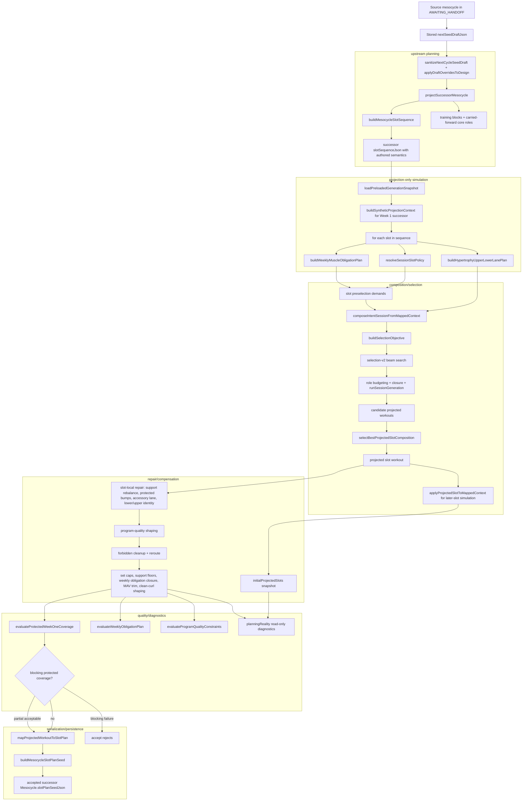
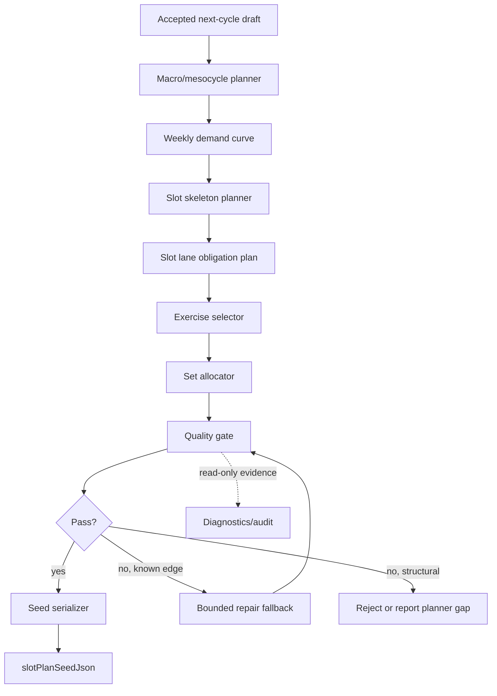

# Handoff Projection Pipeline Map

## 1. Executive Summary

- Current-state architecture verdict: Mostly coherent but complex.
- Main strength: Acceptance and runtime truth have a clean contract: `slotSequenceJson` owns slot order/semantics and `slotPlanSeedJson` owns accepted seeded composition with deterministic `exerciseId`, `role`, and `setCount`.
- Main weakness: The accepted seed is shaped by many late passes after slot-local exercise selection. Some are legitimate safety/polish, but several look like downstream compensation for planner under-specification.
- Highest-risk seam: `src/lib/api/mesocycle-handoff-slot-plan-projection.ts` plus `src/lib/api/mesocycle-handoff-slot-plan-projection.repair-engine.ts`, because this is where upstream slot intent, selector output, repair, quality shaping, diagnostics, and final seed rows converge.
- Recommended target-state direction: Move weekly demand, lane obligations, exercise class intent, and set budgets into explicit upstream planning before selection. Keep repair as rare fallback, keep diagnostics read-only, and keep seed serialization boring.

Observed facts:
- `acceptMesocycleHandoff()` prepares projection and seed material before the transaction, then persists the created successor in `acceptPreparedMesocycleHandoffInTransaction()`.
- `buildMesocycleSlotPlanSeed()` serializes executable `slotId -> exercises[{ exerciseId, role, setCount }]`, may include optional seed-safe `acceptedPlannerIntent` metadata only when explicitly provided, and validates slot-order alignment and positive integer `setCount`.
- `projectSuccessorSlotPlansFromSnapshot()` returns final `slotPlans` plus diagnostics; acceptance rejects blocking protected coverage failures.
- The requested flat file `src/lib/api/mesocycle-handoff-slot-plan-projection.planning-reality.ts` does not exist in this checkout. The current implementation is `src/lib/api/mesocycle-handoff-slot-plan-projection.diagnostics.ts`, which re-exports `src/lib/api/planning-reality/index.ts` and helpers under `src/lib/api/planning-reality/*`.

Interpretation:
- The top and bottom of the system are clean. The middle is overburdened.
- Current architecture is not "bad", but it is repair-shaped enough that future behavior changes should start by quantifying no-repair versus repaired seed deltas.

## 2. Pipeline Diagram



## 3. Step-by-Step Pipeline Walkthrough

| Step | Purpose | Main files/functions | Input | Output | Mutates final seed? | Classification |
|---|---|---|---|---|---|---|
| 1. Freeze handoff artifacts | Close source mesocycle and materialize frozen summary plus editable draft | `mesocycle-handoff.ts`: `enterMesocycleHandoffInTransaction()` | Source mesocycle, closeout evidence | `handoffSummaryJson`, `nextSeedDraftJson` | No, but supplies source truth | upstream_planning |
| 2. Read and sanitize draft | Ensure stored draft stays inside frozen recommendation envelope | `mesocycle-handoff.ts`: `readNextCycleSeedDraft()`, `sanitizeNextCycleSeedDraft()` | Stored draft, frozen recommendation | Sanitized `NextCycleSeedDraft` | Indirect | upstream_planning |
| 3. Apply draft to design | Convert accepted setup choices into next-cycle design | `mesocycle-handoff.ts`: `prepareMesocycleHandoffAcceptance()` | Sanitized draft, recommended design | `NextMesocycleDesign` | Indirect | upstream_planning |
| 4. Project successor structure | Build successor mesocycle shape before persistence | `mesocycle-handoff-projection.ts`: `projectSuccessorMesocycle()` | Source summary, design | Successor mesocycle fields, training blocks, carried roles, preview | Indirect | upstream_planning |
| 5. Author slot sequence | Persist ordered-flexible slots and slot semantics | `mesocycle-slot-contract.ts`: `buildMesocycleSlotSequence()` | Design slots | `slotSequenceJson` with `slotId`, intent, authored semantics | Yes, seed must align to these slot ids | upstream_planning |
| 6. Load generation snapshot | Reuse runtime generation inputs without DB writes | `mesocycle-handoff.ts`: `buildAcceptedMesocycleSlotPlanSeed()`; `context-loader.ts`: `loadPreloadedGenerationSnapshot()` | User id | Preloaded generation snapshot | Indirect | composition |
| 7. Build synthetic projection context | Simulate the successor as an active Week 1 mesocycle | `candidate-selection.ts`: `buildSyntheticProjectionContext()` | Source, design, snapshot | Synthetic `MappedGenerationContext` | Indirect | composition |
| 8. Build weekly hard obligations | Allocate Week 1 hard targets across compatible slots | `weekly-obligations.ts`: `buildWeeklyMuscleObligationPlan()` | Synthetic active mesocycle, slot sequence | Chest, Lats, Quads, Hamstrings targets and allocated slots | Yes | upstream_planning |
| 9. Resolve authored slot policy | Turn slot contract into current-session shape and lane policy | `session-slot-profile.ts`: `resolveSessionSlotPolicy()` | Slot id, intent, slot sequence | Slot profile, protected coverage, compound lane policy | Yes | upstream_planning |
| 10. Build slot lane plan | Add current 4-day upper/lower lane intent before selection | `mesocycle-handoff-slot-lane-plan.ts`: `buildHypertrophyUpperLowerLanePlan()` | Slot id, sequence, previous projected slots | Projection-only lane rows with preferred classes and set budgets | Yes | upstream_planning |
| 11. Build preselection demand | Promote limited slot-owned support demand before selection | `mesocycle-handoff-slot-plan-projection.ts`: `buildSlotPreselectionDemands()` | Slot policy, weekly obligations | `SlotPreselectionDemand[]` | Yes | upstream_planning |
| 12. Compose candidate workouts | Reuse normal intent composition without load assignment or receipt building | `template-session.ts`: `composeIntentSessionFromMappedContext()` | Mapped context, slot id, repair/preselection/lane inputs | Candidate workouts and selection diagnostics | Yes | composition |
| 13. Select exercises | Score and choose exercises through selection-v2 | `selection-adapter.ts`, `selection-v2/*`, `template-session.ts` | Candidate pool, objective, slot policy, targets | Selected exercise ids and proposed sets | Yes | composition |
| 14. Allocate initial sets | Determine per-exercise planned set counts | `selection-v2/candidate.ts`: `computeProposedSets()`; `role-budgeting.ts`: `resolveRoleFixtureSetTarget()`; `runSessionGeneration()` | Selection objective, lifecycle targets, lane targets, role fixtures | Workout with set counts | Yes | composition |
| 15. Pick best projected slot candidate | Compare focused variants for protected coverage, obligations, support quality, duplicates, and slot identity | `candidate-selection.ts`: `selectBestProjectedSlotComposition()` | Candidate workouts | One selected slot workout | Yes | composition |
| 16. Simulate prior slots | Let later slots see earlier projected work and rotation | `candidate-selection.ts`: `applyProjectedSlotToMappedContext()` | Selected slot workout | Synthetic completed history entry | Yes, for later slot choices | composition |
| 17. Apply slot-local repair | Improve selected slot before final weekly shaping | `repair-engine.ts`: `rebalanceUpperSupportProjection()`, `applyExistingAccessorySupportFloorBumps()`, `trimRedundantUpperPullSupportProjection()`, `preserveLowerPatternPrimacy()` | Selected slot workout | Repaired slot workout | Yes | repair_compensation |
| 18. Insert accessory lane | Add bounded low-interference secondary work when capacity and quality allow | `accessory-lane.ts`: `selectAccessoryLaneInsertion()` | Slot workout, soft secondary targets, projected week | Optional Core/Adductors/Abductors/Forearms accessory | Yes | repair_compensation |
| 19. Capture pre-final shape | Preserve the pre-final slot shape for diagnostics | `projectSlotPlansPass()` | Projected slots after slot-local shaping | `initialProjectedSlots` | No | diagnostic_only |
| 20. Apply program quality | Shape duplicates, set spread, fatigue, main-compound count, isolation completeness | `program-quality.ts`: `applyProgramQualityConstraints()` | Projected slots | Mutated projected slots plus diagnostics | Yes | repair_compensation |
| 21. Apply final repair passes | Close obligations/support floors, enforce caps, trim MAV, remove forbidden primary work, prefer clean lower_b curl distribution | `repair-engine.ts`: final closure and trim functions | Projected slots, obligations, library, slot policy | Final projected slots | Yes | repair_compensation |
| 22. Evaluate final quality | Decide whether projection is acceptable and emit readouts | `coverage-evaluation.ts`, `weekly-obligations.ts`, `program-quality.ts`, `planning-reality/*` | Final projected slots plus initial snapshot | Protected coverage, weekly obligations, program quality, planning reality | Some gates affect acceptance; diagnostics do not | quality_gate |
| 23. Serialize seed | Convert final projected slot plans into minimal seed rows | `seed-serialization.ts`: `mapProjectedWorkoutToSlotPlan()`, `buildMesocycleSlotPlanSeed()` | Final slot plans and slot sequence | Versioned `MesocycleSlotPlanSeed` | Yes, direct | serialization |
| 24. Persist successor | Create active successor and persist seed if available | `mesocycle-handoff.ts`: `acceptPreparedMesocycleHandoffInTransaction()` | Prepared projection and seed | Successor `Mesocycle` with `slotSequenceJson`, optional `slotPlanSeedJson` | Yes, direct | serialization |
| 25. Legacy unsupported paths | Allow acceptance without seed when projection is unsupported | `mesocycle-handoff.ts`, tests for BODY_PART unsupported accept behavior | BODY_PART or failed no-slot-plan projection without blocking coverage | Successor may omit `slotPlanSeedJson` | No seed | legacy_fallback |
| 26. Audit-only no-repair paths | Compare repaired projection to no-repair/planner-only variants | `mesocycle-explain`, `planning-reality/*`, planner-only flags | Operator flags | Read-only artifacts | No | diagnostic_only |

Core question answers:

| Question | Answer |
|---|---|
| What exact pipeline produces accepted `slotPlanSeedJson`? | `prepareMesocycleHandoffAcceptance()` -> `projectSuccessorMesocycle()` -> `buildAcceptedMesocycleSlotPlanSeed()` -> `projectSuccessorSlotPlansFromSnapshot()` -> final repaired `slotPlans` -> `buildMesocycleSlotPlanSeed()` -> `acceptPreparedMesocycleHandoffInTransaction()`. |
| Which steps are true upstream planning? | Draft sanitation/design, successor structure projection, slot sequence authoring, slot policy resolution, weekly hard obligation allocation, lane plan creation, bounded preselection demand. |
| Which steps are projection-only simulation? | Synthetic successor context, per-slot projected history/rotation mutation, planner-only no-repair and planner-only override runs. These do not write DB state by themselves. |
| Which steps are downstream repair/compensation? | Upper support rebalance, support-floor bumps, accessory lane insertion, program-quality shaping, forbidden cleanup/reroute, final weekly obligation closure, final support closure, set caps, MAV trim, minimum-set redistribution, lower_b clean-curl distribution. |
| Which steps are diagnostics/readout only? | `planningReality`, shadow weekly demand/allocation, repair materiality, promotion candidates, no-repair comparison artifacts, mesocycle-explain readouts. |
| Which steps directly affect persisted seed? | Exercise selection, set allocation, all final repair/shaping passes, and seed serialization. Diagnostics do not, except quality gates can block acceptance. |
| Which steps are test-only or audit-only? | Planner-only dry-run override, experimental planner-only no-repair, mesocycle-explain artifact compaction, active reseed diffing unless explicit accept mode is used. |
| Where does exercise selection happen? | `composeIntentSessionFromMappedContext()` builds objectives and calls selection-v2 through `selectExercisesOptimized()`, then maps results into `runSessionGeneration()`. |
| Where do slot/lane obligations enter? | Slot semantics enter through `buildMesocycleSlotSequence()` and `resolveSessionSlotPolicy()`. Lane rows enter through `buildHypertrophyUpperLowerLanePlan()` and selection-v2 `slotLanePlan`. |
| Where do weekly muscle targets enter? | `getWeeklyVolumeTarget()` from lifecycle math, backed by `volume-targets.ts` and landmarks, is consumed by weekly obligations and selection objective weekly targets. |
| Where are set counts determined? | `computeProposedSets()`, lifecycle set targets, lane preferred set targets, role budgeting, closure/set overrides, and final repair passes. Final seed uses the final workout exercise `sets.length`. |
| Where are repairs applied? | Mostly `repair-engine.ts`, with additional shaping in `program-quality.ts` and slot-local orchestration in `projectSlotPlansPass()`. |
| Where is final quality judged? | `evaluateProtectedWeekOneCoverage()`, `evaluateWeeklyObligationPlan()`, `evaluateProgramQualityConstraints()`, and `planningReality.summary`. Blocking acceptance currently centers on protected coverage failure. |
| Where is seed serialized? | `mesocycle-handoff-slot-plan-projection.seed-serialization.ts`. |
| Which files are canonical, transitional, or likely legacy? | See section 5. |

## 4. Data Flow Map

Concept flow:

- Source mesocycle summary supplies macro identity, current block/focus, duration, volume target, intensity bias, and frozen recommendation context.
- Next-cycle draft supplies accepted user edits for structure and carry-forward choices.
- Successor mesocycle structure supplies duration, blocks, split/frequency, weekly schedule, and authored slot sequence.
- Slot sequence plus authored semantics supply slot ids, repeated-slot meaning, protected support, primary lanes, and continuity scope.
- Slot profile resolves authored semantics into current-session policy for selection.
- Lane obligations are currently explicit only for the 4-day upper/lower slice.
- Weekly muscle targets enter through lifecycle `getWeeklyVolumeTarget()` for Week 1.
- Exercise candidates come from the generation snapshot exercise library and intent inventory filters.
- Selected exercises come from selection-v2, role continuity, supplemental/closure layers, and candidate comparison.
- Set counts come from selection-v2 proposed sets, lifecycle role targets, lane targets, role budgeting, and final repair.
- Repairs mutate projected workouts after selection.
- Final seed rows are serialized from final projected workouts.
- Persisted `slotPlanSeedJson` is the minimal accepted runtime source.

```mermaid
flowchart LR
  A["source mesocycle summary"] --> B["next-cycle draft"]
  B --> C["successor mesocycle structure"]
  C --> D["slot sequence"]
  D --> E["authored slot semantics"]
  E --> F["slot profile"]
  F --> G["lane obligations"]
  F --> H["slot-local selection objective"]
  C --> I["weekly muscle targets"]
  I --> J["weekly hard obligations"]
  J --> H
  G --> H
  H --> K["exercise candidates"]
  K --> L["selected exercises"]
  L --> M["initial set counts"]
  M --> N["projected slot workouts"]
  N --> O["repairs and final shaping"]
  O --> P["final seed rows"]
  P --> Q["persisted slotPlanSeedJson"]

  O -. "diagnostic snapshot" .-> R["planningReality"]
  N -. "initial vs final delta" .-> R
  R -. "read-only" .-> S["audit/readout only"]
```



## 5. Ownership and Responsibility Boundaries

| Seam | Owns | Should not own | Current quality | Notes |
|---|---|---|---|---|
| `mesocycle-handoff.ts` | Handoff lifecycle, draft sanitation, accept orchestration, transaction boundaries, persistence | Exercise selection policy, repair algorithms | Good | Cleanly prepares projection before transaction; tests cover projection outside transaction and source not completed on failure. |
| `mesocycle-handoff-projection.ts` | Successor mesocycle structure, preview, carried roles, training block projection | Slot exercise composition | Clean | `projectSuccessorMesocycle()` is small and deterministic. |
| `mesocycle-handoff-slot-plan-projection.ts` | Canonical slot-plan projection orchestration | Long-term ownership of every planning, repair, and diagnostic concern | Overloaded | It is the core seam, but it now sequences many responsibilities. |
| Repair engine | Bounded downstream fixes, support-floor closure, set caps, forbidden cleanup, MAV trim | Routine expression of normal plan shape | Powerful but risky | Many final seed mutations happen here. This is the highest-risk area. |
| Weekly obligations | Week 1 hard primary target allocation for Chest, Lats, Quads, Hamstrings | Support floors, quality shaping, diagnostics unrelated to hard obligations | Good but narrow | This is a real upstream planning seam and should grow carefully. |
| Program quality | Quality evaluation and selected safe reshaping | Hard weekly demand source truth | Mixed | It both evaluates and mutates; useful but easy to confuse with policy ownership. |
| Planning reality diagnostics | Read-only shadow demand, allocation, repair materiality, target-state diagnostics | Scoring, repair, seed serialization, runtime replay | Good but large | Strong readout boundary. Size and breadth indicate architecture pressure. |
| Seed serialization | Minimal deterministic seed shape, slot alignment, `setCount` validation | Selection, repair, diagnostics | Excellent | Boring in the right way. Tests protect minimal shape. |
| Slot contract | Persisted authored slot semantics and legacy slot fallback normalization | Runtime exercise selection | Good | Canonical source for slot ids and authored semantics. |
| Session slot profile | Resolve authored slots into current/future session policy | Persistence or seed serialization | Good | Strong boundary between persisted contract and generation objective. |
| Selection adapter | Build selection objective from mapped generation context, slot policy, targets, projection-only inputs | Repair or final seed mutation | Mixed-good | It accepts projection-only inputs but still delegates selection to engine. |
| Role budgeting | Planned set targets for role fixtures, lifecycle targets, support floors | Global weekly repair | Good | Set-count owner for selected/role fixtures, not final seed closure. |
| Selection-v2 | Candidate scoring, beam search, hard constraints, proposed sets | Persistence, handoff acceptance, downstream repair | Mostly good | Projection-only lane/preselection inputs have entered engine types, which is useful but increases coupling. |
| `accessory-lane.ts` | Bounded low-interference secondary-lane insertion | Primary/support target rescue | Narrow and acceptable | More polish than structural rescue. |
| `template-session.ts` | Runtime/session composition and projection composition reuse | Handoff acceptance or seed serialization | Overloaded but canonical | `composeIntentSessionFromMappedContext()` is the important extracted reuse seam. |

File status:

| File or area | Status | Rationale |
|---|---|---|
| `mesocycle-handoff.ts` | Canonical | Acceptance and persistence owner. |
| `mesocycle-handoff-projection.ts` | Canonical | Successor mesocycle structure owner. |
| `mesocycle-handoff-slot-plan-projection.ts` | Canonical but overloaded | Current canonical projection path. |
| `weekly-obligations.ts` | Canonical emerging planner seam | Real upstream allocation for hard weekly targets. |
| `mesocycle-handoff-slot-lane-plan.ts` | Transitional | Current 4-day upper/lower slice only. |
| `repair-engine.ts` | Canonical fallback today, target-state transitional | Needed now, but many responsibilities should shrink if upstream planner improves. |
| `program-quality.ts` | Canonical quality/shaping today, target-state partially transitional | Evaluation should remain; mutation should become smaller. |
| `planning-reality/*` | Canonical diagnostics, read-only | Audit/readout only, not production policy. |
| `seed-serialization.ts` | Canonical | Final minimal accepted seed serializer. |
| `MesocycleExerciseRole` role rows | Legacy/fallback for seeded runtime | Still used for carry-forward/projection continuity, not accepted runtime composition owner. |
| Identity-only seeds without `setCount` | Legacy compatibility | Tests assert missing `setCount` is compatibility fallback. |
| BODY_PART slot-plan projection | Legacy/unsupported fallback | Acceptance can succeed without `slotPlanSeedJson` for unsupported BODY_PART projection. |

## 6. Repair Materiality Analysis

Observed repair types are extensive. The tests protect many of them by name:
- Final repaired set counts become seed counts.
- Runtime replay seed shape stays unchanged after redistribution.
- Planner-only no-repair runs without downstream repair shaping.
- Diagnostics separate likely avoidable shadow repairs from suspicious downstream repair artifacts.
- Forbidden-slot repair is blocked and rerouted only for affected hard demand.
- Clean lower_b Hamstrings curl is preferred over dirty Back Extension repair.

Interpretation:
- Repair is material, not cosmetic. The accepted seed can differ in exercise identity, exercise count, set count, and slot allocation after repair.
- Some repair protects legitimate edge cases, but several repairs look like symptoms of incomplete upstream lane/set/demand planning.
- Exact production materiality needs artifact-level counts across real handoff scenarios.

| Repair type | File/function | What it fixes | Expected edge case or upstream gap? | Architecture concern |
|---|---|---|---|---|
| Upper support rebalance | `repair-engine.ts`: `rebalanceUpperSupportProjection()` | Adds/replaces upper support accessories to meet meaningful protected support | Upstream gap | Selector should satisfy declared support obligations directly. |
| Existing support set bump | `repair-engine.ts`: `applyExistingAccessorySupportFloorBumps()` | Adds sets to selected compatible work | Mixed | Safe as edge handling, risky if routine. |
| Final support floor closure | `repair-engine.ts`: `applyFinalSupportFloorClosure()` | Adds/replaces/bumps across slots to close practical support floors | Upstream gap | Structural rescue when final seed quality depends on it. |
| Final weekly hard obligation closure | `repair-engine.ts`: `applyFinalWeeklyObligationClosure()` | Adds/bump hard primary target work after selection | Upstream gap | Hard primary demand should mostly be satisfied before or during selection. |
| Program quality set spread | `program-quality.ts`: `applySetSpread()`, `mustRedistributeExcessSets()` | Spreads over-concentrated sets and caps single-exercise share | Expected polish, sometimes upstream gap | Good guardrail; should not create normal target shape. |
| Lower pair fatigue shaping | `program-quality.ts`: `applyLowerPairFatigueShaping()` | Reduces duplicate squat/hinge pressure while preserving lower identity | Expected edge case | Reasonable late safety layer. |
| Main compound demotion | `program-quality.ts`: `applyMainCompoundLimit()` | Demotes excess main compounds without deleting selected work | Polish | Acceptable if rare. |
| Deficit-driven isolation injection | `program-quality.ts`: `applyDeficitDrivenIsolation()` | Adds direct Biceps/Triceps/Side Delts isolation when projected week misses support | Upstream gap | Exercise class intent should be planned earlier. |
| Forbidden primary cleanup | `repair-engine.ts`: `removeForbiddenSlotPrimaryRepairExercises()` | Removes cross-region primary-target artifacts | Legitimate safety edge | Safe to keep; should remain a hard invariant. |
| Post-forbidden reroute | `repair-engine.ts`: `applyPostForbiddenCleanupReroute()` | Reroutes only affected hard demand to compatible owning slots | Legitimate edge case | Good safety design, but complexity is high. |
| MAV trim | `repair-engine.ts`: `applyFinalMavTrim()` | Trims over-MAV projected weekly volume without breaking protected MEV | Expected safety | Safe to keep as cap protection. |
| Set distribution caps | `repair-engine.ts`: `applyFinalSetDistributionCaps()` | Enforces max sets per exercise | Expected polish | Safe; better if set allocator avoids it. |
| Minimum viable set redistribution | `repair-engine.ts`: `applyFinalMinimumViableSetRedistribution()` | Removes or redistributes 1-set/subfloor exercises | Expected polish | Safe; upstream set allocator should reduce frequency. |
| Lower_b clean curl distribution | `repair-engine.ts`: `applyLowerBCleanCurlSetDistribution()` | Moves Hamstrings volume from hinge to clean knee-flexion curl | Upstream gap | Indicates class-level lane policy should be explicit pre-selection. |
| Accessory lane insertion | `accessory-lane.ts`: `selectAccessoryLaneInsertion()` | Adds bounded Core/Adductors/Abductors/Forearms low-interference work | Expected edge/polish | Safe if bounded and not used for primary target rescue. |
| Redundant upper pull trim | `repair-engine.ts`: `trimRedundantUpperPullSupportProjection()` | Removes redundant pull support while preserving required pull identity | Expected polish | Safe but should remain small. |
| Lower pattern primacy | `repair-engine.ts`: `preserveLowerPatternPrimacy()` | Keeps lower_b hinge-led when hinge compound is viable | Upstream gap if common | Slot skeleton/selector should own primary anchor order. |

Likely safe to keep:
- Forbidden cleanup and affected-demand reroute.
- MAV trim.
- Minimum viable set redistribution.
- Set distribution caps.
- Accessory lane insertion.
- Duplicate/concentration diagnostics.

Should eventually move upstream or become unnecessary:
- Final weekly obligation closure.
- Final support floor closure.
- Deficit-driven isolation injection.
- Lower_b clean-curl preference.
- Routine upper support rebalance.
- Routine lower pattern primacy correction.

## 7. Current-State Architecture Quality

| Category | Score | Rationale |
|---|---:|---|
| Conceptual clarity | 3 | The top-level flow is understandable, but the projection middle has many phases with overlapping names and responsibilities. |
| Single source of truth | 4 | `slotSequenceJson` and `slotPlanSeedJson` are strong canonical truths. Diagnostics are explicitly read-only. Some policy still appears in multiple shaping seams. |
| Separation of concerns | 3 | Acceptance, structure projection, and seed serialization are clean. Slot-plan projection, repair, and quality shaping are tightly coupled. |
| Test protection | 5 | Tests cover deterministic projection, seed minimality, repaired set counts, no-repair diagnostics, forbidden cleanup, lane ownership, and acceptance gates. |
| Runtime integrity | 4 | Prepare-before-transaction, draft fingerprinting, idempotent accept, seed alignment, and blocking protected coverage are strong. |
| Projection simplicity | 2 | The pipeline is large and compensation-heavy. |
| Ability to debug | 4 | `planningReality`, repair materiality, no-repair artifacts, and test names provide strong readout, but the volume of diagnostics can be hard to navigate. |
| Ease of future changes | 2 | Behavior changes risk accidental drift because selection, repair, quality, and diagnostics are interleaved. |

Current state: Mostly coherent but complex.

Brutal read:
- This is not a casual pile of patches. It has real contracts and real tests.
- It is also not clean top-down planning yet. The accepted seed currently depends on downstream repair enough that deleting or changing repair would be unsafe without a materiality audit.

## 8. Target-State Architecture

### Target Principles

- Mesocycle-level targets are decided before session composition.
- Slot skeleton owns session shape before exercise selection.
- Lane obligations are explicit before candidate scoring.
- Selection satisfies declared obligations directly.
- Set allocation is its own planned phase, not mostly a side effect of selection plus repair.
- Repair is rare edge-case handling, not routine shaping.
- Diagnostics explain decisions and deltas; they do not secretly influence production behavior.
- Seed serialization is deterministic, small, and uneventful.

### Target Pipeline Diagram



### Target Ownership Table

| Layer | Target responsibility | Should produce |
|---|---|---|
| Macro/mesocycle planner | Decide muscles, weekly targets, progression curve, deload transform intent | Weekly demand curve and target tiers |
| Slot skeleton planner | Decide slot ids, intent, archetype, primary/support identity, continuity scope | Authored slot skeleton |
| Lane obligation planner | Allocate muscle/class/pattern/set obligations to slots before selection | Slot lane obligations and per-slot budgets |
| Exercise selector | Choose exercises that satisfy lane obligations and user/context constraints | Exercise identities plus reasoned alternatives |
| Set allocator | Allocate set counts within lane budgets, caps, distribution, and fatigue constraints | Per-exercise set counts |
| Quality gate | Validate slot identity, obligations, volume ranges, concentration, duplicate policy, seed replay | Pass/fail plus actionable reasons |
| Repair fallback | Handle inventory holes, legacy data, forbidden artifacts, and bounded cap cleanup | Explicit repair deltas with reason codes |
| Seed serializer | Serialize only validated final plan | Minimal deterministic `slotPlanSeedJson` |

## 9. Gap Analysis

| Gap | Current behavior | Target behavior | Risk | Migration difficulty |
|---|---|---|---|---|
| Weekly hard demand is partial | Chest/Lats/Quads/Hamstrings are allocated upstream; support demand often arrives through repair | All target tiers have explicit demand ownership before selection | Medium | Medium |
| Lane plan is slice-specific | `buildHypertrophyUpperLowerLanePlan()` only covers current 4-day upper/lower shape | General slot lane planner for supported split templates | Medium | High |
| Set allocation is distributed | Set counts arise from proposed sets, lifecycle targets, role budgeting, lane targets, and final repair | Single set allocator consumes lane budgets and constraints | High | High |
| Repair is material | Repair can change exercise identity and set counts before seed serialization | Repair is rare and mostly bounded fallback | High | High |
| Program quality mutates and evaluates | Quality seam both reshapes and reports | Planner/allocator prevents most issues; quality gate validates | Medium | Medium |
| Diagnostics are broad | `planningReality` explains many future planner concepts without owning behavior | Diagnostics mirror explicit production planner phases | Medium | Medium |
| No-repair path is audit-only | Experimental no-repair comparison exists but is not the normal acceptance basis | No-repair output should eventually be close to accepted output | Medium | High |
| Legacy fallback remains necessary | BODY_PART and identity-only seeds have compatibility paths | Supported accepted mesocycles always have explicit seed/counts | Low | Low to medium |

## 10. Recommendations

### Immediate

| Recommendation | Why | Risk | Expected payoff | Suggested first prompt |
|---|---|---|---|---|
| Keep this report as the architecture entry point for handoff projection | The subsystem was previously discoverable only by reading many files/tests | Low | Faster onboarding and safer future prompts | "Update the handoff projection map with any behavior changes from this branch; do not change production code." |
| Add a lightweight diagnostic index to existing docs later | The requested planning-reality file path has drifted to a directory facade | Low | Reduces file-hunt confusion | "Document the current planning-reality module layout and the old flat-file name as a historical alias." |
| Preserve existing repair and acceptance behavior | Repair materiality is not yet quantified | Low | Avoids accidental seed-quality regression | "Do not change behavior; identify all production seed mutations performed after initial slot selection." |

### Near-Term

| Recommendation | Why | Risk | Expected payoff | Suggested first prompt |
|---|---|---|---|---|
| Run a no-repair vs repaired seed comparison audit | It directly measures dependency on downstream repair | Low, read-only | Converts architecture concern into counts and examples | "Using existing audit-only no-repair flags, compare no-repair slot plans to repaired accepted slot plans and classify every delta." |
| Split the projection walkthrough in code comments or docs by phase names | Current phase order is hard to reason about from the orchestration function alone | Low | Easier review without behavior change | "Add docs-only phase names for handoff slot-plan projection: upstream inputs, slot selection, slot-local shaping, final shaping, quality, serialization." |
| Promote the safest existing upstream-owned support demand only after materiality evidence | Some support repair may be avoidable through lane/preselection demand | Medium | Reduces late repair without rewrite | "From repair materiality evidence, propose one bounded support-demand promotion that does not change seed schema." |

### Long-Term

| Recommendation | Why | Risk | Expected payoff | Suggested first prompt |
|---|---|---|---|---|
| Build a true slot lane obligation planner | Current lane plan is narrow and repair still owns normal shape | High | Major reduction in repair dependency | "Design a general slot lane obligation planner for supported upper/lower handoff projections, preserving current seed output as a golden comparison." |
| Introduce an explicit set allocator after exercise selection | Set counts are currently determined across too many layers | High | Simpler reasoning, fewer cap/redistribution repairs | "Map all current set-count sources and design a single set allocation seam with no behavior change in the first step." |
| Convert repair to fallback with materiality thresholds | Keeps safety repairs but prevents hidden routine policy | Medium-high | Cleaner quality gates and easier future changes | "Define repair severity thresholds and acceptance reporting for handoff projection without changing accepted seeds." |

## 11. What Not To Change Yet

- Do not delete the repair engine until repair materiality is quantified.
- Do not move selection-v2 internals before defining planner obligations.
- Do not treat audit diagnostics as production policy.
- Do not collapse projection and runtime generation paths without proving parity.
- Do not change `slotPlanSeedJson` schema while the current seed serializer is stable and well-tested.
- Do not bypass `slotSequenceJson` or authored slot semantics.
- Do not promote planner-only no-repair output into acceptance until it is proven equivalent or intentionally better.
- Do not remove BODY_PART or identity-only seed fallbacks until live data and tests prove they are unused or safely migratable.
- Do not make program quality diagnostics hard acceptance blockers without separating evaluation from mutation.

## 12. Suggested Next Audit

Recommended next audit: no-repair vs repaired seed comparison audit.

Why this one:
- It directly answers whether accepted seeds are cleanly planned or repair-dependent.
- The code already has an audit-only no-repair path and tests that it leaves normal preview unchanged.
- It will produce concrete deltas: missing lanes, exercise identity changes, set-count changes, unresolved demand, cap cleanup, forbidden cleanup, and acceptance blockers.
- It is the safest next step because it is read-only and does not require production behavior changes.

Suggested prompt:

```txt
Audit the handoff slot-plan projection by comparing current repaired projection output against the existing planner-only no-repair output. Produce a read-only markdown report that quantifies exercise identity deltas, set-count deltas, unresolved demands, repair materiality, and which deltas are likely upstream-planner gaps versus legitimate edge-case repairs. Do not change production code, tests, or data.
```
