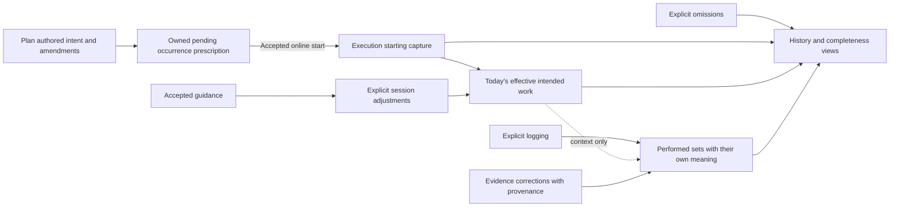
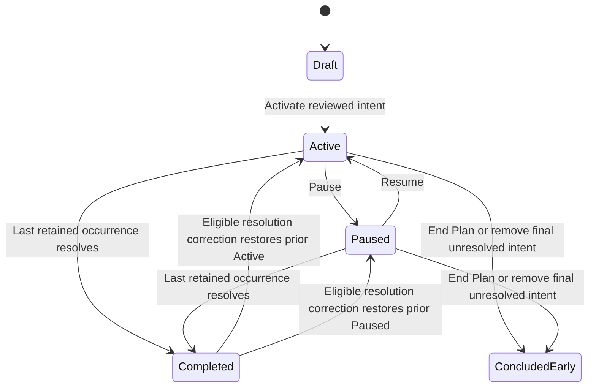
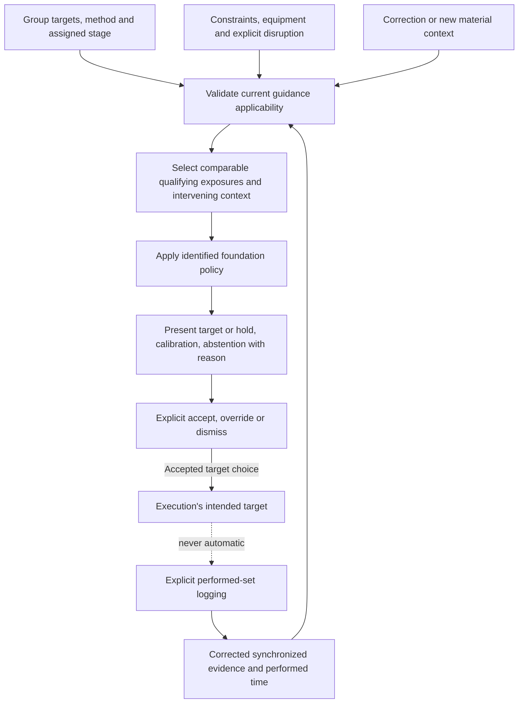

# Trainer App 2.0 — Technology-Agnostic Domain and Architecture

## 1. Status / verdict

**The future-state model is coherent and ready for repository gap analysis.** This document derives logical ownership, identities, actions, consistency requirements, and evidence semantics from the product contract. It does not assess existing software or select implementation technology.

**Authority:** [Trainer-App-2.0-Blueprint-FINAL (1).md](<C:/Users/aabloch/Downloads/Trainer-App-2.0-Blueprint-FINAL (1).md>), revision September 9, 2026, second adversarial-review revision, status FINAL PRODUCT AND BEHAVIORAL BLUEPRINT. Source SHA-256: `5FC72877DC2E1103DC8A199EBC791ED6E149B4CEBF11955CF949CD92C2023094`. References of the form **B§21** identify sections of this replacement blueprint, explicitly selected by the user as the authoritative version.

Blueprint instructions concerning prototype evaluation are future-phase product context, not authorization to inspect implementation during this task. The user's request defines the work scope; the selected blueprint supplies its product and behavioral requirements.

The model's terms are internal distinctions, not additional user-facing navigation. “Owner” means the sole authority for a fact and its accepted changes. An ownership boundary is not necessarily a service, separate deployment, aggregate, or persisted object. Preserving historical versions and action provenance does not prescribe event sourcing.

Foundation obligations include online start, offline continuation, explicit position relationships, corrections, restriction enforcement, and the specified progression policies. Deferred operations such as guided stage repetition must respect this same model when introduced. No application code, existing architecture, implementation schema, or legacy runtime construct informed this derivation.

## 2. Architectural principles derived from the product contract

| Principle | Architectural consequence | Product basis |
| --- | --- | --- |
| Intent, execution, and evidence have different meanings | Future planning cannot act as the mutable source of a started session or historical denominator | B§4, §9–10, §15–18 |
| Operations determine continuity | Stable identities and explicit copy, repeat, substitute, split, and correction relationships; no matching by names, dates, indexes, or similar values | B§4, §10–12, §19 |
| Every accepted mutation has a defined scope | Preview and acceptance identify affected work; changed eligibility refreshes the whole operation; combined edits are indivisible | B§7, §9–10 |
| The user owns consequential decisions | Guidance may propose; logging, prescribing changes, restrictions, and resolution require their authorized actions | B§22–24 |
| Recorded work is evidence, not a completion guess | Prefills, omissions, unknown work, adjusted targets, and actual sets remain distinct | B§15–16, §26–27 |
| Closure is a factual outcome of specified actions | Finished and skipped resolve retained work; removal and abandonment have different meanings; milestones do not govern closure | B§8, §18, §30 |
| Measurement meaning accompanies numbers | Historical units, loading convention, exercise, rep basis, and equipment cannot float with catalog edits | B§19–21, §27 |
| Explanation can be historical truth | Preserve advice actually presented, decisions, original intent, closure cause, and correction provenance even when calculations change | B§8–10, §18, §21–22 |
| Durable local acknowledgement and authoritative acceptance are distinct | Recover local work; expose provisional finish; resolve dependencies and conflicts before authoritative finalization | B§9, §17 |
| Uncertainty reduces inference, not access to training | Preserve incomplete evidence; allow honest logging and manual authoring; abstain from unsupported advice | B§14–15, §20–25, §32–33 |
| Account-wide exclusivity is narrow and strong | One current plan and one open execution are separate invariants, enforced at the relevant acceptance boundaries | B§4, §7–9, §17–18 |
| Readouts do not acquire write authority | Next workout, progress, PRs, milestone status, eligibility, and analytics derive from owned facts | B§11, §18, §21–22, §27–30 |

## 3. Domain map

The minimum model has five primary semantic owners: **Goals & Constraints, Planning, Execution & Evidence, Exercise & Measurement, and Recommendations**. Reuse, synchronization, migration, and presentation carry their own narrower records. Execution and historical evidence deliberately share an authoritative owner: finishing does not transfer the workout into a second mutable history system.

### 3.1 Direction and applicable instructions

| Concept / shape | Purpose and owner | Lifecycle | Authoritative contents and relationships | Explicitly does not own |
| --- | --- | --- | --- | --- |
| Training Direction — user-owned description with history | Cross-plan aims; Goals & Constraints | Authored, changed, superseded | Direction and links to milestones/priorities; plans retain the objective meaning associated with their approval | Plan closure or achieved status |
| Milestone — criteria-bearing goal | Define a testable outcome; Goals & Constraints | Defined, criteria deliberately revised, optionally retired; evidenced status is derived | Exercise/variation, quantity, units, loading convention, reps, conditions, performed versus estimated criterion; separate manual acknowledgement | Performed evidence, PRs, automatic plan ending |
| Training Priority — structured emphasis | Express programming emphasis; Goals & Constraints | Set, reordered/changed, retired | Emphasis and explicit relative priorities; plan association preserves its approved context | An outcome guarantee or inferred restriction |
| Constraint / Restriction — explicit scoped instruction | Practical limits and exclusions; Goals & Constraints | Created, changed, expires or explicitly cleared | Instruction kind, affected activity, scope, validity, explicit authorship; restriction history | Silent edits to plans, proof that a substitute is medically safe |
| Scoped Constraint Exception — dependent authorization | Deliberate override of a named restriction; Goals & Constraints | Granted, expires, revoked; applicability rechecked after restriction changes | Restriction reference, selected work, scope, validity period and user decision | General exemption, copied-plan authority, blanket permission after a restriction changes |
| Structured Context and Preference — distinguishable values/records | Record illness, pain, travel, preferences, and explicit return adjustments; Goals & Constraints, or Execution for session-only facts | Recorded, revised, expired/cleared as applicable | Explicit source and scope; observations/hypotheses remain labeled separately | Unspoken medical judgments or permanent exclusions |

### 3.2 Authored work

| Concept / shape | Purpose and owner | Lifecycle | Authoritative contents and relationships | Explicitly does not own |
| --- | --- | --- | --- | --- |
| Plan — intent and lifecycle boundary | Finite approved block; Planning | Draft → Active/Paused → Completed or Concluded Early; specified resolution corrections may restore nonterminal state | Identity, goals-as-approved, stages, ordered occurrences, initial approved intent, deliberate amendments, original/revised endpoint, closure cause and provenance | Started prescription, performed sets, milestone achievement |
| Programmed Stage / Training Week — plan-owned grouping | Assigned progression context independent of elapsed calendar time | Authored, edited for eligible future work, retained as historical context | Stage identity, ordering, purpose, intended targets/deload context; occurrence membership | Wall-clock advancement or a second completion engine |
| Workout Structure — owned value composition | Ordered arrangement of positions and prescriptions, reusable by copying | Authored, copied, edited by its owner | Arrangement, set targets, relevant guidance and roles | Shared mutable authority across copied plans/occurrences |
| Planned Workout Occurrence — identity-bearing plan child | One specific obligation | Pending, started, finished/skipped resolution, removed intent or not pursued at closure | Identity, sequence, optional date, stage, owned prescription, retained disposition, skip/removal/abandonment decisions; ordinary execution relationship | Performance or independent execution finish status |
| Programmed Exercise Position — identity-bearing occurrence child | Distinguish repeated appearances of the same exercise | Created, continued by edit/reorder, replaced or removed explicitly | Position identity, selected exercise, role, ordered targets, progression-group assignment | Identity inferred from exercise name or index |
| Future Counterpart Relationship — explicit plan-owned relationship | Define intended continuation for targeted future edits | Authored, deliberately changed, retained as provenance when no longer applicable | Explicit member positions and continuation decisions; selected scope is previewed | Comparability, shared mutable prescriptions, automatic progression transfer |
| Prescription — semantic value, owned at each intent layer | Describe expected work rather than results | Authored, captured at start, explicitly adjusted in execution | Required/optional targets, exercise/measurement meaning, counts, ranges, effort, rest, roles; identifiable target work within positions | Logged performance or implied completion |
| Progression Group — explicit prescription grouping | Specify sets evaluated together | Authored, captured, eligibility rechecked after changes | Shared exercise, measurement, role, method, required target structure; distinct top/back-off groups | Counterpart membership, pooled histories based on names |
| Plan Amendment — dependent provenance | Preserve what future intent changed and why its endpoint changed | Preview → accepted or refreshed; accepted meaning retained | Operation identity, before/after intent, exact affected identities, removed/additional work, endpoint outcome | A second current plan prescription |
| Template — independent reusable intent owner | Starting point for plans or workouts; Reuse | Authored, revised, copied, retired | Template contents and source provenance | Live authority over any destination copy |

The Plan owns its occurrence prescriptions; workout structure is their composition, not a competing object whose later edits propagate automatically. A template or reusable source structure can own its own contents. Instantiating it produces destination-owned contents. “Version” throughout this document means distinguishable historical meaning, not a mandated storage mechanism.

### 3.3 Training and interpretation

| Concept / shape | Purpose and owner | Lifecycle | Authoritative contents and relationships | Explicitly does not own |
| --- | --- | --- | --- | --- |
| Workout Execution — session and evidence boundary | One concrete training occasion; Execution & Evidence | Open → Finished; dedicated Undo Finish → same Open session; empty accidental session may be Discarded | Identity, optional source occurrence, starting capture, session positions, adjustments, set evidence, omissions, timing, finish record, corrections | Future intent, plan lifecycle decisions |
| Execution Exercise / Session Position — execution child | Identify session-local work | Captured, added, adjusted/substituted; history retained | Own identity, optional programmed-position source, actual exercise/meaning, intended and actual order relationships | Invented plan lineage for additions |
| Performed Set — identity-bearing evidence | One deliberate assertion of performed work; Execution & Evidence | Logged, explicitly edited/corrected, optionally excluded as erroneous | Set identity, actual exercise, measured values and semantics, classification, source target when known, actual order, effort when recorded, performed time when known | Its position's later exercise label, inferred effort, a second real set on retry |
| Session Adjustment — dependent intent change | Explain today-only departure; Execution & Evidence | Applied and retained; later changes preserve preceding meaning | Exact remaining-work scope, before/after targets, substitution links, user decision, reason if supplied | Plan amendments or deletion/relabeling of recorded work |
| Omission — explicit execution assertion | Distinguish intentionally not performed work from unknown | Recorded; correctable with provenance | Identified target work and explicit not-performed assertion | Automatic classification of every unlogged target |
| Standalone Execution — execution variant, not another aggregate | Training without a plan obligation | Same execution lifecycle | Source occurrence absent; optional template/prior-session provenance; explicit target structure if supplied | Plan resolution or automatic retrospective attachment |
| Training History — derived view | Present corrected evidence and its context; History/Analytics | Rebuilt as evidence changes | No independent performance authority; consumes executions and corrections | Editable duplicate sets or inferred performance from intent |
| Historical Correction — dependent evidence change | Correct facts without creating a training occasion; Execution & Evidence | Proposed against known state, reconciled, accepted; provenance retained | Target identity, original/corrected values or exclusion, actor/action and time, source context | Execution reopening or plan reactivation |
| Resolution Correction — cross-owner action and provenance | Repair accidental finish/skip | Preview, eligibility validation, atomic acceptance or no change | Execution owns finish correction; Planning owns occurrence skip/closure correction; a common action relates their effects | A third authority for either resolution or evidence |
| Measurement Profile / Semantics — semantic definition and captured value | Define quantitative meaning; Exercise & Measurement | Defined, revised prospectively; historical references/meaning preserved | Units, load kind/convention, rep basis, supported dimensions, interpretation | Mutable reinterpretation of recorded numbers |
| Equipment Context — meaningful setup reference/value | Preserve relevant loading and available steps; Exercise & Measurement | Defined, updated prospectively, captured with work | Machine/setup/assistance context, available values in the relevant convention, known uncertainty | Numerical equivalence of similar machines |
| Exercise / Variation — catalog identity | Identify movement and relevant attributes; Exercise & Measurement | Created/customized, renamed, updated; merges only deliberately with provenance | Stable identity, measurement support, equipment and descriptive attributes | Swapping historic exercise assignments on rename or duplicate detection |
| Progression Policy — identified rule definition | Make guidance reproducible; Recommendations | Version introduced, used, superseded for future computations | Supported method and version, evidence rules, defaults; plan/execution owns its selected method and target configuration | Workouts, performed history, background movement of accepted targets |
| Recommendation — consequence-bearing guidance record | Preserve what was actually offered and decided; Recommendations | Presented; accepted, overridden, dismissed; applicability can become stale | Candidate, target scope, explanation, policy version, evidence/context used, user disposition | Performed evidence or unaccepted prescription changes |
| Recommendation Evidence — dependent explanation basis | Explain and reassess advice | Captured for presented guidance; later validity reevaluated | References to evidence identities/versions plus sufficient input meaning to reproduce the reason | Alternate mutable history or permanently frozen current eligibility |
| Migration Provenance — import mapping and review record | Preserve source identity, uncertainty, and cutover coverage; Migration | Observed, quarantined/reviewed, imported/excluded, reconciled | Source system/account/record/revision, export mapping, destination identity, precision, decisions, outstanding records | New live plan obligations or overwrite permission |
| Action / Conflict Record — delivery and reconciliation capability | Retry safety and recoverable competing intent; Synchronization | Durable local, pending, accepted, conflicted, explicitly reconciled | Account, stable action identity, target/base state, dependencies, recoverable competing input and outcome | Domain authority to choose whose conflicting edit wins |
| Recognition / Review Delivery — presentation record | Avoid repeated celebration and remember dismissal; Presentation | Eligible derived occasion, delivered/dismissed, review revisitable | Stable recognition identity and delivery/dismissal history | Goal status, plan closure, whether work happened |

## 4. Ownership model

| Important fact | Sole authoritative owner | Consumers and boundary rule |
| --- | --- | --- |
| Future prescribed work | Planning, through the Plan's pending occurrences | Execution receives a start capture; later planning changes cannot reach through it |
| Prescription after start | Execution & Evidence | Owns starting capture and explicit subsequent adjustments; history can show both |
| Today-only changes | Execution & Evidence | A plan change requires a separate explicit scope or combined action |
| Actual performance and effective corrected evidence | Execution & Evidence | History, analytics, goals, and recommendations consume it read-only |
| Whether an occurrence is resolved | Planning's resolution rule over its own skip decision and its linked execution's authoritative finish fact | No freely editable resolved flag; a cached resolution must agree with these facts. Finish and its plan consequences become accepted together |
| Whether an execution is finished | Execution & Evidence | Planning consumes this fact; neither a device's provisional status nor an analytics result substitutes for it |
| Plan closure | Planning | Retains outcome, cause, endpoint, prior nonterminal state for eligible undo, and unfinished-at-closure context |
| Evidence corrections | Execution & Evidence | Corrections change current evidence with provenance; they do not change plan state |
| Skip / closure corrections | Planning | Resolution correction coordinates with Execution when undoing finish; no independent correction subsystem owns duplicate status |
| Measurement meaning | Exercise & Measurement defines semantics; the evidence record owns the meaning captured for its numeric assertion | Catalog definitions guide new work. Correcting captured meaning is an explicit evidence correction |
| Constraint instructions, exceptions, and applicability rules | Goals & Constraints | Applicability is derived from these records and action context; each prescribing boundary must evaluate it before acceptance |
| Progression policy definition and versioned defaults | Recommendations | Planning owns plan/group method selection and parameters; Execution owns the captured/today configuration. Neither redefines the policy algorithm |
| Recommendation history | Recommendations | Execution references presented/accepted guidance and owns resulting target adjustments, not a competing advice history |
| Current-plan membership | Planning, enforcing the account-wide Active-or-Paused rule | Any index or account pointer is an enforceable representation of this rule, not another lifecycle authority |
| Open-execution membership | Execution & Evidence, enforcing the account-wide Open rule | Includes provisionally finished local sessions until authoritative finish |
| Performed date/time | Execution & Evidence, subject to explicit corrections | Synchronization preserves it and supplies its own separate delivery times |
| Imported source identity and reviewed mapping | Migration | Destination Execution & Evidence owns imported performance after acceptance |

**Duplicate-authority hazards:** deriving history from the current plan; making template contents live dependencies; independently changing occurrence and execution finish flags; letting analytics close plans; letting a profile edit rewrite recorded measurements; allowing synchronization arrival order to decide evidence; treating accepted advice as a performed set. None is permitted.

Resolution is intentionally a derived predicate with an authoritative owner, while the decisions that cause it are records. Plan closure additionally has irreducible historical meaning: a final skip, removal of intent, and End Plan can leave no actionable future work but imply different outcomes. Reconstructing closure from today's pending count alone loses that meaning.

## 5. Identity model

### 5.1 Common rules

Every identity belongs to its account and domain scope. Stable identifiers are opaque; labels, sequence numbers, dates, exercises, and numerical content are attributes. A retry identity identifies a command; a set or session identity identifies its subject. Equal values do not make two commands or two real performances identical. Lineage explains origin without transferring ownership or merging evidence.

### 5.2 Plans and occurrences

Editing a draft, activating it, amending remaining work, rescheduling, pausing, and eligible lifecycle correction preserve Plan identity. Copying or creating a new training block creates a new Plan, even if its title and contents match. Initial approved intent and later accepted changes remain distinguishable.

A continuing occurrence keeps identity through rename, date change, reordering, stage reassignment in a reviewed pending-work edit, and prescription edits before start, even when the prescription changes substantially. Explicit substitution within its intended session need not create another occurrence. A remove-and-introduce operation removes the prior occurrence from intent and creates a new one. The preview states which operation the user is performing; content comparison never decides continuity.

Newly inserted sessions, stage repetitions, and training a genuinely separate occasion require new occurrences or standalone executions. Repeat Stage names the source prescription stage, creates new occurrence and position identities, identifies insertion order and counterpart continuity, and explicitly lists any existing pending sessions to remove or skip. Source outcomes and later assigned stages remain unchanged unless independently included in the reviewed operation. Removed identities are never recycled.

### 5.3 Positions and targets

Programmed positions are distinct even if exercise and all targets match. Reordering preserves their identities. A session captures its own position identities with explicit source-position links. Session-only additions have no invented programmed identity.

Future counterparts are explicitly authored position relationships inside a plan. A targeted edit traverses those relationships to propose a named occurrence/position set, which the user may narrow or broaden. It never globally replaces matching exercise names. A copy creates new positions and new relationship ownership. A repeat explicitly establishes whether its new positions continue existing within-plan relationships.

A substitution of remaining work retains the source-position relationship but creates separately identifiable work for the replacement exercise; already performed sets retain their actual exercise and measurement meaning. A split creates distinct positions and explicit counterparts. A combination preserves the contributing identities as provenance and cannot combine their performance histories by implication.

Within a prescription, individual required work must be addressable sufficiently to distinguish a logged target, omitted target, removed remaining target, and additional set. This is a semantic target identity within its owner, not a requirement for a particular persisted object. Four identical target rows cannot be interchangeable when a correction or queued finish references one of them.

### 5.4 Executions and performed sets

Resume, device change, reload, temporary offline operation, and Undo Finish continue the same execution. Starting from a preview creates nothing until authoritative acceptance. A start retry returns its earlier outcome. A separate training occasion creates a new execution with optional repeat/source provenance. Late-work reconciliation can explicitly create a distinct already-historical execution; it does not reserve an open workout or attach to an unrelated occurrence.

An empty accidental execution may be discarded. Its discarded identity is not reused, and it contributes no performance or resolution. A later accepted start of the still-pending occurrence gets a new execution; the discarded attempt remains non-ordinary provenance, never a second ordinary linked execution. Empty-session Skip coordinates discard/detachment of the empty attempt and the skip decision; any recorded or conflicting recoverable work prevents treating it as empty.

Logging a set creates its identity once. Editing, correcting, excluding an erroneous record, and reconciling its synchronized versions preserve that set identity. A deliberate “duplicate set” logging action creates a new performed-set identity. Forgotten evidence added to an existing session creates a new set identity under the same execution with correction provenance. Neither import nor synchronization deduplicates separate sets by identical values.

## 6. Intent → execution → evidence model

| Layer | Authoritative meaning | Change rule |
| --- | --- | --- |
| 1. Authored plan intent | Initially approved whole block, goal context, and deliberate amendments | Planning may revise eligible future work; original intent remains inspectable |
| 2. Occurrence prescription | Specific owned exercise positions, target structure, and assigned stage in approved intent | Pending-work edit only; cannot be the live backing for a started session |
| 3. Starting capture | Prescription and relevant guidance presented at accepted start, with source identities and meaning | Preserved as the historical starting reference; ordinary plan/catalog edits cannot reinterpret it |
| 4. Today's adjusted prescription | Starting work plus explicit session changes and accepted target choices | Execution changes this layer, with scope and provenance; future edits cannot change it |
| 5. Performed evidence | Explicit recorded assertions, corrected when necessary | No automatic creation from any intent layer; each set preserves actual meaning |

Example: occurrence O1 starts with four required working targets A–D. Execution E1 captures all four. Sets S1 and S2 explicitly fulfill A and B. A future edit changes selected pending O2/O3 from four sets to three; E1 still reports **2/4 starting, 2/4 adjusted**, with C and D unknown. An explicit Adjust Today removes D from today's remaining target: E1 now reports **2/4 starting, 2/3 adjusted**, with the target change recorded. D is removed from today's intent, not retroactively performed or automatically marked omitted. C remains unknown unless the user explicitly marks it not performed.

If the user instead keeps four targets and marks C/D omitted, evidence is two performed, two explicitly omitted, and no unknown required targets. These are different user operations. Finish resolves the occurrence in either case without converting the denominator or the unknowns. Additional performed sets remain additional; substituting leg press for C/D cannot relabel S1/S2 as leg press.

Session context, status, and completeness are separate dimensions. A finished session can have unknown work. A deliberately shortened target can be met without implying the original prescription was met. An accepted load can remain entirely unperformed.

## 7. Commands / actions

### 7.1 Common command contract

Each accepted action identifies the originating account, stable action identity, exact subject/scope, expected relevant state, and any dependencies. Repeating the same action returns the same accepted outcome; it does not rerun creation, closure, import, or delivery effects. Reusing an action identity with different intent is a conflict, not an edit. Distinct edits remain distinct even when their values match. Validation failures and scope changes must not leave partial domain effects.

The table uses these offline categories:

- **Yes, local:** required continuation capability after successful online start and durable capture; local acknowledgement is not authoritative cross-device acceptance. Known restrictions and dependencies still apply.
- **Provisional:** Finish may be durably requested offline, but remains authoritative Open until synchronized and reconciled.
- **Online:** requires authoritative acceptance before the stated domain transition.
- **Not promised:** the blueprint does not require offline support for this action. It may retain a local draft/request, but foundation can require connectivity for its shared mutation. This is not an added product prohibition.

All rows inherit retry safety and preservation of unrelated state. “Boundary” identifies the state that must be validated together, not an endpoint or technology. B§4, §7–18, §22–24 establish these actions.

### 7.2 Planning and lifecycle actions

| Action | Preconditions | Authoritative change | Must not change | Concurrency boundary | Offline |
| --- | --- | --- | --- | --- | --- |
| Create Plan / Copy Plan / Start from Template | Authenticated owner; selected source intent available if copying | New Draft and independently owned occurrences, positions, relationships; source provenance | Source plan, executions, resolution, runtime loads, transient context, exceptions | New identity/action and selected source meaning | Not promised |
| Edit Draft | Owned Draft; edit based on known draft | Draft intent; hard validity may remain unresolved while drafting | Other drafts, template/source, history | Conflicting draft scope; later review must match accepted draft | Not promised |
| Activate Plan / Start Plan | Exact reviewed Draft; executable valid work; exclusions resolved; no other current plan | Draft → Active; initial approved intent and endpoint; current-plan membership | Existing open execution from a concluded plan; milestone status | Account current-plan exclusivity + draft review + restrictions | Online |
| Edit Future Occurrences | Exact previewed pending scope still eligible; applicable restrictions checked | Selected occurrence/position prescriptions and amendment provenance | Every open/finished execution; unselected counterparts | Entire selected scope + restrictions; no silent narrowing | Online |
| Shift Dates / Reorder Pending Work | Reviewed affected pending identities remain eligible | Scheduling/sequence, same identities and prescriptions unless separately selected | Assigned stage targets, resolutions, performed date/time | Full affected scope and ordering context | Online as future-plan edit |
| Edit Today and Future | Open execution plus reviewed future scope; both still compatible; restrictions checked | Execution adjustment and Plan amendment under one accepted action | Starting capture, performed sets, unselected work | Execution state + full future scope + restriction applicability | Online; both apply or neither |
| Restructure / Shorten Remaining Plan | Reviewed additions/removals/stages/endpoint; pending scope unchanged | Remaining intent and explicit removed-intent provenance; revised endpoint or Concluded Early as specified | Open/finished executions and source identity; historical outcomes | Whole affected plan scope, concurrent starts, resulting closure | Online; guided workflow may follow foundation |
| Repeat Stage | Specified source prescription stage, insertion and counterpart preview; explicit replacement/skip scope | New occurrences and positions; deliberate within-plan continuity; named removals/skips if selected | Original outcomes and other later stages | Source meaning + insertion order + entire affected pending scope | Online when delivered; guided assistance may be deferred |
| Skip Occurrence / Skip Ahead | Pending selected occurrences without performed work; started-empty case must explicitly discard first/as one coordinated action | Explicit skip decision; resolution; possible Completed outcome | Performed evidence, other pending work, milestone status | Selected occurrences vs starts/logging; plan endpoint and closure | Online; foundation does not promise offline skip |
| Discard Empty Accidental Execution | Authoritatively Open and truly empty, with no unresolved work conflict | Execution → Discarded; release open membership; retained occurrence becomes Pending | Any actual or recoverable recorded work; plan resolution | Execution changes + ordinary link + account open membership | Not promised; authoritative release requires reconciliation |
| Pause Plan | Current Active plan | Active → Paused; explicit pause context | Pending resolutions/dates, open execution and its evidence | Plan state vs new planned start | Not promised |
| Resume Plan | Current Paused plan | Paused → Active | Dates, prescriptions, prior skips; no automatic escalation | Plan state and current membership | Not promised |
| End Plan | Active/Paused plan with unresolved work; explicit user decision | Concluded Early; unstarted pending work not pursued because plan ended; closure context | Open execution, recorded sets, source link; no fake skips/finish | Plan state, affected occurrences, races with start/finish | Not promised; accepted closure is authoritative |

Pending future edits can operate on retained intent while paused without resuming planned execution. Their permission follows the future-intent rules; they do not imply a start. Closed plans are history/copy sources, not an editing path for new live obligations. A finish or skip that resolves the final retained work while paused can complete the plan, preserving Paused as the prior state for eligible resolution correction.

### 7.3 Execution, correction, and guidance actions

| Action | Preconditions | Authoritative change | Must not change | Concurrency boundary | Offline |
| --- | --- | --- | --- | --- | --- |
| Start Occurrence | Active source plan, eligible pending occurrence, fresh/explained preview, applicable restrictions satisfied, no open execution | New execution with captured prescription/guidance; ordinary source link; open membership | Other occurrence identity or stage; earlier pending work when starting later | Account open rule + occurrence/plan + restrictions + source state | Online; capture durably local before offline-ready |
| Start Standalone Workout | No open execution; selected structure representable; restrictions checked for affected work | New execution, no plan occurrence; optional copied structure provenance | Current plan state or obligations | Account open rule + selected starting intent/restrictions | Online even if starting empty |
| Resume Execution | Same owned Open execution, including source plan Paused/Concluded Early | Restore local continuation; no new domain identity | Starting capture, plan state, set identities | Reconcile known execution state; cached continuation may remain pending | Yes, local when already available on device |
| Log Set / Deliberately Duplicate Set | Owned continuing execution; explicit confirmation of actual work; known measurement or honest unsupported-note path | New identified set evidence; duplication creates a new set | Unconfirmed prefills, future targets, other recorded sets | Set identity + session state/target relationship; late finish conflict preserved | Yes, local |
| Edit Set / Remove Erroneous Set | Identified evidence and known base; explicit edit/removal | Corrected values or exclusion with provenance, same set identity | Other sets, original provenance, occurrence resolution | Same-set versions, remove-vs-edit, finish dependencies | Yes, local in continuing session; finished-history offline correction not promised |
| Add Exercise Today | Open execution; valid measurement and restriction check for prescribing | New session position, explicit targets if supplied | Plan positions and lineage; actual prior work | Execution scope + applicable known restrictions | Yes, local |
| Substitute Remaining Work Today | Open execution; explicit remaining target selection; suitability and restriction decision | Separate replacement work with source-position link; adjustment record | Already performed exercise, values, starting denominator | Selected remaining work vs logs/other changes; restrictions | Yes, local |
| Adjust Today / Remove Remaining Work / Change Actual Order | Open execution; exact intended scope; prescription changes checked | Adjusted target or recorded actual ordering; retained change context | Starting capture, recorded work, plan order/future intent | Touched positions/targets vs concurrent logs and finish | Yes, local |
| Mark Omitted / Correct Omission | Explicit identified work and assertion; no unresolved contradiction with performed evidence | Omission assertion or correction | Unknown unrelated targets; actual set evidence | Target assertion vs log/correction/finish | Yes, local |
| Finish Execution | Open execution; explicit finish; dependencies identify included durable changes | After synchronization: Finished, linked resolution, possible Plan completion; retain unknown work | Unlogged prefills, omissions not explicitly asserted, identity, Concluded Early closure | All included changes + unseen-change conflicts + occurrence/endpoint + account membership | Provisional offline |
| Correct Historical Evidence / Add Forgotten Evidence | Known finished evidence/context, explicit correction; conflicting bases reconciled | Effective evidence, timing, classification, assignment, or additional sets with provenance | Finished status, source identity, plan closure, past advice/delivery | Target evidence versions and affected execution relationships | Not promised; no provisional reopening |
| Undo Finish | Finished execution; no other Open; reviewed source-plan effects; no other current plan if restoration required | Same execution → Open; linked occurrence unresolved; eligible auto-completed plan restores prior Active/Paused | Sets, starting/adjusted intent, original finish/provenance; Concluded Early stays closed | Account open rule + execution + plan/current-plan rule, all-or-none | Online |
| Undo Skip | Identified skipped occurrence with no ordinary execution; reviewed effects; current-plan eligibility for restoration | Skip correction; Pending on Active/Paused or eligible restored Completed plan | Evidence, other identities; explicitly concluded plan does not regain live obligations | Occurrence + plan/current membership; all-or-none | Online |
| Accept Recommendation | Presented candidate still applicable to exact target/context; restrictions pass | Recommendation decision + explicit target/intent change at rightful owner | Performed evidence, starting capture, unrelated future intent | Advice inputs/applicability + target scope + restrictions; combine required effects | Today-only may be local if applicability can be established from available state; stale/unknown suggestion refreshes; future scope Online |
| Override Recommendation | Explicit alternative and scope; valid measurement/restrictions | Recorded override; chosen target at rightful owner | Performed evidence; historical original advice | Same as target edit; known conflicts cannot be bypassed by “override” | Same as corresponding today/future edit |
| Dismiss Recommendation | Identified presented advice/evidence context | Dismissal record suppressing unchanged advice | Prescriptions, actual performance, restrictions | Advice disposition; materially changed inputs can support a new explained suggestion | Not promised; local dismissal can be retained without plan mutation |
| Add / Change / Clear Restriction | Explicit instruction, scope and validity | Goals & Constraints record; reevaluation obligations | Existing evidence or silent rewrite of approved intent | Restriction state vs prescribing action applicability | Not promised for profile/plan-wide writes; session-only explicit context/exception may accompany local today changes |
| Add Scoped Exception | Explicit named restriction, affected work, scope and validity | Narrow exception authorization | Restriction outside selected scope; copied plans | Restriction meaning/version + selected work; changed restriction rechecked | Local session-only exception can support offline today adjustment against known restrictions; broader writes not promised |

Offline acceptance of today-only guidance never claims knowledge of remote changes. If current applicability cannot be established, the user can manually choose an honest target under known restrictions; the system cannot label an unverified stale recommendation as newly validated. Restrictions never prohibit recording what actually happened. A correction to finished evidence can be collected locally in a future capability, but authoritative conflict resolution is still required before it changes shared evidence.

## 8. Lifecycle / state models

### 8.1 Plan

`ConcludedEarly` in the diagram is the user-facing **Concluded Early** state. Its closure remains unchanged when its open execution later finishes or is reopened by Undo Finish. Drafts are never current plans. “Current” means exactly Active or Paused, not most recently created or viewed.

The completion transition is a mandatory consequence of resolving the last retained occurrence, not an asynchronous analytics decision or administrative step. Retaining unfinished work while shortening the endpoint can establish a revised plan that subsequently completes. Removing the final unresolved pending work with nothing unfinished retained concludes early; a vacuous “all zero remaining are resolved” test is insufficient. Explicitly skipping all remaining occurrences can complete because the identified obligations were deliberately resolved.

Closure records preserve the action/cause, approved endpoint, original-versus-revised context, and prior Active/Paused state. Ordinary evidence correction leaves closure intact. Undo of the finish or skip that automatically completed the plan restores the prior nonterminal state subject to exclusivity. This models the blueprint's resolution-correction transition, not a generic “reopen closed plan” action. An explicit End Plan is never reversed implicitly.

### 8.2 Planned occurrence: separate disposition and resolution

The smallest unambiguous model uses two dimensions rather than many visible statuses:

| Dimension | Values / meaning | Authority |
| --- | --- | --- |
| Intent disposition | Retained; Removed from intent; Not pursued because plan ended | Planning records the deliberate action/cause |
| Execution / resolution | No ordinary execution and no effective skip = Pending; linked Open execution = Started; linked Finished execution = Finished resolution; explicit effective skip without execution = Skipped resolution | Planning derives its lifecycle using its skip decisions and Execution's finish fact |

Removed and Not pursued are not successful resolutions and never count as skips. End Plan changes unstarted pending work to Not pursued; a started occurrence keeps its source association and an unfinished-at-closure fact. Its later finish updates its historical resolution, not the plan's explicit closure. “Pending” is actionable only on a nonterminal plan, and new planned starts require Active.

Transitions are:

- Pending → Started by authoritative start; Started → Finished by synchronized finish, even if partial.
- Pending → Skipped by explicit skip; an empty started attempt must first be discarded or coordinately discarded-and-skipped without losing work.
- Pending → Removed by reviewed removal; Pending → Not pursued by End Plan.
- Started → Pending only when an empty accidental attempt is authoritatively discarded and the source plan still retains live work. If already Concluded Early, discard leaves no live obligation and preserves the closure context.
- Finished → Started by eligible Undo Finish, preserving execution identity.
- Skipped → Pending by eligible Undo Skip on a nonterminal or restored automatically Completed plan.
- On Concluded Early, correcting an erroneous skip changes the historical resolution assertion and records that remaining work was not pursued; it does not turn into a live Pending obligation.

These are internal distinctions. The UI can continue using ordinary “resume,” “finished,” “skipped,” and truthful change context.

### 8.3 Execution and synchronization

The authoritative lifecycle is **Open → Finished**, with **Finished → Open** only through Undo Finish, and **Open → Discarded** only for an empty accidental execution. There is no separate standalone lifecycle.

Local delivery overlays are orthogonal: **durably local / pending synchronization / synchronized / needs reconciliation**. A **locally finished, pending synchronization** execution is still authoritative Open. Finish intent references its included changes. Dependencies missing or conflicting prevent authoritative finish and occurrence resolution. Once accepted, release of open membership and linked plan effects occur together. Discard is not a way to throw away unsynchronized performed work.

### 8.4 Recommendation

An unpresented computed candidate is disposable derived output. Once consequential advice is presented, preserve the presentation and basis. Its user disposition is **Presented (undecided), Accepted, Overridden, or Dismissed**. Applicability is a separate current interpretation: **applicable or stale/invalidated**.

A presented undecided suggestion can become stale and require refreshed guidance. Accepted advice can later lose its evidentiary support without losing the historical Accepted decision or silently moving the execution's target. Dismissed advice remains suppressed for unchanged evidence; a material change permits a new explained presentation. A refresh preserves prior presentations rather than editing what the user previously saw. Conflicting disposition actions are reconciled; repeated acceptance cannot duplicate a target adjustment.

## 9. Domain invariants

The following are semantic test obligations. “Accepted” means authoritative unless explicitly labeled local. Quantification is within one originating account, and effective evidence excludes explicitly corrected erroneous assertions while retaining their provenance.

| ID | Invariant / future test oracle | Basis |
| --- | --- | --- |
| I01 | For each user, count of plans in {Active, Paused} ≤ 1; Draft is never current | B§7–8 |
| I02 | For each user, count of authoritative Open executions ≤ 1, across planned/standalone; pending local finish still counts | B§4, §17–18 |
| I03 | For each occurrence, ordinary linked execution count ≤ 1; discarded empty attempts confer no ordinary performance link; repeat creates new identity | B§4, §16 |
| I04 | Rename, reorder, date move, or Edit Existing preserves occurrence identity regardless of content changes; remove-and-introduce creates a new one | B§4 |
| I05 | Repeated/copied occurrences and positions never reuse source identity; copy owns its counterpart relationships | B§4, §6, §12 |
| I06 | Every future counterpart is explicitly established; matching names, indexes, or numbers cannot establish it | B§4, §10 |
| I07 | After start, any future-plan/catalog update leaves starting capture unchanged and cannot alter today's target implicitly | B§9, §19 |
| I08 | Starting and adjusted prescriptions remain distinguishable; editing future four to three cannot alter a started 2/4 denominator | B§9–10 |
| I09 | Performance evidence requires explicit logging/correction/import of actual evidence; prefill, recommendation acceptance, and Finish create none | B§15–16, §22, §33 |
| I10 | Unknown remaining work remains unknown unless explicitly omitted or otherwise corrected; finish never supplies the assertion | B§16 |
| I11 | Skip cannot discard or coexist with performed work as an ordinary occurrence outcome; any such work uses partial finish or correction | B§16 |
| I12 | An accepted partial finish resolves its retained linked occurrence without asserting full completeness | B§8, §16 |
| I13 | A future edit applies to exactly the previewed eligible scope or nothing; any selected newly started/incompatibly changed item forces refresh | B§10 |
| I14 | Combined today+future acceptance changes both authorized scopes once or neither, including advice/adjustment records needed to explain it | B§10 |
| I15 | Start and skip/removal have one accepted order; losing stale start creates no execution, and losing stale edit does not silently omit the started item | B§9–10 |
| I16 | Start requires connectivity and authoritative plan/occurrence/restriction/open-execution checks; preview/cache is not a reservation | B§9, §17 |
| I17 | Last retained finish/skip causes Completed; milestone truth neither causes nor prevents completion | B§8, §30 |
| I18 | Removing final unresolved pending work with no unfinished work retained causes Concluded Early, never vacuous Completed | B§8 |
| I19 | Removed intent, skipped, unknown, omitted, and not pursued at closure are distinct; analytics cannot collapse their denominators | B§8, §10, §16, §27 |
| I20 | End Plan preserves every open execution and its source link; later finish leaves Concluded Early unchanged | B§8, §17 |
| I21 | Pause resolves nothing, advances no stage, and changes no dates; open work can continue and standalone training does not resume/satisfy the plan | B§11, §13–14 |
| I22 | Earlier pending work survives an intentional later start; default selection returns to earliest pending; elapsed days never advance assigned stage | B§11 |
| I23 | Replacing remaining work preserves all performed-set identities, actual exercise/meaning, and source relationships; additions acquire no guessed target | B§15 |
| I24 | Corrections retain original/corrected meaning and provenance; ordinary erroneous removal excludes evidence without masquerading as permanent deletion | B§18 |
| I25 | Ordinary historical correction cannot reopen execution or plan and cannot rewrite prior presented advice | B§18, §21 |
| I26 | Undo Finish preserves execution/set identity and requires no other Open; plan restoration and exclusivity validation are atomic | B§18 |
| I27 | Undo Skip requires no ordinary execution; eligible restoration respects current-plan exclusivity; explicitly concluded plans gain no live obligations | B§18 |
| I28 | Units normalize only with equivalent underlying meaning; unknown convention is not equivalent and zero is not missing | B§15, §19–20 |
| I29 | Substitution suitability and future-counterpart links do not imply comparability or progression-group continuity | B§4, §20–21 |
| I30 | Performed-set meaning survives catalog rename/metadata change; changed measurement assignment requires explicit correction | B§19 |
| I31 | Preparation/ramp-ups are excluded from working volume/working PRs/progression by default; optional extras do not fill required-group evidence | B§21, §26 |
| I32 | Automatic progression uses only the specified synchronized, finished, comparable qualifying structure and known required effort; insufficient evidence is not zero | B§21 |
| I33 | Current disruption or a more recent relevant nonqualifying/disrupted exposure prevents escalation from older successes; changed structure gets fresh eligibility | B§21 |
| I34 | Equipment steps use the recorded convention and actual supported values; assistance progression reverses numeric direction; zero assistance requires deliberate new group | B§21 |
| I35 | Presented advice retains policy identity, inputs, reason, and decision; correction invalidates affected future guidance, but accepted open-session targets remain fixed until explicit change | B§21–22 |
| I36 | Explicit restrictions are checked at affected prescribing boundaries; exceptions are narrow, named, time-scoped, and never inherited by a copy | B§24 |
| I37 | Inferred preferences, observations, discomfort, or notes cannot silently become restrictions, diagnoses, or structured actions | B§23–25, §28 |
| I38 | New restrictions preserve performed evidence and honest logging; offline enforcement claims cannot precede device knowledge | B§24 |
| I39 | Local acknowledgement implies successful durable save; reload restores acknowledged local entries; account changes cannot discard or cross-apply them | B§17 |
| I40 | Same action delivered repeatedly has one effect; equal-valued distinct actions are not duplicates; creation/finish/import/recognition are repeat-safe | B§17, §30, §33, §35 |
| I41 | Authoritative finish requires every referenced durable change and resolution of relevant conflicts; missing dependencies keep execution Open | B§17 |
| I42 | Conflicting same-set edits, removal-vs-edit, and finish-vs-unseen changes preserve competing values and require explicit reconciliation; arrival order is not intent | B§17 |
| I43 | Late work after finish remains recoverable until explicitly assigned as correction or distinct historical workout; no automatic append, second workout, or source reassignment | B§17 |
| I44 | A stale queued update cannot silently replace an explicit correction, even if delivered later | B§17–18 |
| I45 | Training date/time is independent of entry/upload/correction time; current timezone changes cannot move history; unknown temporal precision stays unknown | B§27 |
| I46 | Milestone evidence and PR status recalculate after correction; estimates cannot satisfy performed criteria; manual acknowledgement stays distinct | B§3, §18 |
| I47 | Undo/re-finish and repeated recalculation cannot redeliver the same plan completion celebration; dismissal cannot impede training | B§18, §29–30, §35 |
| I48 | Import identity comes from source record/revision, never similarity; repeated import has one effect; source changes cannot overwrite destination corrections silently | B§33 |
| I49 | Unknown legacy intent, effort, units/convention, or exact time cannot be fabricated; late imports cannot drive progression until reviewed | B§33 |
| I50 | Legacy plan reference/import creates no live 2.0 obligations; reviewed continuation creates new draft identity without duplicating performance | B§33 |
| I51 | Migration/rollback preserves post-cutover evidence, stable mappings, coverage limits, and outstanding devices/records; it cannot claim unchecked completeness | B§33 |
| I52 | Activation uses the reviewed draft and current restrictions; hard validity blocks, concerns/tradeoffs alone do not; no-executable-training plan cannot activate | B§7 |
| I53 | Rest/preparation and optional finishers do not invent empty executable obligations or prevent otherwise valid completion | B§7, §26 |
| I54 | Workload and duration readouts declare conventions/precision; planned order cannot fabricate actual supersets, rest, or active time | B§26–27 |

## 10. Measurement / comparability model

### 10.1 Meaning travels with each assertion

Exercise & Measurement defines supported quantitative meanings. Each prescription and performed set preserves the meaning under which its values were authored or recorded, through captured values or a historical definition that cannot silently change. These are semantic obligations, not a choice between embedding and referencing. B§15, §19–21, §26–27 govern this model.

| Dimension | Required meaning and evidence treatment |
| --- | --- |
| Exercise / variation | Stable actual exercise identity, meaningful variation and known context. A replacement's suitability does not change the exercise on earlier sets. Custom entries may have limited descriptive metadata |
| Units | Original entered value and unit remain available. A normalized value is a derived equivalent only when all other measurement meaning agrees |
| Per-hand versus combined | Explicit load convention. A recorded 20 per hand is not relabeled 40 combined; displayed conversions must explain the basis and cannot infer unrecorded sides/implements |
| External load | Identify added resistance and how its quantity is recorded. Do not implicitly add bodyweight or change to total-system load |
| Assistance | Identify assistance amount and mechanism, separately from external resistance. Less assistance can be harder. Different assistance mechanisms need not be comparable |
| Bodyweight | Distinguish bodyweight movement, additional external load, and assistance. Preserve actual bodyweight only if known/recorded and relevant; never invent it or assume an unstated total-system calculation |
| Zero | A valid value when the convention permits it: e.g. no external load or zero assistance in its recorded context. Zero cannot mean missing load, unknown effort, or a failed logging action. Reaching zero assistance does not automatically convert the group into unassisted progression |
| Rep basis | State how reps were counted: total, per side, alternating or another supported explicit basis. Unknown basis limits comparisons; never double or halve by guess |
| Equipment context | Preserve meaningful machine/setup identity, loading/assistance convention, and limitations. Equipment may expose ordered available values for progression, using the same convention as the record |
| Effort | Actual RIR or other supported effort only when recorded; prescribed effort is a target, not observed effort. Missing RIR cannot meet an RIR-dependent trigger |
| Work classification | General preparation, ramp-up, working, optional finisher; preserve required-versus-optional role independently of actual performance. Correctable classification affects calculations with provenance |
| Prescription role | Distinguish top-set/back-off or other explicit target roles and required set structure. Raw comparable sets need not establish a qualifying progression exposure |
| Time | Execution training date/timezone, known start/finish instants, known set performed times and actual order; separate entry, sync, correction times. Precision and confidence are explicit when limited |
| Completeness | Explicit performance, explicit omission, unknown, and removed-from-adjusted-intent are distinguishable. Missing detail is not reconstructed from planned values |
| Unsupported quantitative meaning | Preserve human-readable notes and original source values where applicable, without forcing them into misleading supported numeric analytics |

No universal load or “performance score” can replace these dimensions. Equivalent unit conversions are permitted; mechanical equivalence between machines or assistance systems is not implied. Per-hand/combined conversions require known semantics and do not automatically permit progression transfer when the prescription convention changes.

### 10.2 Four evidence relationships

Comparability is a relation between evidence and a particular question/target, not a permanent exercise-level boolean.

| Classification | Decision conditions | Allowed use |
| --- | --- | --- |
| Directly comparable | Known equivalent exercise/variation and relevant setup; equivalent numeric meaning and rep basis; required context for the question is available | Direct quantitative history or criterion evaluation; progression still requires its separate structure, effort, recency, and synchronization checks |
| Related but not comparable | Shared purpose/movement context but different/uncertain machine, assistance, variation, convention, or role | Show labeled context; inform substitution choice or user calibration; no automatic numerical transfer |
| Insufficient | Relevant dimensions, required set coverage, effort, target structure, or performed-time precision are missing | Preserve and show known facts; hold/calibrate/abstain for affected decisions. It may still support a less demanding question |
| Invalidated or conflicted | A referenced version has been corrected/excluded, or competing evidence has no reconciled current meaning | Old version remains provenance; exclude it from affected current calculations. Reevaluate corrected effective evidence; unresolved conflicts cannot qualify for progression |

These categories are question-specific. Missing RIR can prevent a double-progression increase without erasing a valid load-and-reps history or a performed milestone that does not require RIR. A corrected 120 lb set may be valid current evidence even though its prior 200 lb assertion is invalidated. Substitution ranking consumes suitability and restriction context separately from this evidence relation.

### 10.3 Performed-time semantics

Calendar attribution defaults to the preserved training date and its timezone; a midnight-crossing session uses its start date unless deliberately corrected. Recency uses trustworthy performed instants where available, never upload order. Date-only evidence remains date-only; unknown timezone or duration stays unknown rather than becoming midnight in the current timezone.

A date/time correction retains execution identity and original provenance, invalidates affected period summaries and guidance, and moves exposure to the correct period. Implausible or future device times require confirmation before driving automatic progression. Elapsed duration, known interruptions, and measured active time are separate quantities; no active time or rest interval is inferred from planned ordering.

## 11. Progression / recommendation boundary

### 11.1 Ownership and information flow

Planning selects explicit methods and targets for progression groups and assigns programmed stages. Execution captures that configuration and owns today's accepted target. Recommendations owns identified policy definitions and the advice actually presented. History provides corrected evidence with quality and synchronization status. None of the policy computations can log, correct, finish, or restructure a workout on its own. B§21–23 are the policy authority.

A group's identity identifies its authored role and targets. Matching evidence eligibility is separately checked across sessions; sharing a counterpart relationship cannot skip that check. Standalone evidence can qualify only when its comparable target structure and role were explicitly captured. Unknown prior intent cannot be backfilled merely to make an exposure qualify.

### 11.2 Foundation evaluation

1. **Identify the request.** Capture target execution/position/group, method and policy version, current required sets, rep range, effort target, measurement meaning, equipment steps, assigned stage, relevant restrictions, and explicit disruption/return context.
2. **Select trustworthy evidence.** Use effective corrected records in finished, synchronized session groups, with all required sets explicitly recorded, comparable exercise/equipment meaning, matching set count and rep-range policy, and no unresolved correction or synchronization conflict. Preparation, optional extras, omitted required work, and unknown required work cannot fill the group. The session as a whole may be partial in another group; evaluate this group's actual completeness.
3. **Check intervening context before filtering it away.** Keep the chronology of relevant disrupted/nonqualifying exposures and explicit current context. A more recent relevant disruption cannot disappear because it failed the qualification filter. Current deload, explicit illness/pain, or return adjustment suppresses automatic escalation. Today-only reductions, altered structures, and substituted work remain exposure/context, not normal triggers.
4. **Apply the time window.** Examine the latest two qualifying exposures performed within the preceding **28 days**, and show their dates. Double progression needs both. Rep progression uses the latest qualifying exposure in that window and does not invent a second-exposure requirement. Insufficient time precision means abstaining from the recency-sensitive inference when eligibility cannot be established.
5. **Apply the selected policy below.** A changed rep range, set count, equipment, or prescription role requires fresh eligibility. Foundation does not automatically carry readiness across those changes.
6. **Present only applicable guidance.** Retain consequential candidate, policy identity, input evidence and meaning, dates, target scope, and explanation. An invalidated candidate is refreshed before application. User acceptance writes today's intended target (or explicitly authorized future intent), never performed evidence.

| Policy | Trigger | Result | Failure / limit |
| --- | --- | --- | --- |
| Double progression | Both latest qualifying exposures use the same comparable load; every required set reaches upper rep target; when RIR is prescribed, every required set records RIR ≥ prescribed lower bound | Suggest one adjacent supported equipment value harder, with return to lower rep target; external load normally rises, assistance falls | No automatic increase if any trigger is unmet or intervening/current disruption blocks escalation; explain and hold/calibrate |
| Rep progression | At same load/difficulty, latest qualifying exposure has every required set meeting lower rep target and any prescribed RIR minimum | Suggest one additional rep on each set below its upper bound, capped at that bound | At upper bound hold; never automatically change load; missing effort/coverage prevents unsupported escalation |
| Equipment step application | Available values are explicit in the recorded convention | Adjacent supported harder value; per-hand step remains per hand | No fabricated intermediate value; no harder value means hold and offer deliberate method/target change; zero assistance requires deliberate unassisted-group setup |

Other progression methods remain manually authorable until their product policies are defined. The model introduces no new intensity formula, volume recommendation rule, recovery score, readiness threshold, automatic reset interval, or algorithm for transferring progression across changed prescriptions. A more recent nonqualifying exposure blocks an increase for the relevant history; it does not authorize a newly invented universal restriction on unrelated exercises. When its relevance or cause is uncertain, show that uncertainty and hold/calibrate rather than claim causal knowledge.

### 11.3 Evidence invalidation and historical advice

Presented guidance needs enough preserved input meaning to explain why it was offered, not just pointers to values that later mutate. Correcting a supporting set invalidates affected pending/future suggestions and derived milestone/PR results. Past presentation, acceptance, override, and dismissal records remain truthful about what happened then.

An accepted target in an open execution remains that target until an explicit change. New material context may prompt reconsideration, never background replacement. Accepting a future-plan suggestion inherits future-edit scope review and connectivity. Dismissal is scoped to unchanged advice/evidence context; a new presentation after material change explains what changed. Background recomputation has no authority to create a performed set or redeliver the same recognition.

## 12. Constraints / goals model

Goals & Constraints owns current explicit instructions and their history; Planning preserves the goals, priorities, and context associated with approved intent. A later direction change cannot rewrite what an earlier plan was intended to accomplish. Milestone criteria are authoritative; current evidenced achievement is derived. Manual acknowledgement and estimated achievement remain separate from performed achievement. B§3, §7, §22–25, §28–30 establish these distinctions.

### 12.1 Applicability and precedence

An applicability decision takes **instruction meaning + affected work + profile/plan/session scope + validity period + explicit exception + action context**. Its outputs identify applicable instructions, satisfied instructions, unresolved conflicts, expired/inapplicable exceptions, and any uncertainty from missing exercise metadata.

- Explicit instructions outrank inferred preferences. A narrow explicit exception can override its named broader restriction only for selected work and validity.
- Two conflicting explicit instructions without such an exception are surfaced as a conflict. The system does not invent a total priority ordering from creation time, specificity alone, or inferred preference.
- Profile-wide, plan-specific, date-bounded, and session-only scope are explicit. A temporary restriction may expire at its stated end or remain until cleared. Expiry does not rewrite prior prescriptions or evidence.
- Exceptions refer to the restriction and authorized work, with scope and validity. Changed restriction meaning triggers fresh applicability; an old exception cannot expand by inference. A copied plan has no inherited exception authority.
- Approximate duration/frequency limits and programming tradeoffs are not automatically treated as representational errors. Activation distinguishes hard validity, strong concerns, tradeoffs, and explicit exclusions. No universal quality score becomes a gate.

### 12.2 Enforcement without falsifying reality

| Boundary | Required behavior |
| --- | --- |
| Activation | Validate exact reviewed plan and applicable current restrictions; exclusion conflict needs an edit or scoped exception |
| Planned start | Recheck plan/occurrence/restrictions online; do not start stale affected work silently |
| Standalone start / adding exercise | Apply the same prescription restriction checks; empty standalone start cannot become a bypass for later additions |
| Future edit, combined edit, substitution, recommendation acceptance | Evaluate affected proposed work and explicit scope before acceptance; recheck changed restrictions |
| Already open execution | Surface newly known restriction; preserve capture and all evidence; continuing to prescribe affected work requires change or exception |
| Offline continuation | Apply known cached restrictions and explicit session exceptions; acknowledge that unseen remote instructions could not be enforced earlier |
| Honest logging / correction | Retain what happened even if it conflicted with a restriction; do not prevent evidence entry or erase it |
| Incomplete custom-exercise metadata | State uncertainty and obtain deliberate confirmation when proposing/prescribing; missing attributes do not certify compliance |

Structured pain/illness context can suppress escalation without being promoted to a permanent prohibition. Substitution advice is not medical clearance. Notes remain available for human use but do not silently become structured inputs or commands. Goal achievement and plan completion proceed independently, and optional review never blocks training access.

## 13. Durability / concurrency / offline model

### 13.1 Logical responsibilities

| Capability | Responsibility | Does not decide |
| --- | --- | --- |
| Authoritative write boundary | Validate account ownership, command meaning, fresh relevant state, exclusivity, restriction applicability, and cross-owner invariants | Which technology enforces the decision |
| Durable local execution workspace | Retain captured prescription, acknowledged entries, adjustments, omissions, action identities/dependencies and local finish request; restore on same-device reload | Authoritative occurrence/plan closure while offline |
| Repeat-safe acceptance | Associate each action identity with one immutable intent and accepted outcome; repeat downstream effects safely | Duplicate identity from numerical similarity |
| Conflict detection and recovery | Detect incompatible source states, preserve competing values and identify affected work; collect an explicit reconciliation decision | Last arrival as an automatic winner |
| Dependency-aware synchronization | Deliver/retry same actions, respect their prerequisites, keep pending data recoverable, project accepted results back to devices | Rewrite source identity or decide whether late work is another workout |
| Derived information invalidation | Mark affected interpretations stale and recompute from corrected facts; prevent stale consequential advice acceptance | Mutate historical evidence or accepted targets |

### 13.2 Online start and local readiness

Start has one accepted order relative to plan pause/end, skip, removal, edits, restrictions, and other starts. It checks the user-wide open-execution invariant and captures the prescription actually accepted. A cached preview is neither a lock nor an execution. If the preview is materially stale, refresh/explain the relevant changed work before creating the session.

A successful but timed-out start is recovered with the same action identity. The device must durably possess the accepted prescription and execution identity before claiming offline readiness. If the authoritative start succeeded but local capture failed, the next interaction resumes/retrieves the same execution; it does not issue a fresh start. Two devices may continue the same accepted execution, but independent competing starts cannot both win.

### 13.3 Logging, ordering, and finish

Successful durable save on the device or authoritative store precedes acknowledgement; during offline continuation that save must be local. Each action carries stable identity, originating account, target identity, relevant expected version/meaning, and dependencies. For example, a log under a newly added session position depends on that addition; an edit depends on the set it edits; a finish identifies the durable changes included by the user. Actual performed order and time remain separate from this delivery dependency order.

Independent additions can be retained together when their identities and relationships are independent. Two new set identities are not enough to prove independence if they both claim the same single prescribed target or depend on incompatible position changes; preserve and reconcile that relationship conflict. Concurrent edits/removal of one set preserve all competing input until explicitly resolved. An old queued edit cannot defeat a later synchronized correction merely by arriving later.

**Finish is a dependency barrier and an accepted domain transition.** Arrival of a finish request alone cannot finalize. Missing referenced actions remain pending; conflicting included or unseen changes require reconciliation. Once coherent, acceptance finalizes Execution, makes Planning's linked resolution effective, applies any mandatory closure, and releases account open membership as one semantic result. A local pending finish continues to block a new authoritative start.

This does not require knowing about every disconnected device before any finish can succeed. The distinction is deliberate: referenced and known conflicting work prevents finish; genuinely unknown late work discovered after accepted finalization enters explicit reconciliation. It is neither silently appended nor lost.

### 13.4 Late work and closed plans

After authoritative finish, late independent work remains durable pending input. The user confirms either:

1. It was performed in the same session: accept it as an evidence correction under that execution, retaining provenance and checking target conflicts.
2. It was a distinct training occasion: explicitly create a separate historical execution with its own identity and performed time, leaving the original occurrence relationship unchanged. This recovery action creates no open execution and satisfies no other occurrence by implication.

If another device ended the plan while its execution remained open, valid queued entries still belong to that execution. They can synchronize and finish normally; Planning retains Concluded Early. A new plan can be activated after closure, but its start waits for the old execution to finish or, if truly empty, be discarded.

### 13.5 Strong versus eventual consistency

| Requirement | Consistency required | Reason / permissible lag |
| --- | --- | --- |
| Current-plan exclusivity and open-execution exclusivity | Strong at acceptance | Cannot later reconcile two accepted current plans/open workouts without violating the contract |
| Start vs skip/remove/edit/pause/end and known restriction changes | One strong accepted order | Captured work must be eligible at acceptance; stale competing scope refreshes |
| Activation against its review | Strong | A reviewed draft cannot silently become a different activated plan |
| Whole-scope future edits and today+future edits | Strong semantic all-or-none | No unreviewed partial application across owners |
| Finish dependencies, conflict resolution, linked resolution and closure | Strong at authoritative finish | Local provisional state may lag; accepted effects cannot contradict each other |
| Undo Finish / Undo Skip and affected plan restoration | Strong all-or-none with account checks | No partial reopen or silent replacement of another current plan |
| Same-set correction vs queued mutation | Strong explicit conflict semantics at acceptance | Competing input may wait; accepted correction never silently overwritten |
| Local acknowledgement | Immediate durable save before acknowledgement | No promise of authoritative sync or survival after uninstall/storage clearing |
| Independent local logging / today adjustments | Eventually synchronized | Each is durable and pending until accepted; conflicts remain recoverable |
| Remote restriction visibility on an offline device | Eventual knowledge with honest enforcement scope | Enforce known constraints; surface new conflicts on receipt without rewriting past evidence |
| Analytics, PR/milestone displays, next-workout projections, reviews | Recomputable/eventual read visibility | Label pending/stale information; actual start or advice acceptance validates authoritative facts |
| Recommendation invalidation | Immediate invalidation check at consequential acceptance; recomputation may be eventual | A stale display cannot become authority to apply an invalid candidate |
| Celebration/review delivery | Eventual and repeat-safe | One delivery identity prevents replay after repeated processing or undo/re-finish |
| Import processing | Eventual review with strong source/action identity and correction checks on acceptance | Quarantined/unreviewed evidence cannot be smuggled into progression |

“Strong semantic all-or-none” does not mandate a single physical transaction, distributed protocol, or deployment layout. Whatever mechanism is chosen must make one coherent accepted outcome visible to subsequent commands and recover partial delivery without partial domain meaning.

### 13.6 Account isolation and recovery limits

Pending local records remain bound to their originating account through sign-out, app update, failed synchronization, and later sign-in. Another account cannot view, submit, merge, or acquire those records through a device change. Switching accounts does not count as permission to delete them. Prolonged failures require export or another recoverable path.

The guarantee covers acknowledged durable state on the same device or authoritative store. Clearing device storage, uninstalling, or destroying a device can lose unsynchronized records. The UI must state the actual durability/synchronization status and cannot advertise stronger recovery than exists. These requirements prescribe a capability, not storage, queue, or transport technology.

## 14. Derived / read models

Derived outputs may be retained for efficient display, but retain their input basis/freshness and remain recomputable. A semantic reason to preserve a historical fact is different from a reason to cache a calculation. Presented advice, user decisions, original intent, corrections, and delivery acknowledgements are historical facts; PR status or next-workout selection is not. B§8, §11, §18, §21–22, §27–30 define this separation.

| Read model | Authoritative inputs | Dangerous promotion to source truth |
| --- | --- | --- |
| Next workout / Home primary action | Authoritative Open execution, current plan state, pending retained occurrence order, presentation dismissal records | Cached next item cannot reserve/start work or advance stages; Resume wins even for a concluded source plan |
| Current-plan position | Active/Paused plan, approved sequence/stages, effective resolutions, retained disposition | An index cannot become occurrence identity or resolve earlier work after a later start |
| Original versus revised plan | Initial approved intent, amendments, source-copy provenance, original/revised endpoints | Latest intent cannot replace original denominator or hide removed work |
| Workout completeness | Starting targets, explicit adjusted targets, target-linked sets, additional work, omissions, unknowns, classifications | Finished is not 100%; unlogged is not omitted; extra sets cannot fill arbitrary missing targets |
| Adherence / plan execution summary | Original and revised targets, performed sets, explicit skips/omissions, removals, closure-abandonment context, pause/deload | Revised completion cannot be labeled original-plan adherence; unknown causes cannot become punitive scores |
| Calendar-week / rolling exposure | Effective performed date/time/precision, sets/categories, timezone, known interruptions | Sync date cannot assign training week; uncertain time cannot invent exact frequency |
| Programmed-week volume | Assigned stages, approved prescriptions/amendments, captured execution stage, actual work where labeled | A stage spanning twelve days cannot imply four sessions per seven calendar days |
| Working-set / muscle volume | Corrected working-set classifications, exercise muscle attributes, declared direct/indirect/weighted convention | Estimated involvement is not exact stimulus, recovery capacity, or an automatic demand to add work |
| Comparable exercise history | Effective actual exercise/variation, measurements, equipment, role and performed-time context | Name or substitution suitability cannot establish direct numerical equivalence |
| PR status | Effective performed working evidence, supported comparison conditions, measurement meaning, correction/conflict status | Old typo, prep work, recommendation, or estimated maximum cannot become a performed working PR |
| Milestone status | Explicit milestone criteria/conditions, trustworthy compatible evidence, separate manual acknowledgement | Automatic achievement cannot rewrite criteria or close a plan; estimated cannot satisfy performed criterion |
| Progression eligibility | Captured group targets/role, corrected finished synchronized evidence, required effort, performed recency, intervening exposures, explicit current context, policy version | A stored “ready” flag cannot survive changed evidence, equipment, targets, restrictions, or disruption unchecked |
| Recommendation candidate/applicability | Current target scope, policy, equipment, constraints, evidence basis, decisions, material context | A candidate cannot mutate intent or evidence; old presentation history cannot certify present applicability |
| Restriction applicability | Explicit instruction meaning/scope/validity, exception scope, affected work, metadata confidence | A cached compliant flag cannot authorize work after an applicable restriction changed |
| Activation review | Exact draft contents, representability, current constraints, transparent programming concerns and estimation assumptions | A previous review cannot approve a changed draft; programming concern cannot become invented hard validity |
| End-of-plan review | Closure outcome/cause, original/revised intent, effective execution evidence including later finish, resolution corrections, goals, uncertainty | Frozen review cannot own closure; later evidence changes review without silently reopening the plan |
| Duration estimate / observed duration | Planned rest/setup assumptions versus known start/finish, interruptions, measured active time | Estimated duration is not recorded duration; elapsed is not measured active training |
| Analytics dashboard / observed patterns | Above qualified projections and their inputs; notes only as human-reference content | Correlation cannot silently become causation, preference, restriction, diagnosis, or programming policy |
| Recognition eligibility | Plan closure or current milestone evidence plus delivery history | Recalculation cannot create another celebration for the same already-delivered recognition |

For occurrence resolution, `resolved(o)` is true only when its effective explicit skip exists or its ordinary execution is authoritatively Finished. Removed or abandoned work is not made resolved by filtering it out. Planning owns this rule; closure additionally preserves the causal action and endpoint semantics. Read models can expose unresolved-at-closure alongside later finished evidence.

## 15. Logical subsystem boundaries

These boundaries separate meaning and mutation authority. They do not force separate processes, databases, teams, or services. Keeping strongly coupled acceptance close may be the simplest later implementation; this document does not select that topology.

| Boundary | Owns | Consumes | Exposes | Cross-boundary mutations / consistency |
| --- | --- | --- | --- | --- |
| Goals & Constraints | Direction, goal criteria, priorities, explicit restrictions, exceptions, structured profile context and preferences; applicability rules | Work scope, exercise metadata, current time/context; derived evidence for goal presentation | Explicit instruction context and applicability/conflicts; goal definitions | Prescribing boundaries validate current applicability as part of acceptance; new instructions do not mutate existing plans/evidence; milestone displays may update eventually |
| Planning | Plans, stages, owned occurrence intent, positions, counterparts, amendments, skips/removals, endpoint/closure, current-plan rule | Goals/constraints, measurement validity, source templates, authoritative execution-link/finish facts | Complete approved intent, pending scopes, start source, resolution/closure meaning | Start capture/link, finish consequences, combined edits, undo, and closure races require coherent acceptance with Execution; reviews/next selection may be derived |
| Execution & Evidence | Executions, open-execution rule, starting captures, session adjustments, actual sets/semantics, omissions, timing, finish and historical corrections | Planning source intent, measurement definitions, known restrictions, explicitly accepted guidance | Corrected evidence with provenance, session status, trustworthy history inputs | Start/finish/undo/combined edits coordinate with Planning; correction conflicts with Synchronization reconcile explicitly; analytics/history consumes read-only |
| Exercise & Measurement | Exercise/variation definitions, supported semantics, meaningful equipment context and available increments | User-defined exercise/setup details | Representability, captured measurement meaning, comparability basis and descriptive suitability attributes | Changes apply prospectively; historic meaning changes only through Execution correction. Reuse/Planning/Execution validate new intent against meaningful definitions |
| Recommendations | Identified policy definitions/defaults; actual presentations, explanations, input basis and disposition history | Qualified evidence, target groups/stage, constraints, equipment, explicit context | Candidate/hold/calibration/abstention, explanation, applicability, historical advice | Accept/override coordinates disposition with rightful target mutation; future changes inherit Planning review; evidence correction invalidates future use without altering prior advice |
| Reuse | Independently owned template intent and source provenance | User-authored structure; reviewed context for recommended structures when supported | Copyable intent | Copy creates destination ownership/new identities, no transferred exceptions/performance; changing a template never updates copies |
| History & Analytics | Recomputable views and declared analytical conventions, not performed facts | Planning intent/closure, Execution evidence/corrections, goal criteria, measurement meaning | Honest history, comparisons, completeness, PRs, milestone evidence, exposure, reviews | No autonomous domain mutations. Recompute/invalidate after authoritative changes; consequential decisions must not trust stale projections |
| Synchronization & Recovery | Durable local delivery state, stable action outcomes, dependencies, recoverable conflict input, account isolation | Owned domain state and local actions | Pending/synchronized/conflicted status; replay and reconciliation requests | Dispatches to rightful owners; cannot independently finish/overwrite/reassign. Strong checks at acceptance; local delivery eventual |
| Migration & Cutover | Stable import mapping, source revisions, provenance, cutover boundary, quarantine decisions, coverage and discrepancy records | Source exports/late records, destination correction versions and evidence | Reviewed historical imports, traceability and coverage reports | Accepted import/correction enters Execution & Evidence once; no live Planning obligations; late records reviewed before progression; rollback must preserve new evidence |
| Presentation & Recognition | Delivery/dismissal and resumable review interaction state | Derived next action, closure and milestone evidence, advice presentation context | Home priority, optional celebration/review, pending/conflict explanations | Repeat-safe delivery acknowledgement; no authority over training, milestones, or closure; display lag may not imply a successful authoritative action |

### 15.1 Required cross-boundary acceptance sets

| Accepted operation | Facts that must agree |
| --- | --- |
| Activate | Exact reviewed intent + validity/current restrictions + current-plan exclusivity |
| Start planned workout | Active plan + eligible pending occurrence/current prescription + restriction decision + execution creation/capture + single open membership + ordinary source relationship |
| Start standalone | Selected/empty starting intent + applicable restriction decision + execution creation + single open membership |
| Today and future edit | Exact execution adjustment + all named pending-work edits + applicability + amendment/adjustment explanation |
| Finish | Complete included durable changes + reconciled relevant conflicts + execution finish + occurrence resolution + mandatory closure consequence + open-membership release |
| End Plan | Explicit early closure + pending-not-pursued disposition + preserved open execution/source; concurrent start/finish has a defined order |
| Undo Finish / Skip | Corrected resolution + permitted plan restoration + account exclusivity + provenance, with no partial change |
| Accept consequential recommendation | Applicable presented guidance + user decision + exact target change at its owner; no logged evidence effect |
| Accept evidence correction/import | Effective record and provenance + conflict resolution + dependent invalidation information; derived recalculation may follow |

The source facts supporting these operations must be stable enough to validate their accepted meaning. A cached read model may accelerate a preview, but cannot stand in for acceptance checks. No subsystem owns both a suggestion and an independent right to implement it without user action.

## 16. Migration boundary

Migration imports evidence and source context into the target semantics; it does not reconstruct unknowable live plan continuity. This section defines the target contract from B§33 and does not inspect or characterize the existing repository.

| Concern | Target-system semantics |
| --- | --- |
| Stable import provenance | Source system and account, stable source session/set record identities, source revision, export/cutover context and destination mapping remain traceable |
| Repeated import | Same source record revision has one effect; an interrupted retry returns/reconciles the prior outcome. Different real sessions with equal dates/loads remain distinct |
| Known measurement meaning | Preserve original numerical values, units, conventions, exercise/equipment context and notes; classify evidence according to known semantics |
| Unknown measurement meaning | Preserve original data and uncertainty; no guessed per-hand convention, machine equivalence, assistance meaning or artificial numeric normalization; exclude affected automatic comparisons |
| Uncertain historical intent | Retain available prescriptions and plan relationships as sourced evidence with confidence; missing starting targets/groups remain unknown; never manufacture a normal progression exposure |
| Unknown effort | Remains unknown; no conversion of planned RIR or absence into recorded RIR |
| Date-only records | Preserve source date and any actually known timezone/precision; do not invent midnight instants, durations, ordering, or exact recency |
| Known omissions | Preserve explicit source omissions and known import coverage gaps separately from unlogged/unknown work |
| Later source correction | Compare the source change with the last imported source meaning and any intervening destination correction; accept nonconflicting change with provenance, otherwise require explicit reconciliation |
| Destination correction | Execution & Evidence owns the corrected destination assertion. The import mapping preserves its relationship to the source; a repeat or later source update cannot erase it silently |
| Late legacy upload | Mark outstanding import, retain performed date, quarantine from automatic progression; explicitly import or exclude after review with a reason |
| Imported session identity | Mapping refers to real source identity; corrections retain destination execution identity. Recovery never attaches imported performance to a new obligation by similarity |
| In-flight legacy plan | Historical/reference data only. Continuing remaining intent requires a reviewed new 2.0 draft with independently owned obligations; earlier performance is not copied into it |
| Cutover boundary | Record final source snapshot and accepted write boundary; reconcile/export known device queues beforehand; 2.0 owns new logging afterward |
| Source cannot be made read-only | Identify late writes as outstanding imports; do not claim complete migration beyond the checked boundary |
| Verification and coverage | Reconcile coverage at cutoff, representative histories, values/units, timestamps, known omissions and outstanding devices; produce a concise discrepancy record |
| Recoverability and rollback | Retain source export and mapping. After any 2.0 logging, preserve/reconcile that new evidence before rollback; no silent loss of post-cutover work |

Import acceptance and progression eligibility are separate. A reviewed late record may be valid preserved history yet still lack sufficient measurement, target, effort, or temporal meaning for automated progression. A source record lacking reliable identity remains a documented mapping/reconciliation problem; matching numeric content is not a substitute for identity. Neither import order nor the cutoff time overwrites its performed time.

## 17. Behavioral-scenario validation

This is a model-level adversarial walkthrough, not a claim of running software tests. Each row names the responsible facts, accepted transition, and invariant checks. The first twenty are the required scenarios; the remaining rows cover additional blueprint collisions and evidence edge cases.

### 17.1 Required twenty scenarios

| # | Scenario | Identity, ownership, and transition that determine the result | Invariants / result |
| --- | --- | --- | --- |
| 1 | Skip final Upper B and start next week's Lower A | Planning records Skip on identified O-UpperB, derives its resolution, and selects earliest remaining pending O-LowerA. Start captures Lower A's assigned stage into a new linked execution | I04, I11, I16, I22: no regenerated identity or date-based stage advancement; earlier pending work, if any, still takes default priority |
| 2 | Start, then edit future four sets to three | E1 owns four-target capture. Planning edits only previewed pending O2/O3. E1's two logged sets remain under its four starting targets | I07–08, I13: 2/4 stays 2/4 for today; no live reference to future prescription |
| 3 | Explicitly shorten today's started workout | Execution accepts adjustment of named remaining targets; starting capture and set identities stay fixed | I08–10, I23: 2/4 starting can be 2/3 adjusted; removed intent, unknown, and omission stay distinct |
| 4 | Two same-name exercise positions | P1/P2 have independent position/target identities and explicit counterpart membership. Replacement targets P1 and previewed P1 counterparts only | I06, I23, I29: reorder cannot exchange history; P2 untouched |
| 5 | Repeat disrupted week | Planning copies specified stage intent into new occurrences/positions, previews insertion and explicit counterpart continuity; named removal/skip decisions handle any replaced pending work | I05, I19, I22: original performances/skips persist; later stages do not silently shift |
| 6 | Finish eight of twelve, four unknown | E1 retains eight explicit sets; finish depends on their durable actions. Once coherent, E1 → Finished, linked occurrence resolves; four targets have no omission assertion | I09–10, I12, I41: partial resolution, truthful 8/12 and unknown remainder |
| 7 | Attempt to skip session with recorded work | Execution owns recorded sets. Skip's empty/pending eligibility fails; finish partially is available without deleting evidence | I11–12, I23: no state transition to Skipped that loses work |
| 8 | Correct milestone-triggering 200 lb to 120 lb | Same set S1 gets explicit evidence correction retaining original 200. Derived milestone/PR/current guidance reevaluate the effective 120; historical advice/delivery remain | I24–25, I35, I46–47: no new workout or reopened plan; achievement may become unsupported |
| 9 | Switch to non-comparable machine | Execution adjustment creates distinct replacement work with its actual equipment/semantics; source-position relationship retained; earlier sets unchanged | I23, I28–30: related history visible; no transferred load readiness; hold/calibrate |
| 10 | Accept target and never perform it | Recommendations records Accepted; Execution updates intended target. No Log Set action exists | I09, I35: zero invented performed evidence; finish does not turn the target into a result |
| 11 | Log offline, reload, synchronize | Previously accepted E1/capture and locally acknowledged S1/action A1 restore from durable local state; synchronization retries A1 with same identity | I02, I39–40: same execution and set, no duplicate; pending status remains truthful |
| 12 | Two devices race to start | Account-wide start acceptance orders A1/A2 together with source eligibility. One creates Open E1; other resumes E1 if appropriate or reports conflict | I02–03, I15–16: no second open or duplicate ordinary execution |
| 13 | Finish arrives before referenced sets | Finish F1 references A1…A8. Missing dependencies keep it pending and E1 authoritative Open; conflicting versions require reconciliation before finish acceptance | I02, I41–42: occurrence/plan cannot advance early; no new workout can start on provisional finish |
| 14 | End Plan while execution open | Planning → Concluded Early, unstarted pending → Not pursued, preserving E1 and unfinished-at-closure context. E1 later finishes under original source | I19–20: closure remains Concluded Early; review includes later evidence |
| 15 | Undo final finish | Online correction checks no other Open and no competing current plan if restoring completion. Same E1 → Open; occurrence unresolved; auto-completed Plan restores prior Active/Paused atomically | I01–02, I26, I47: sets and prescription remain; conflicting current plan requires a separate explicit conclusion first; no partial undo or repeat celebration |
| 16 | Standalone training while plan paused | New E-standalone has no occurrence source and requires no other Open; plan remains Paused with same pending work | I02, I21: valid history, no satisfaction/resumption; can inform guidance only with qualifying explicit target context |
| 17 | Restriction added after activation | Goals & Constraints records restriction; Planning does not rewrite intent. Next affected start/edit/advice boundary checks applicability; known open execution surfaces it | I36–38: change/exception required for further prescription; evidence/honest logging preserved |
| 18 | Copy plan with scoped exception | Copy creates new Plan/occurrences/positions/relationships and source provenance; exception authority remains scoped to source work | I05, I36, I52: destination review checks current restriction; new exception or edit needed |
| 19 | New disruption after two qualifying successes | Guidance retains relevant chronology and current context before filtering qualifiers; newer disruption suppresses escalation from earlier success pair | I32–35: hold/calibrate with reason, no invented policy transfer or automatic higher target |
| 20 | Legacy record arrives after cutover | Migration identifies source identity/revision as outstanding, quarantines progression eligibility, preserves performed date and reviews import/exclusion | I40, I45, I48–51: one import effect; no live obligations or overstated coverage |

### 17.2 Additional collision and evidence checks

| # | Scenario | Determinate model result | Invariants |
| --- | --- | --- | --- |
| 21 | Start races with Skip / Remove | First accepted action determines eligibility. Start-first excludes occurrence from pending edit; skip/remove-first prevents stale start. Entire selected future-edit scope refreshes, never silently narrows | I13, I15–16 |
| 22 | Combined edit races with log/finish/future start | Validate execution and every selected future identity together. Incompatible change preserves both scopes unchanged pending refreshed preview | I13–15, I42 |
| 23 | Another device edits a set included by Finish | Same set identity, different bases/values: preserve competing versions; finish remains pending until explicit reconciliation selects coherent included evidence | I41–42 |
| 24 | Independent additions to Open session | Distinct additions with nonconflicting source/target relationships are both retained. Same target or incompatible position claims need explicit reconciliation | I40, I42 |
| 25 | Late independent work after authoritative Finish | Keep durable pending work. User chooses correction to same execution or separate historical session; no automatic append/new execution/source reassignment | I43 |
| 26 | Older queued update arrives after explicit correction | Base mismatch detects conflict; corrected evidence remains effective until explicit reconciliation. Recoverable stale values are visible | I24, I44 |
| 27 | Activate next plan while old execution is open | Old plan must already be closed; new Draft → Active allowed, but new execution start fails until old Open resolves. Home prioritizes Resume old workout | I01–02, I20 |
| 28 | Undo Finish under Concluded Early / standalone | Same execution reopens when no other Open. Concluded Early remains closed; standalone remains unlinked | I02, I20, I26 |
| 29 | Undo Skip on Active, Paused, Completed, Concluded Early | No ordinary execution required. Active/Paused → Pending preserving plan state; eligible auto-completed plan restores prior state unless another current plan exists; Concluded Early corrects history only | I01, I27 |
| 30 | Remove all final pending work versus skip all | Removal with no unfinished retained work → Concluded Early. Explicit skips → resolved retained obligations and possibly Completed, with truthful skip count | I17–19 |
| 31 | Shorten endpoint, then finish retained work | Reviewed amendment preserves original/revised endpoints; resolving retained work → Completed revised plan. Review cannot imply adherence to original scope | I08, I17–19 |
| 32 | Substitute after two squat sets | S1/S2 remain squat with their own meaning; new leg-press work addresses explicitly remaining targets; changed count appears only as adjustment | I07–08, I23, I29–30 |
| 33 | Empty accidental start then discard / skip | Reconcile emptiness first; discard frees Open and ordinary link without resolution. A coordinated skip then creates an explicit skip, never deletes recoverable work | I02–03, I11, I39–42 |
| 34 | Pause with open execution, then finish | Plan stays Paused while Open resumes; if its finish resolves final retained work, mandatory completion applies and records prior Paused for eligible undo | I17, I21, I26 |
| 35 | Missing required RIR; top set improves but back-off does not | Missing effort prevents RIR-dependent increase. Independently authored groups evaluate independently; top-set success cannot stand in for back-off sets | I29, I31–35 |
| 36 | Assistance reaches zero or equipment lacks next value | Adjacent supported harder step only; no fabricated values. At zero assistance user deliberately defines unassisted group; at limit hold/explain | I28, I34 |
| 37 | Sunday work syncs Tuesday; timezone later changes | Preserved Sunday training date controls calendar exposure; supported performed instant controls recency; upload/current timezone does not move history | I45 |
| 38 | Correct session date / import date-only history | Correction retains execution and shifts derived periods with provenance; date-only import never acquires an invented instant/duration | I24–25, I45, I49 |
| 39 | Unknown custom-exercise metadata under restriction | Prescribing surfaces uncertainty and asks deliberate confirmation; cannot certify compliance from missing fields; honest actual logging remains possible | I36–38 |
| 40 | Remote restriction arrives after offline logging | Retain locally logged evidence, surface newly known conflict, require change/exception for further affected prescription; do not claim enforcement before receipt | I38–39 |
| 41 | Milestone mid-plan; plan ends without milestone | Goal evidence and closure evaluate independently in either order. Review can acknowledge actual work without claiming an unevidenced achievement | I17, I46 |
| 42 | Forgotten sets in genuinely finished session | Historical correction adds evidence under same execution, no Undo Finish; plans remain closed and dependent evidence recalculates | I24–25 |
| 43 | Copy/template changed at source | Destination contents and identities remain owned by destination; source references explain origin only; no copied logs, accepted runtime loads, or transient exceptions | I05, I09, I36 |
| 44 | Rename catalog exercise or duplicate detection | No historical measurement reinterpretation or automatic history merge; actual record correction/merge needs deliberate provenance-preserving action | I28–30 |
| 45 | Repeated finish/import/celebration processing | Same accepted identities yield one effect. Resolution correction preserves prior delivery identity, so re-finish does not replay the same celebration | I40, I47–48 |
| 46 | Dismiss review and train tomorrow | Delivery/dismissal owner preserves choice; Home follows open/current-plan context and immediate training path, with review revisitable | I47 |
| 47 | Sign out with pending records and another account signs in | Pending data stays durable and isolated to originating account; no upload under new identity and no implicit deletion | I39 |
| 48 | Late source correction conflicts with destination correction | Import mapping and compared bases identify divergence; preserve both and reconcile explicitly; neither later upload nor repeated import wins automatically | I44, I48 |
| 49 | Roll back after new 2.0 training | Preserve and reconcile new evidence before restore; source export alone cannot prove safe rollback or full migration coverage | I51 |
| 50 | Optional work unperformed; lower volume during deload | Optional work does not prevent completion; prep stays outside ordinary working totals; deload context prevents automatic regression/escalation claims | I31–33, I53–54 |

The walkthrough finds no unresolved contradiction between identity, ownership, and the required outcomes. Four tempting shortcuts were explicitly rejected in the model: closure from an empty pending list alone, history from live plan targets, progression by filtering away disruptions, and finish by arrival order alone.

## 18. Open architectural decisions

**No missing product decision or unresolved domain contradiction blocks repository gap analysis.** The following choices remain deliberately open within the established semantics; none changes a required behavioral result.

| Decision to resolve during implementation design | Non-negotiable contract already fixed |
| --- | --- |
| Physical aggregate/module boundaries and enforcement arrangement | Each fact has one owner; listed cross-boundary acceptances remain indivisible and exclusive where required |
| How to represent historical intent and captured measurement definitions | Original intent, starting/adjusted prescriptions, and recorded meaning remain inspectable and cannot change implicitly |
| How to address individual prescribed targets | Logs, omissions, adjustments, dependencies, and additional work cannot be matched ambiguously by row index/name |
| Local durability, accepted-action retention and conflict representation | Acknowledged data recovers, retries have one effect, late input remains recoverable, corrections cannot be silently overwritten |
| How to implement projection freshness and invalidation | Stale displays cannot authorize starts, changes, or consequential guidance; current evidence recalculates honestly |
| UI form of previews, conflicts, context and optional review | Exact scope and consequences remain clear; required decisions are explicit; training access remains direct |
| Initial supported catalog breadth and equipment metadata | Unsupported/unknown meaning remains honest; manual logging is not blocked by optional descriptive attributes; automatic policy abstains when necessary |
| Delivery timing of deferred assistance | Repeat-stage, guided restructuring, ranked replacements and richer policy use the existing identity/evidence contract when delivered |

One operational representation is made explicit here rather than hidden in later code: a discarded empty start is a non-ordinary historical attempt so the still-pending occurrence can start again. It cannot preserve an ordinary performance link, permit repeat performance under reused occurrence identity, or discard recoverable work. Its exact internal representation and UI copy remain implementation choices. Resolution correction restores only the lifecycle effects specified in B§18; no general reopening or replacement of another current plan is introduced.

## 19. Explicit non-decisions / deferred technology choices

This document chooses no programming language, framework, database, tables, implementation schema, ORM, database constraints, transport, API route, client state library, queue, cache framework, event sourcing, CQRS, or deployment topology. Terms such as authoritative acceptance, captured meaning, version, provenance, synchronization, and projection describe capabilities, not those mechanisms.

It does not specify migrations, select legacy mappings, propose repository changes, preserve any existing subsystem for cost or familiarity, or conduct gap analysis. It adds no progression algorithm beyond B§21, no automatic transfer between changed prescriptions, no inferred medical restrictions, no autonomous training-plan mutation, and no retrospective standalone attachment requirement.

Foundation remains a complete trustworthy training loop: manual goals/plans, online authoritative start, durable offline continuation, partial finish and honest evidence, explicit future/today edits, corrections, restrictions, performed-time semantics, and the specified double/rep progression that may abstain. Guided multiweek restructuring, repeat assistance, richer suggestions, learned hypotheses, broader dashboards, and offline starts may follow only under their specified or newly defined product contracts. Offline start in particular requires future reservation/conflicting-start policy before it can be enabled; that is a deferred feature decision, not a foundation blocker.

## 20. Readiness verdict for repository gap analysis

The model assigns each important fact one authority, distinguishes all five intent/execution/evidence layers, defines stable identity through edits and repeats, preserves corrected and uncertain evidence, and makes the required lifecycle and concurrency outcomes explicit. The required twenty scenarios and thirty additional collision/evidence cases have been checked against those rules as a document-level validation.

The next phase may inspect the current Trainer App repository and classify existing components against this future-state model as **retain, extract, simplify, rewrite, or retire**. It should assess actual components against these ownership and behavioral obligations rather than adapting the model to historical implementation constructs. No such inspection or classification has begun in this task.

**READY FOR REPOSITORY GAP ANALYSIS**
