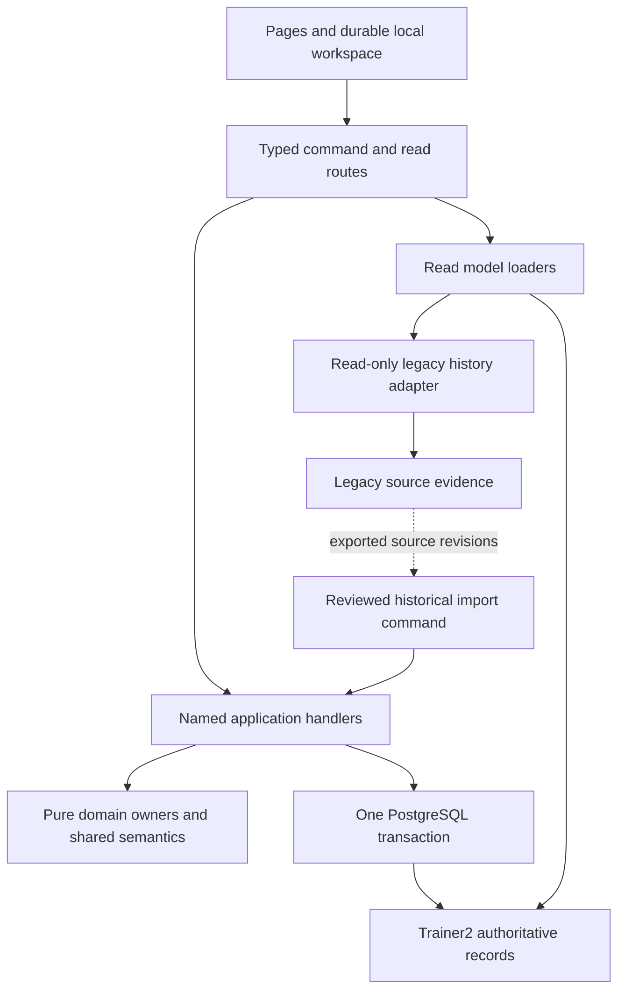
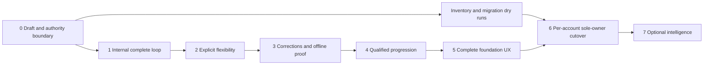

# Trainer App 2.0 — Implementation Architecture and Phased Delivery Plan

Implementation update, September 9, 2026: the first local Draft slice is implemented as documented in [DRAFT_SLICE.md](DRAFT_SLICE.md), with evidence in [DRAFT_ACCEPTANCE.md](DRAFT_ACCEPTANCE.md). That document is canonical for actual supported behavior and the four targeted clarifications: a separate committed outcome cursor; full immutable versioned command-envelope binding; ordinary deletion as a tombstone; and `HISTORICAL_IMPORT` versus `VERIFIED_START` capture provenance. These clarifications supersede conflicting abbreviated sketches below. The rest of this plan remains proposed future work, and Phase 0 is not complete. Exact hash-verified source documents are archived alongside this file; the original external paths below identify their provenance.

## 1. Status / executive recommendation

**Implement a modular monolith inside the existing Next.js application, with new domain command APIs and an additive, separately owned persistence model.** Replace live planning, lifecycle, execution, evidence, correction, synchronization, goals, and recommendation authority. Retain the delivery foundation and extract narrowly qualified mechanics. Use one PostgreSQL transaction for each strongly coupled acceptance set. Do not introduce services, a message broker, a generic workout-save API, or full event sourcing.

This is a proposed implementation design, not implemented behavior or deployment approval. Inspection was read-only; this document is the sole output, outside the repository. No application code, tests, migrations, branches, database contents, or provider state were changed. No test suite was run.

Authority, in descending order:

1. [Final product blueprint](<C:/Users/aabloch/Downloads/Trainer-App-2.0-Blueprint-FINAL (1).md>), September 9, 2026, second adversarial revision. SHA-256 `5FC72877DC2E1103DC8A199EBC791ED6E149B4CEBF11955CF949CD92C2023094`.
2. [Domain architecture](C:/Users/aabloch/Downloads/TRAINER_APP_2_DOMAIN_ARCHITECTURE.md). SHA-256 `174501628F254383389C867F2D08519D30E1A0B433CADBC922665FF7E4DFE547`.
3. [Repository gap analysis](C:/Users/aabloch/Downloads/TRAINER_APP_2_REPOSITORY_GAP_ANALYSIS.md). SHA-256 `07A47F6AE9F05EC3A11AF0E691516934C33AB6AEC370EF5016D1E17B3700A879`.

References B§n, A§n, and I01–I54 refer to blueprint sections, architecture sections, and architecture invariants. The blueprint's filename suffix is intentional: it is the exact file/hash selected by the architecture and gap analysis. Repository inspected: `C:/Users/aabloch/claude/vibe-coding/Trainer`, HEAD `eb1b45e9c516d14e8857e5b028f2be13233619cd`, clean working tree, September 9, 2026; same revision as the gap analysis. Actual deployed revision, database population, roles, known devices, and provider configuration were not inspected.

**Delivery decision:** Phases 0–5 are internal build milestones, not independently releasable partial products. B§32 requires offline continuation, corrections, restrictions, measurement meaning, and foundation progression in the first usable release. Phase 6 admits users only after those gates pass and their account's cutover boundary is established. New training never runs partly under each system. A draft-only preview can precede cutover; live 2.0 training cannot.

## 2. Implementation principles

1. One live owner per fact and per account from the first enabled write. Compatibility reads carry source labels and cannot prescribe, resolve, or correct new work.
2. Planning owns authored future intent. Execution & Evidence owns every started prescription, subsequent session adjustment, and actual assertion. Finishing does not move evidence into a second history owner.
3. Identity follows the explicit operation. Editing keeps identity; remove-and-introduce and copying allocate new identities. Sequence, dates, labels, and content hashes never identify occurrences.
4. Immutable full intent revisions and assertion versions preserve history; mutable heads select effective versions. This is ordinary transactional state with retained versions, not a universal event stream that must be replayed to open the app.
5. Consequential preview acceptance uses exact identities and relevant versions. Changed selected scope refreshes the whole action. A combined edit never silently narrows.
6. Finish, completeness, intent disposition, and delivery status are different facts. Partial finish resolves; unknown is not omitted; removal is not skipping; provisional finish does not release the open execution.
7. Retain original units, conventions, actual exercise, and temporal precision with evidence. Unknown source meaning remains unknown even when that excludes automation.
8. Read models compute and explain. Commands validate and mutate. Historical presentation records preserve what was shown without owning current eligibility.
9. Operational gates and authenticated account scope precede persistence. New runtime has no permission to update legacy training tables.
10. Extract only after documenting assumptions and replacing legacy input contracts. Current numeric outputs and fixture parity do not define 2.0 policy.

## 3. Proposed module/topology design

Use the installed Next.js/React/TypeScript, Prisma and PostgreSQL foundation. The inspected app already keeps DB-backed orchestration in `src/lib/api`, pure policy in `src/lib/engine`, and thin routes. Preserve that convention with a `trainer2` namespace; the existing `planning/v2` name refers to a retired generator and must not identify this product.

```text
trainer-app/
  src/app/trainer2/                    pages: home, plans, execution, history, recovery
  src/app/api/trainer2/
    plans/...                         typed, named command routes and read routes
    occurrences/...                   start / skip / undo-skip
    executions/...                    start / sets / adjustments / finish / undo
    recommendations/...               present / accept / override / dismiss
    direction/...                     goals, instructions, exceptions
    sync/...                          transport batches, outcomes, recovery
  src/components/trainer2/            editor, logger, scope preview, reconciliation
  src/lib/api/trainer2/
    planning/                         command handlers and transactional planning writes
    execution/                        command handlers and transactional evidence writes
    direction/                        instruction and goal commands
    catalog/                          prospective exercise/equipment commands
    recommendations/                  presentation and acceptance handlers
    reads/                            Home, history, review and eligibility loaders
    sync/                             inbox, dispatch, dependency and conflict handling
    migration/                        reviewed historical import acceptance only
    acceptance.ts                     account lock, action outcome, transaction plumbing
  src/lib/engine/trainer2/
    planning/                         validity, scope, lifecycle consequence, copy rules
    execution/                        adjustment and assertion validation
    measurement/                      values, representation, comparison predicates
    direction/                        instruction applicability
    recommendations/                  versioned double/rep progression
    analytics/                        declared workload and evidence calculations
  src/lib/session-semantics/trainer2/  pure capture, completeness and resolution vocabulary
  src/lib/trainer2-contracts/          transport schemas, IDs, versioned persisted DTOs
  src/lib/trainer2-local/             IndexedDB workspace, journal, restore, sync client
  src/lib/db/trainer2/                narrow query helpers, lock/constraint mapping
  src/lib/legacy-history/             read-only source adapters; no runtime generation
  src/lib/operations/                 existing gate + future runtime ownership fence
  prisma/schema.prisma                additive Trainer2* models; existing models untouched
  prisma/migrations/                  later reviewed schema/constraint migrations
  scripts/trainer2/                   inventory, import dry-run, discrepancies, local DB tests
```

These are proposed paths, not files created by this task. Do not precreate every empty directory in Phase 0.



Dependencies point inward: UI → contracts; routes → application; application → pure policies and persistence; policies → plain values only. Read loaders may call shared pure classifiers, never command handlers. Domain owners expose small in-transaction functions for coupled operations; the coordinating named handler owns commit. For example, `finishExecution` calls Execution's finish mutation and Planning's closure consequence in the same transaction. Planning cannot edit set evidence, and Execution cannot amend a future plan outside an explicit combined handler.

There is no generic repository framework, plugin command bus, or shared mutable “workout” model. The sync endpoint is a whitelist transport dispatcher to the same named handlers, not a second semantic API. Import adapters return source facts and confidence; only import commands can admit them into Execution & Evidence.

Use server-side Prisma for new data. No browser Data API mutations, Realtime-based acceptance, or provider-specific distributed synchronization is necessary. Proposed new tables use explicit `Trainer2` names in the existing schema to minimize ORM reconfiguration; deny browser database roles access and enable RLS if the schema is exposed by Supabase. Use a dedicated least-privilege server role for new runtime writes and a separate read-only legacy adapter connection/role. Deployment must verify the actual grants; a naming prefix is not isolation. No existing privileged credential is assumed safe by virtue of current configuration.

Authentication resolves a verified server principal to the existing stable User ID through a unique issuer/subject mapping. A browser-supplied account ID is checked, never trusted. The prototype `OWNER_EMAIL`/`owner@local` lookup is not an authentication mechanism. Local development can have an explicitly isolated development principal; hosted writes must fail closed without a verified identity. Authentication provider wiring must be tested with the deployed access model before user admission; this plan does not require changing providers.

## 4. Target persistence model

### 4.1 Representation choices and shared rules

Table names below omit the `Trainer2` prefix. New rows use opaque UUIDs, `accountId`, action provenance, and owner-scoped foreign keys. Existing catalog source IDs can be text in mappings even if not valid UUIDs. Numeric evidence uses PostgreSQL `numeric` / Prisma Decimal, transmitted as decimal strings; preserve entered units and values without rounding on write. Times use `timestamptz` for known instants and separate `date`, IANA timezone, precision/confidence fields for training attribution. Never fill an unknown instant with midnight.

Use immutable **full PlanRevision documents** for finite authored structure and immutable **full ExecutionPrescriptionRevision documents** for captured/adjusted session intent. Their normalized identity registries provide foreign-key anchors; they contain no competing current prescription values. Full documents keep original/revised review simple without a custom event replay engine. Finite plans and single-session prescriptions are small enough for this foundation design; measure actual size before introducing normalized revision children or deltas.

Each document has a strict versioned schema, canonical content hash, explicit IDs, complete measurement captures, and source revisions. Validation verifies duplicate IDs, ownership, relationships, and every reference. Identity tables and document heads change in the same transaction. A deferred database seal/constraint check verifies structural references and same-owner membership before commit; immutable revision tables reject update/delete and late child association. Domain validation supplies the detailed product rules. Hash equality provides integrity, not identity or authorization. No JSON numeric content is silently coerced, and no unknown document version is accepted as current.

Deletion codes used in every row below:

- **P:** preserve; normal commands cannot hard-delete. Corrections append versions/exclusions. Dedicated separately authorized personal-data erasure is a different workflow and must cover provenance, local exports, and retry tombstones coherently.
- **A:** archive/retire prospectively; referenced historical versions remain.
- **D:** ordinary deletion of a never-activated draft is a tombstone hiding it from normal views while retaining root identity, full revisions, stable registries and durable action outcomes. No retried create/edit may resurrect it. Physical erasure is a separately authorized workflow. Once activated, P applies.

All immutable versions carry creator/action, recorded time, previous-version/source reference and reason where supplied. Effective head changes require CAS. Mutable state is limited to heads, lifecycle, delivery processing and explicit archival flags; old payloads cannot be overwritten. Tables are introduced by the phases that use them, not all at once.

### 4.2 Account, planning and reuse

| Table/entity | Authoritative purpose and owner | Primary identity and relationships | Mutable versus immutable; provenance | Delete |
| --- | --- | --- | --- | --- |
| AccountPrincipal | Verified external principal → account; access infrastructure | UUID; unique `(issuer, subject)` → existing User | Binding changed only through deliberate account administration, audited; never client email guessing | P |
| AccountWorkspaceKey | Recover encrypted pending workspace after authenticated sign-in; Sync/access infrastructure | Composite `(accountId, keyVersion)` → User | Immutable server-wrapped account data key and wrapping-key version; rotation adds a version and retains decryptability until old pending journals migrate. Plaintext keys never enter action/export metadata | P; explicit erasure separate |
| AccountTrainingState | Serialization point, runtime ownership and freshness counters; acceptance infrastructure | PK accountId → User; `runtimeOwner=LEGACY/FENCED/TRAINER2`, `ownershipEpoch`, `acceptedSequence`, `evidenceEpoch`, `instructionEpoch` | Explicit transitions/counters mutable under row lock; ownership transition audit immutable. Contains no current-plan/open-execution pointer | P |
| Plan | Intent root and lifecycle; Planning | UUID + account; heads to current and initial-approved PlanRevision; optional copied-source revision/import artifact | Lifecycle enum Draft/Active/Paused/Completed/ConcludedEarly, CAS revision, current head mutable; identity/origin and initial-approved pointer fixed after activation | D/P |
| PlanRevision | Complete authored intent at a revision; Planning | UUID; unique `(planId, revisionNumber)`; parent revision, accepted action | Immutable full structure, objectives-as-approved, ordered stages/occurrences/positions, prescriptions, groups, counterparts, endpoint and amendment before/after scope. Draft edits also append; initial approval identifies one version | P while root retained |
| ProgrammedStage | Stable plan-owned stage identity | UUID → Plan; first-created revision | Identity/plan immutable; name, order, deload/purpose and assigned progression context live only in each PlanRevision | D/P |
| PlannedOccurrence | Stable intended session and disposition; Planning | UUID → Plan; first-created revision; historical origin if copied/repeated | Identity/owner fixed; disposition Retained/Removed/NotPursued and effective skip-decision pointer mutable with CAS/provenance. Sequence/date/stage/prescription only in PlanRevision. No independent finished/resolved boolean | D/P |
| ProgrammedPosition | Distinct exercise position identity; Planning | UUID → occurrence/plan; source-position provenance nullable | Identity/occurrence fixed; exercise, role/order and targets in PlanRevision only. A deliberately continued position can change exercise; removed identity never reused | D/P |
| CounterpartRelationship | Explicit within-plan future-edit relationship identity; Planning | UUID → Plan; membership is explicit position-ID list in each PlanRevision | Identity fixed; membership evolves only in reviewed revision. No comparison or progression authority | D/P |
| ProgressionGroup | Explicit authored group identity; Planning | UUID → programmed position; plan owned | Identity fixed; selected method/versioned parameters, required target IDs and role in PlanRevision. Top/back-off are distinct groups. Cross-session qualification is separately evaluated | D/P |
| PrescribedTarget (owned value) | Individually addressable planned set/work target; Planning | UUID within PlanRevision, bound to ProgrammedPosition and optional group | Immutable per revision: classification, requiredness, supported measurement, ranges, effort/rest. Continuing target retains ID; added target new ID; removed target stays in earlier versions. No target table needed until cross-row querying warrants it | P with revision |
| PlanDecision | Irreducible lifecycle/skip/removal history; Planning | UUID → Plan, action; optional occurrence; prior decision | Immutable decision kind, previous/new lifecycle or disposition, endpoint revision, prior Active/Paused state, closing trigger, unfinished execution IDs at closure. Plan/occurrence heads select effective decision; decision is never edited | P |
| ResolutionCorrection | Audit relationship for atomic undo; Planning/Execution each own their effects | UUID → action + original finish/skip/closure decisions and affected execution/occurrence | Immutable reviewed effects, expected bases, prior state restoration or historical-only correction. No separate authoritative lifecycle column | P |
| Template (deferred authoring table) | Independently owned reusable intent; Reuse | UUID + account/shared catalog scope; current version head | Archive/head mutable; versioned copied-intent document immutable. Prior-plan copying does not require this table in foundation; introduce only with template authoring | A |
| TemplateVersion (deferred) | Historical copy source; Reuse | UUID → Template | Immutable independent structure; copies allocate all destination IDs and do not inherit exception grants | P |

Plan amendment is the `PlanRevision` change metadata plus associated `PlanDecision` when lifecycle/disposition changes; do not create a third mutable amendment object. A stage registry entry alone is not an obligation. A rest day is stage/scheduling annotation, not an empty executable occurrence.

### 4.3 Execution and evidence

| Table/entity | Authoritative purpose and owner | Primary identity and relationships | Mutable versus immutable; provenance | Delete |
| --- | --- | --- | --- | --- |
| WorkoutExecution | One concrete session, including standalone/imported; Execution & Evidence | UUID + account; optional sourceOccurrenceId, repeat/source-copy provenance; starting and current prescription heads; context head | State Open/Finished/Discarded and CAS/state revision mutable; starting head, identity and source fixed. Source link has ordinary or discarded-attempt meaning. Import/recovered historical execution is created Finished, never Open by default | P |
| ExecutionPrescriptionRevision | Durable starting or deliberately adjusted prescription; Execution | UUID → execution, revision number; predecessor/action; kind START/ADJUSTMENT | Immutable full session document: session position/target/group IDs, planned source IDs, source PlanRevision, labels, assigned stage, measurement/equipment, requiredness, targets and presented guidance references. START exactly once; no query to mutable Plan needed to resume | P |
| SessionPosition | Identity for captured/added/substituted work; Execution | UUID → execution; optional ProgrammedPosition source; optional replaced SessionPosition | Identity/lineage immutable; prescription content and intended order in execution revision. Added exercise has no programmed source. Substitution creates a distinct position, preserving actual prior sets | P |
| ExecutionTarget | Addressable session work identity; Execution | UUID → execution/session position; optional source prescribed-target UUID | Identity and source immutable; definition in execution revisions. New adjusted targets receive new IDs; removed targets persist for historical denominators | P |
| ExecutionGroup (owned value) | Captured explicit group role/configuration; Execution | New UUID within execution prescription, optional source ProgressionGroup ID | Immutable per prescription revision; target membership, method, role, measurement and qualifying structure. Standalone targets may define groups without invented planned lineage | P with revision |
| SessionAdjustment | Explain explicit today intent change; Execution | UUID → action, execution, before/after prescription revision | Immutable exact affected target IDs, changes, replacement links, scope, reason, relevant instruction knowledge; no numeric performance. Full resulting revision avoids replay dependence | P |
| ExecutionContextRevision | Correctable session time and structured context; Execution | UUID → execution; previous version/action | Immutable training date/timezone/precision, known start/finish, interruption/active-time facts, explicit illness/pain/return context, notes; mutable head only on execution | P |
| PerformedSet | Identity and effective evidence head; Execution | UUID → execution/session position; current SetAssertion ID | Identity fixed; head mutable by CAS. Actual exercise/target association is in assertion, so explicit corrections can repair assignment without changing set identity | P |
| SetAssertion | One version of a performed assertion or erroneous exclusion; Execution | UUID → PerformedSet, previous assertion, action | Immutable actual exercise/variation, original quantity/unit/convention, effort as recorded, classification, optional target ID, performed time/order and evidence confidence; `excluded` version retains original. A correction may add forgotten sets under new set IDs | P |
| Omission | Explicit not-performed assertion head; Execution | UUID → execution/ExecutionTarget; head version | Identity fixed; head mutable; at most one effective omission per target. Never created merely by Finish | P |
| OmissionAssertion | Version of omission/retraction; Execution | UUID → Omission, predecessor/action | Immutable assertion and optional reason; retraction preserves prior meaning. Log-vs-omission disagreement is reconciled, not overwritten | P |
| EvidenceCorrection | Explain accepted evidence changes; Execution | UUID → action/execution; changed set/context/omission assertion IDs and prior versions | Immutable correction purpose, bases, replacements/exclusions, actor and source. Ordinary in-session edits also retain assertion history; finished corrections are explicitly labeled | P |
| ExecutionResolution | Finish/discard/undo provenance; Execution | UUID → execution/action, prior resolution; optional ResolutionCorrection | Immutable finish dependency manifest and state transition, captured completeness basis, performed finish time and acceptance time. Execution state is maintained with this record; no separate mutable finish flag in Planning | P |

Ordinary execution link is unique per occurrence excluding explicitly Discarded empty attempts. Discard retains its attempted source and immutable start capture but releases ordinary claim. Discard requires absence of effective evidence and of known unresolved recoverable work; unknown late actions are reconciled, never admitted as evidence to a discarded attempt automatically.

### 4.4 Catalog, direction, advice, delivery and migration

| Table/entity | Authoritative purpose and owner | Primary identity and relationships | Mutable versus immutable; provenance | Delete |
| --- | --- | --- | --- | --- |
| Exercise | Prospective catalog/custom identity; Exercise & Measurement | UUID, shared or account-owned; stable source mapping | Current name/description/aliases/descriptive attributes and revision mutable; archival explicit. No universal progression/comparability boolean | A |
| ExerciseVariation | Distinct catalog variation identity | UUID → Exercise, same ownership | Prospective description/measurement defaults mutable by revision; historical assertions capture actual variation meaning | A |
| MeasurementDefinition | Supported measurement schema/default version; Measurement | UUID with schema/policy version; exercise/variation may reference | Immutable version, dimensions, load kind/convention, rep basis, valid zero and allowed units; supersede prospectively | P |
| EquipmentContext | User/shared setup identity and prospective values; Measurement | UUID; current EquipmentVersion | Identity stable; version head/archival mutable; generic equipment type alone is not machine identity | A |
| EquipmentVersion | Recorded setup and actual supported steps | UUID → EquipmentContext | Immutable mechanism, setup qualifiers, units/convention, ordered supported values or unknown; advice captures this exact version. No fabricated default increment | P |
| DirectionRevision | Cross-plan manual direction/preferences/context; Goals & Constraints | UUID + account, previous/action | Immutable text and explicitly structured preferences/context; effective head selected by latest accepted account direction change. Notes never become commands | P |
| TrainingPriority | Explicit emphasis identity and current version; Goals & Constraints | UUID + account; version chain stored as immutable revisions | Priority order/content retirement explicit; plan captures approved version/meaning. Not an achieved outcome | A/P |
| Milestone | Criterion identity and version head; Goals & Constraints | UUID + account; criteria revisions | Head/retirement mutable; each revision immutably captures exercise, measurement, reps/conditions, performed/estimated type. No persisted achieved boolean | A/P |
| MilestoneAcknowledgement | Deliberate manual acknowledgement | UUID → milestone criterion revision/action | Immutable acknowledgement/retraction history, distinct from automatic evidence | P |
| Restriction | Explicit practical constraint/exclusion identity and version head; Goals & Constraints | UUID + account; typed scope profile/plan/session/work IDs | Immutable instruction revisions contain kind, scope, validity, authored meaning; clear creates a revision. Exclusion versus approximate planning concern explicit | A/P |
| ScopedException | Named, version-bound narrow authorization; Goals & Constraints | UUID → restriction revision, explicit plan/session/position scope/action | Immutable grant and revocation/supersession record; applicability checks time and exact version. Never inherited by copy | P |
| Recommendation | What was actually presented; Recommendations | UUID + account; target scope/versions, policy ID/version and evidence fingerprint | Immutable presentation payload, reason, candidate and captured inputs; disposition head/revision mutable. Applicability is computed, not a permanent valid bit | P |
| RecommendationEvidence (owned value) | Reproducible historical basis | Explicit evidence identity/version references in Recommendation document | Immutable relevant values/meaning, dates, excluded/intervening context, equipment and instruction versions; no duplicated current evidence table | P with presentation |
| RecommendationDisposition | Accept/override/dismiss decision | UUID → recommendation/action; preceding disposition | Immutable decision, chosen alternative and exact adjustment/amendment ID. Competing dispositions require CAS; acceptance and target mutation one commit | P |
| DurableAction | Stable submitted intent and authoritative outcome; Sync | PK `(accountId, actionId)`; device, dependency IDs, subject IDs | Envelope/hash/base versions immutable. Processing status Waiting/Accepted/Rejected/Conflict/Superseded and outcome version update under lock; accepted result/sequence fixed. Keep identity/hash/outcome for record lifetime, no expiry that allows re-execution | P |
| ActionConflict | Recoverable competing input/reconciliation | UUID → DurableAction(s), subject and competing accepted versions | Original conflict facts/values immutable; resolution-action pointer/status mutable. New reconciliation action records explicit choices, cannot edit original envelope | P |
| RecognitionDelivery | Nonrepeating delivery/dismissal; Presentation | Unique `(accountId, kind, subjectId, recognitionKey)` | Claim/delivered/dismissed stages and review UI position mutable through repeat-safe actions; identity persists through undo/refinish. No milestone/closure truth stored here | P |
| MigrationBoundary | Cutover source snapshot and coverage claim; Migration | UUID + account, ownership epoch | Immutable export hash, cutoff/source coordinates, writer fence proof, known devices/omissions; later reconciliations append reports, never broaden original claim silently | P |
| SourceArtifact | Original export/plan/prescription/evidence provenance; Migration | UUID; source system/account, artifact kind, content hash | Immutable original payload or secured export reference with verified hash, source era and observed time; no future obligations | P |
| ImportRecord | Stable source identity → destination identity | UUID; unique source system/account/entity/sourceRecordId; optional destination execution/set | Mapping established once; latest reviewed source-revision pointer changes by CAS. No fuzzy matching; target corrections remain Execution-owned | P |
| ImportRevision | Observed source revision and disposition | UUID → ImportRecord/source artifact; unique source revision token | Immutable raw source, confidence, destination base version, proposed mapping; review/import/exclusion decision linked by action. Later source correction adds revision and compares destination edits | P |

TrainingPriority, Milestone and Restriction each have their own physical `*Revision` table with UUID, owning root FK, revision number, prior revision, action and immutable typed payload; root stores the effective head. They are not a shared generic entity/value store. Direction needs one account head (on AccountTrainingState) if indexed latest lookup is undesirable; choose one representation, never two. Foundation default is an explicit direction-head FK on AccountTrainingState with no copied direction contents.

### 4.5 Constraints, indexes and access

- Partial unique index on Plan(accountId) where lifecycle in Active/Paused. Partial unique index on WorkoutExecution(accountId) where state=Open. Partial unique occurrence link where source exists and execution is not Discarded. SQL migration owns indexes unsupported by declarative ORM representation; schema verification checks them.
- Composite `(accountId,id)` keys/FKs prevent cross-account parent/child association. Shared catalog references are separately validated as shared or owned; user identity never changes on update.
- Unique action IDs, `(root,revisionNumber)`, one START revision per execution, unique source-record/source-revision mappings and recognition keys. Heads must reference a version of the same root; deferred checks handle root/version creation cycles.
- Effective set target claims and omissions cannot both occupy the same target. Validate under the account lock, with deferred DB constraint checks joining effective heads. Distinct extra sets are allowed with no target claim. A log and omission targeting the same work become a conflict.
- Index executions by account/training date, set assertions' effective exercise and parent heads, occurrences by plan, imports by source key, and waiting actions by account/status. Load finite PlanRevision to select order; do not introduce a denormalized scheduling index as authority.
- New app role writes only new owned tables through application handlers; read role cannot write. Immutable record protection covers UPDATE, DELETE, reassignment and unsealed graphs. Avoid cascades that erase performance through Plan/catalog deletion.
- No `PlanHealth`, `ProgressionReady`, `CurrentPR`, `NextWorkout`, `WorkoutCompleteness`, or inferred “resolved” authority tables. Cache only after measured need, with source versions and a recomputable contract.

## 5. Identity representation

Use random opaque UUIDs generated once at user action creation for local sets, targets, positions and actions; server-created IDs are retained in the saved action result. UUID generation is not ordering. The versioned canonical command-envelope hash binds command type/schema, action ID, account, originating device, ownership epoch, explicit targets, expected bases, ordered dependencies and complete intent. No envelope fields are excluded; only external nonsemantic transport metadata is outside binding. Preserve decimal strings and ordered arrays. Preserve the original submitted envelope unchanged; dependency resolution uses separate derived data. Reusing an action ID with any changed bound field is rejected without changing the original action/outcome. Copies use new Plan/stage/occurrence/position/group/target/counterpart IDs and an explicit old→new map retained as provenance. Exception grants, performance, completion and runtime accepted load decisions are not copied.

Example: Plan P contains occurrences O1/O2, each with positions A and B of the same exercise. Relationship R explicitly connects O1.A to O2.A. Reordering B before A changes only order. Replacing future A previews O2.A by ID, not every exercise match. Start of O1 creates execution E, session position EA, execution targets ET1–ET4 and a captured group G. Logging set S explicitly claims ET1. Substituting remaining work creates EB and new targets linked to the replaced remaining target scope; S continues to mean the original exercise. An extra set has its own UUID and no guessed target. Future O2 changes never touch E's START revision.

Plan resolution is `effective skip OR ordinary linked execution.state == Finished`. Pending means retained/no skip/no ordinary execution on a nonterminal plan; Active is additionally required to start. Removed/NotPursued are separate dispositions. Plan closure retains the causal decision and prior nonterminal state; zero pending alone cannot distinguish completion from removed intent.

## 6. Command/application model

### 6.1 Common interface

Every mutation has a named handler and a strict command-specific payload. HTTP routes may use resource paths, but no payload accepts arbitrary nested Workout state, lifecycle flags, or unrestricted metadata. For example, `POST /api/trainer2/executions/{id}/finish` accepts a Finish command; a set route accepts a Log/Edit/Remove command, never “save everything.”

```typescript
type CommandEnvelope<T> = {
  schemaVersion: 1;
  actionId: UUID;
  originatingAccountId: UUID; // must match server principal; never grants ownership
  deviceId: UUID;
  ownershipEpoch: number;
  dependsOn: UUID[];
  observedExecutionSequence?: number;
  expected: {
    planRevisionId?: UUID;
    planStateRevision?: number;
    executionStateRevision?: number;
    prescriptionRevisionId?: UUID;
    assertionHeads?: Record<UUID, UUID>;
    instructionEpoch?: number;
    recommendationRevision?: number;
  };
  intent: T;
};
type CommandOutcome =
  | { status: "accepted"; actionId: UUID; sequence: number; result: unknown }
  | { status: "waiting"; actionId: UUID; missingDependencies: UUID[] }
  | { status: "conflict"; actionId: UUID; conflictId: UUID; details: unknown }
  | { status: "rejected"; actionId: UUID; code: string; details: unknown };
```

Actual result types are command-specific discriminated schemas, not `unknown`; the sketch abbreviates them. Server acceptance time is separate from client performed time. Offline references can identify an expected version by the predecessor action ID until its server assertion ID is known; dependency resolution translates that reference without rewriting the submitted intent.

Common to **every row below**: verified account ownership; classified operational gate; appropriate runtime epoch; stable action identity **K** = `(accountId, actionId)` plus immutable canonical intent hash; successful action and domain writes commit together. Replay returns the original result before applying current-version checks, after authorization; historical result includes its acceptance version, so a replay does not imply current state is unchanged. Waiting actions may advance when dependencies arrive; rejected intent changes require a new action. All mutations invalidate the named reads through current version/epoch changes, not background source edits.

Preview is a read response containing exact affected IDs, source versions, restriction versions, policy version, endpoint effects and a canonical digest. Acceptance recomputes/validates that scope; a client hash is not proof. Foundation uses conservative whole-Plan revision CAS for future edits. Execution edits use touched target/position/set bases so independent additions can merge. IDs shown in preview are the IDs applied, including newly allocated copy/restructure IDs.

Read invalidation shorthand: **P** Home/position/original-revised/programmed workload/plan review; **X** Resume/completeness; **H** effective history/calendar/PR/milestone evidence; **G** current recommendation/progression applicability; **C** constraints/review; **D** delivery/suppression. All read acceptance paths independently revalidate.

### 6.2 Planning commands

All below use K and an account-serialized transaction; “base” identifies the additional optimistic scope. None enables offline future-plan mutation.

| Command and request intent | Authoritative validation and base | Transactional records/effects | Conflicts/errors; invalidated reads |
| --- | --- | --- | --- |
| Create Plan `{planId, structure, objectiveVersions}` | Representable draft, owned catalog references and distinct explicit IDs; no base for new root. Draft may be incomplete but reports activation blockers | Plan Draft + registries + first PlanRevision + K outcome | Duplicate ID with another action, foreign references, malformed structure; P/C |
| Copy Plan `{sourcePlanRevisionId, newIds, intendedCopy}` | Source readable; exact source revision; copy authored intent only, current constraints shown; deliberate selection of prior vs revised source | Independent Draft graph + copy mapping/provenance + K. Do not copy today's accepted loads or source outcomes | Source unavailable, incompatible version, mapping ambiguity; P/C |
| Edit Draft `{planId, operations}` | Draft lifecycle and exact PlanRevision; explicit add/edit/remove/reorder IDs; schema validity | New complete PlanRevision and new identity rows if needed; advance head | Activated/stale draft, reused IDs; P/C |
| Activate Plan `{planId, reviewedDigest}` | Exact draft, current instruction versions, hard validity, at least one executable occurrence, no other Active/Paused Plan; explicit exceptions for exclusions | Set initial-approved/current revision, Active lifecycle + PlanDecision, K. Existing open execution does not block activation after previous plan ended | Current-plan conflict, stale review, invalid targets, unresolved exclusion; P/C/D |
| Edit Future Occurrences `{scopeIds, operations, preview}` | Active/Paused plan; all selected retained pending and unchanged; explicit counterpart-derived or manual scope; whole plan revision/state bases | One revised intent + disposition decisions for removals + new IDs for additions + endpoint consequence + K | Any started/skipped/removed/stale selected item refreshes whole scope; C/P/G |
| Edit Today and Future `{executionScope, futureScope, operations, preview}` | Open execution, exact touched prescription/assertion bases, future scope all eligible, same intended plan relationship, restrictions for both | ExecutionPrescriptionRevision + SessionAdjustment AND PlanRevision/amendment/endpoint decisions + K | Failure in either scope aborts both; pending local work must first synchronize or be included/reconciled; X/P/G/C |
| Restructure Remaining Plan `{explicitContinuations, additions, removals, stageMap, counterpartMap, preview}` | Active/Paused, exact pending set; open/finished work excluded; operations define continuity. Validate finite executable revised intent and preview closure cause | One PlanRevision + registries and removal/endpoint PlanDecisions. No inferred repeated identities | Stale scope/ambiguous lineage/unsupported guided operation; P/G/C. Basic explicit editing foundation; guided repeat/split/merge UI later |
| Skip Occurrence `{occurrenceIds, preview}` | Active/Paused and exact retained pending IDs, no ordinary execution. For started-empty case require coordinated Discard Empty, never implicit loss of logs | Explicit skip PlanDecision(s), skip heads, possible Completed decision preserving prior state + K | Start/log won race, work exists, stale preview; P/D |
| Pause Plan `{planId, optionalContext}` | Active current Plan, state revision | Paused + PlanDecision; preserve every occurrence, date, open execution and prescription | Invalid state/stale transition; P/C/G |
| Resume Plan `{planId}` | Paused current Plan, state revision | Active + PlanDecision; no dates/stages/targets changed | Invalid state/current membership conflict; P/C/G |
| End Plan `{planId, preview}` | Active/Paused; current state/revision and exact remaining pending/open context | ConcludedEarly + closure decision; unstarted pending → NotPursued; record unfinished-at-closure IDs; preserve open execution + K | Start/finish/edit changed preview, invalid terminal state; P/D; X display source context |

Removing the final unresolved pending work with none unfinished retained concludes early. Shortening while retaining work records revised endpoint; later last finish/skip completes. Explicit skips can complete even if all remaining sessions are skipped. Paused final finish/skip may complete and must retain Paused as undo restoration state.

### 6.3 Execution and evidence commands

All mutations use K. `Resume Execution` is a read/recovery request and creates no action or execution merely by viewing; a separate presentation acknowledgement, if needed, uses its own K.

| Command and request intent | Authoritative validation and base | Transactional records/effects | Conflicts/errors; invalidated reads |
| --- | --- | --- | --- |
| Start Occurrence `{occurrenceId, reviewedSource}` | Online; Active Plan, exact source revision and stage/target digest, restrictions, retained pending, no Open execution; account lock serializes start/skip/remove/end | New Open execution, START revision, session position/target IDs and captured groups/context, ordinary link + K | Stale preview refresh; open conflict returns resumable owned execution; no new session on lost race; P/X/G |
| Start Standalone Execution `{executionId, structureOrEmpty, sourceCopy?}` | Online; no Open; representable explicit structure and restrictions; source version when copying. Current Plan irrelevant | Same execution graph with null source occurrence + K | Open execution, unavailable source, restriction conflict; X/H only, no Plan resolution |
| Resume Execution `{executionId, localCursor}` | Owned Open server execution or already durable local workspace; reconcile latest server state when online | No domain mutation; download immutable capture and accepted actions/outcomes | Remote finish → reconciliation, not reopen; foreign/missing source blocked. Cached continuation offline allowed |
| Log Set `{setId, sessionPositionId, targetId?, actual, performedTime}` | Explicit confirmation, Open, valid captured actual meaning; target unclaimed and not omitted; dependencies on newly created position/target. Uses relevant target base, not total workout revision | PerformedSet + initial SetAssertion, affected sequence/evidence epoch + K | Target collision, incompatible adjustment, remote finalization → ActionConflict; X/H/G |
| Edit Set `{setId, expectedAssertion, correctedValues}` | Open execution for ordinary edit; exact set assertion head, known target/measurement; no silent exercise relabeling | New SetAssertion + correction context, head CAS + K | Same-set competing edit/removal, finished execution, target conflict; X/H/G |
| Remove Erroneous Set `{setId, expectedAssertion, reason?}` | Same base protections; deliberate erroneous exclusion, not erase performance to permit skip | Excluded SetAssertion + EvidenceCorrection + K; historical values retained | Stale edit/removal or finish conflict; X/H/G |
| Add Exercise Today `{positionId, exerciseMeaning, targets, groups?}` | Open; valid measurement; known applicable restrictions/exception; explicit new IDs | New session identity/targets, new prescription revision + SessionAdjustment + K | Restriction/structure conflict; X/G. No programmed source invented |
| Substitute Remaining Work `{sourcePositionId, remainingTargetIds, replacement, targetMap}` | Open; selected targets still remaining; exact touched versions; check instructions. Existing logs are not selected for replacement | New SessionPosition/targets; immutable adjustment/source map; new prescription revision + K | Selected target logged elsewhere, changed remaining scope, invalid meaning; X/G. Original sets unchanged |
| Adjust Today `{targetIds, changes, optionalContext}` | Open; exact touched bases; validate target count/ranges/classification/order/remaining scope and restrictions | New prescription/context revision + SessionAdjustment + K | Concurrent logs/removals/finish; X/G. Actual order change is explicit context/evidence order, not Plan order |
| Mark Omitted `{targetIds, expectedTargetBases, reason?}` | Open; explicit not-performed assertion; no current performed claim or unresolved contradiction | Omission + OmissionAssertion(s) + K | Log-vs-omission/changed scope; X/G. Correct Omission appends a retraction against expected head |
| Finish Execution `{executionId, includedActionIds, observedSequence, manifestDigest, performedFinish}` | Open; all included dependencies accepted or explicitly reconciled; no known unresolved relevant conflicts/unseen execution changes. Partial is valid; remaining unknown stays unknown | ExecutionResolution + context finish version + Finished; linked Planning closure consequence if applicable; release Open by state transition; K and epoch changes | Waiting dependencies; conflicting unseen work; already finished by different action requires refresh/reconciliation, not silent second acceptance; P/X/H/G/D |
| Correct Historical Evidence `{executionId, expectedHeads, corrections, reason?}` | Online; Finished; exact evidence/context versions; explicit forgotten set/assignment/time/exclusion changes. Do not require current source Plan | New assertions/context/omission versions + EvidenceCorrection + K, evidence epoch change; no state/source-link change | Stale correction, conflicting late work, uncertain time surfaced; H/G/X/P review only, no lifecycle effect |
| Undo Finish `{executionId, originalFinishId, reviewedEffects}` | Online; same Finished execution; no other Open; exact finish/plan state. If its finish caused automatic completion, no other current Plan before restoration | Same execution Open + resolution correction/provenance; remove effective finish resolution; restore causal auto-completed Plan to prior Active/Paused when eligible; K | Other Open/current Plan, stale closure cause; all-or-none. ConcludedEarly stays closed, standalone has no Plan effect; P/X/H/G/D |
| Undo Skip `{occurrenceId, skipDecisionId, preview}` | Online; exact effective skip, no ordinary execution. Nonterminal or causally auto-completed restoration obeys current-plan exclusivity | ResolutionCorrection + superseding PlanDecision; Pending for eligible live Plan; on ConcludedEarly historical correction + NotPursued, no live obligation | Ordinary execution/current-plan conflict/stale skip; P/D |

Additional required narrow commands: **Discard Empty Execution** (online, no effective or known queued/conflicted work, records Discarded and releases ordinary link without resolving); **Reconcile Actions** (new K naming conflicting actions/versions and explicit chosen result); **Recover Distinct Historical Execution** (online, explicit late-work classification, new Finished standalone historical identity, no open/current-plan effect). These are necessary foundation recovery interfaces, not a generic save escape hatch.

Undo is limited to the restoration cases in B§18. A completed Plan whose closure was not caused by the selected finish/skip cannot be reopened through a generic lifecycle setter. Such historical mistakes use evidence/resolution annotation where supported; expanding undo semantics would require product clarification, not an invented reopen command.

### 6.4 Recommendations and instructions

| Command and request intent | Authoritative validation/base | Transactional records/effects | Conflicts/errors; invalidated reads |
| --- | --- | --- | --- |
| Present Recommendation `{target, candidateBasis}` | Compute candidate from current authoritative inputs; exact policy/evidence/target/instruction/equipment versions; suppress unchanged dismissed presentation | Immutable Recommendation/evidence record committed before consequential card is shown; K outcome | Basis changed → recompute; no target/performance effect; D/G |
| Accept Recommendation `{recommendationId, explicitScope}` | Current presented disposition revision; exact target and evidence applicability rechecked, restrictions pass. Online foundation acceptance; offline manual adjustment remains available | RecommendationDisposition + owner's SessionAdjustment or reviewed PlanRevision in one transaction + K | Stale basis/target, competing disposition, scope/restriction conflicts; G/X or P, D |
| Override Recommendation `{recommendationId, alternative, explicitScope}` | User-selected valid alternative, same target version/instruction checks; stale advice may be acknowledged historically but cannot bypass fresh scope review | Immutable override disposition + explicit target mutation + K | Known conflict cannot be overridden implicitly; G/X or P, D |
| Dismiss Recommendation `{recommendationId, dispositionRevision}` | Owned presentation, exact disposition | Dismissal + K; suppress unchanged fingerprint | Competing acceptance/dismissal → reconcile; D, no target mutation |
| Add Restriction `{id, kind, instruction, scope, validity}` | Explicit user instruction, supported scope; no diagnosis inference; account instruction epoch | Root + immutable revision + epoch increment + K | Conflicting instructions surfaced; no retrospective evidence deletion; C/G |
| Clear Restriction `{id, expectedRevision}` | Explicit clearing of exact instruction | New cleared revision/head + epoch increment + K | Stale instruction requires refresh; C/G |
| Add Scoped Exception `{restrictionRevisionId, selectedWork, validity, decision}` | Named current restriction, exact narrow scope/time; no inheritance. Online broad grants; local session-only grant may accompany offline today action | Exception authorization + K, and associated today adjustment atomically when combined | Restriction changed/expired or scope broadened → refresh; C/G/X |

Manual direction, priority and milestone create/revise/retire commands use typed criterion/instruction payloads, expected revision, K and their owner's single transaction. `Acknowledge Milestone` explicitly records manual acknowledgement, never numeric evidence. Exercise/custom/variation/equipment commands append prospective definitions; historical assignments change only through EvidenceCorrection. `Acknowledge Recognition` and `Dismiss Review` affect delivery only. `Accept Import Revision` and `Accept Source Correction` use the migration acceptance sets in §7/§13.

## 7. Transaction and consistency design

### 7.1 Acceptance implementation

Use a Prisma interactive transaction with an account row `SELECT ... FOR UPDATE` acquired before domain reads, then consistent lock order: account → plans sorted by UUID → executions → child heads. Foundation serializes accepted commands per account, a practical low-complexity choice for one person's training. This does not mean stale independent changes are rejected: semantic bases still decide whether they can merge. Parallel users remain independent.

After the account lock, read source facts, authenticate all object references, validate explicit expected bases and dependencies, call pure policies, write the owner's records and accepted action result, increment accepted sequence/freshness epochs, then commit. No network calls, UI waits or export generation inside a transaction. Database unique/check constraints are backstops. All command writers, including instruction/catalog changes that affect account-scoped acceptance, must participate in the lock protocol; shared catalog changes use immutable definition versions so they cannot mutate a captured dependency in place. System-wide catalog retirement or policy changes use versioned availability checks with explicit locks/version CAS as needed.

Keep transactions short. Use bounded transient retries for deadlock/serialization errors with the **same K**, rereading bases each time; do not retry a semantic conflict as new intent. Connection loss after commit is recovered by outcome lookup. User decisions never happen while locks are held.

Waiting/rejected/conflicted delivery is durably recorded without changing domain meaning. An inbox transaction may store the immutable envelope first; later domain acceptance atomically commits effect + outcome. This is not partial acceptance: `received/waiting` explicitly means no domain effect. Crashes between receive and accept leave retryable input. The account lock and unique action key prevent two workers accepting it twice. Recoverable conflicts are committed as a conflict result, not lost by rolling back the only copy of submitted values.

| Strong acceptance set | Indivisible records/checks in the transaction | Permitted work outside commit |
| --- | --- | --- |
| Activate reviewed Plan | K, exact reviewed PlanRevision, current restrictions/exceptions, hard validity, unique current Plan, activation decision/initial approval | Render review beforehand; refresh invalid preview afterward |
| Start occurrence | K, no Open, Active Plan, pending occurrence, exact source, instructions, execution/START graph, ordinary link and Open uniqueness | Device persists response afterward; until then do not claim offline readiness |
| Start standalone | K, selected/empty intent, instructions, no Open, execution/capture graph with no occurrence | Same local readiness handshake |
| Today + future edit | K, both full scopes/versions/instructions, SessionAdjustment + revised capture and PlanRevision + endpoint decisions | Scope preview beforehand; no asynchronous half-application |
| Finish + resolution + closure | K and included manifest, all dependencies/conflicts, execution state/context/resolution, possible PlanDecision, Open release, evidence epoch | PR/review recalculation and celebration delivery may follow; not mandatory to finish |
| End Plan with open execution | K, Plan revision/state, pending/open scope; early closure, NotPursued decisions, unfinished-at-closure evidence | Open execution continues under its own capture |
| Undo Finish / Undo Skip | K, original decision/cause, account exclusivity, evidence-preserving correction record, execution/occurrence correction, eligible prior-state restoration | Refresh displays; never separately conclude another current Plan |
| Accept/override consequential advice | K, original presentation/disposition, authoritative evidence and current target/instructions, decision + exact owner's target mutation | Later guidance can recompute, never move accepted target |
| Accept evidence correction | K, expected assertion/context heads, conflict decision if needed, replacement/exclusion versions, provenance, evidence epoch | Qualified history/PR/milestone recalculation; original advice/delivery remains |
| Import source correction | K, unique source revision, current mapping, expected last imported destination version AND current destination head, reviewed conflict choice, evidence versions/correction, import decision and epoch | Dry-run/export/report before/after; no blind upsert |

Recognition processing is not in the finish acceptance set. It reads committed source facts and atomically claims a stable delivery identity. A render failure cannot roll back performed training. Imports can be processed in bounded per-execution transactions; a migration run is not one giant transaction. Its coverage report distinguishes accepted, quarantined and outstanding items.

### 7.2 Why any nontransactional mechanism exists

Database-to-device delivery cannot be one PostgreSQL transaction. The local journal, durable inbox, stable action outcomes and repeatable download bridge this gap. The server never treats local acknowledgement as authoritative state. No distributed commit is needed because all domain owners share one database. DurableAction is sufficient as inbox/outcome ledger; do not introduce an outbox broker solely for optional read refreshes. If future external delivery is added, its outbox must be written in the relevant transaction with a stable effect identity.

## 8. Offline/synchronization design

### 8.1 Device storage and readiness

Use IndexedDB through a small typed adapter; avoid a new sync framework. Object stores: `accountWorkspace`, `executions`, `immutableCaptures`, `actions`, `outcomes`, `conflicts`, `inputDrafts`, `syncCursor`. Every key begins with verified originating account ID; action IDs and immutable local payloads survive reload. UI state management may reuse existing React/Zustand patterns, but in-memory state is never acknowledgement.

Online start flow: durably allocate/store start K → submit → recover same K if response uncertain → save accepted execution ID, full START capture, known restrictions, server versions and local cursor in one IndexedDB transaction → confirm transaction completion → advertise offline continuation. If local storage fails after server start, say that offline readiness failed and retry capture retrieval for the same execution. Do not issue another start. Empty previews/cache entries are never executions.

The logger app shell and required static assets must also survive an offline reload. Add a narrowly scoped service worker/offline logger route with versioned static asset cache and a generic nonpersonal bootstrap; session contents are loaded only from the account workspace. Do not cache authenticated HTML/API responses in a cross-account shared cache. Cache/version migration must retain older command/capture decoders until pending journals are reconciled; an update cannot clear a queue or force an incompatible replay. Request persistent storage where supported, expose actual failures, and test installed and browser mobile modes. Background Sync is an optimization, not a required delivery guarantee; foreground/reconnect/reload retries are sufficient.

### 8.2 Local action journal

Each explicit log/edit/adjust/omit action atomically stores its immutable command plus the local derived session view in IndexedDB before showing “saved on this device.” A prefilled value or transient keystroke is a draft, not a performed assertion. Deliberate duplication allocates a new set ID and action ID even if values match. Save failure leaves input visible and unacknowledged; offer retry/export rather than clearing it.

Dependencies form a DAG: add position → log set → edit set; local session-only exception → associated prescription change; all included work → finish. Reject cycles/malformed cross-account references before accepting. Dependent local edits use predecessor action references rather than guessing server revision numbers. Retain original envelopes even after reconciliation; a new action records how a conflict was resolved or superseded.

### 8.3 Delivery and outcomes

Implementation correction: `acceptedSequence` orders accepted domain commands and execution freshness only. Every durable Waiting/Accepted/Rejected/Conflict/Superseded transition appends an immutable ActionOutcome with a separate account-scoped `outcomeCursor`, including later changes to older actions. Allocate the cursor under the account row lock in the same transaction as its transition so later cursors cannot commit past earlier uncommitted ones. Paginate the journal ascending with `after < cursor <= through`, where `through` is a captured committed high-water mark; retain that upper bound through pagination and poll afresh after draining it. The first slice implements this persistence/read primitive and explicitly rejects dependencies; sync HTTP and dependency processing are deferred. See DRAFT_SLICE.md for exact hashing and cursor contracts.

`POST /sync/actions` accepts a bounded batch of typed envelopes and returns one durable result per action. It may receive out of order; a Waiting outcome lists missing dependencies and changes no domain state. Foreground retry uses bounded exponential backoff with jitter, stable IDs and online/auth checks. Network/server-transient errors retry; validation failures and conflicts require displayed resolution, never endless invisible retry. `GET /sync/outcomes?after=cursor` plus execution snapshot refresh restores accepted state; reads have no reconciliation writes.

Server accepted sequence is monotonically allocated under the account lock. Execution-related accepted actions retain that sequence, allowing a finish to compare known changes against its observed execution frontier without conflating performed order with upload order. Independent additions with distinct target claims and compatible prescription bases can merge even if another set has been logged. Same-set edits use exact assertion bases. Two different set IDs claiming one required target are a relationship conflict, not independent additions.

### 8.4 Finish barrier and multi-device behavior

Local finish freezes an immutable manifest of included action IDs, dependencies, observed server execution sequence, effective assertion/target bases and intended performed finish time. Store it and the provisional UI state atomically. The authoritative execution remains Open. A device cannot start another workout merely because its local screen says finished.

At acceptance, require all referenced actions accepted or resolved by an explicit reconciliation action. Compare every server-known execution change after the observed frontier with the manifest's dependency closure. If additional changes are known and not acknowledged, return a finish conflict with a readable diff. The user reviews them and issues a replacement finish action depending on the reconciliation; the original is retained as superseded. This catches finish-vs-edit even where a set CAS alone would not.

There is no claim of omniscience about disconnected devices. If an unreferenced action was unknown when finish committed, its eventual arrival is durable pending reconciliation. The user chooses corrected evidence on the original execution or a distinct Finished historical standalone execution. Never append silently, reopen automatically, create a second Open session, or assign another occurrence. Valid queued work on an Open execution whose Plan was ended still synchronizes normally; subsequent finish cannot reopen ConcludedEarly.

Devices may resume the same authoritative execution online and cache it locally. An already cached device may continue offline; uncertainty about a remote finish is represented on synchronization. A second device with no accepted cached start needs connectivity to retrieve that existing execution. Logging against an obsolete assertion after a synchronized historical correction produces a conflict showing both versions, never last-write-wins.

### 8.5 Restrictions, account isolation and prolonged failure

Offline prescribing checks cached known restrictions plus explicitly authored session exceptions. When a new remote instruction is learned, surface affected remaining work and require an edit/exception before further prescribing. Preserve already recorded performance and original knowledge timestamps; late synchronization cannot claim earlier enforcement. If queued prescription intent conflicts with newly learned rules, retain it and its performed evidence for explicit reconciliation; do not reject honest performed evidence merely for violating a restriction.

On sign-out, stop sync, clear decrypted in-memory views and revoke account workspace access; do not delete pending records. Another account's UI/worker cannot list, render or submit them. IndexedDB namespacing plus account checks are mandatory; for shared-device sign-out confidentiality, encrypt account payloads with an account-specific data key wrapped for authenticated server retrieval. While the device remains signed in, retain a non-exportable local CryptoKey in its account workspace so an offline reload can decrypt acknowledged entries; an in-memory-only key would fail the recovery contract. Explicit sign-out atomically removes that local unlocked key and marks the workspace locked, while preserving encrypted records. The server retains the wrapped key in AccountWorkspaceKey for retrieval only by the originating authenticated principal. Offline continuation uses the already unlocked account workspace; unlocking after explicit sign-out requires sign-in. Do not silently let the newly signed-in account unlock previous data. This key lifecycle is part of Phase 3 browser testing, not a claim that browsers resist a compromised OS or same-origin malicious code. Key rotation retains old versions until pending journals can be decrypted and migrated; it never strands acknowledged data.

Provide an account-scoped export of pending actions, captures, conflict versions, local schema version and hashes; after sign-in it can be imported into the same account recovery flow with the same identities. Never export another account's plaintext from the current session. A long-lived queue has no TTL. Local cleanup requires server-confirmed accepted state and recoverable authoritative outcome; conflicted/pending input cannot be opportunistically evicted. App uninstall, cleared storage or destroyed device can lose unsynchronized work; storage status copy must be truthful. No offline new execution start in foundation.

## 9. Exercise/measurement/comparability design

### 9.1 Definitions versus captures

| Meaning | Catalog/default definition | Prescription capture | Performed evidence capture |
| --- | --- | --- | --- |
| Exercise/variation | Stable ID, names/aliases, descriptive movement/muscle/equipment attributes; custom entries can omit nonessential detail | Intended ID, displayed name/variation meaning and definition version | Actual ID/name/variation meaning as recorded; never inherited from a later relabeled position |
| Measurement kind | Explicit supported reps + external load, bodyweight, added load, assistance; notes for unsupported dimensions | Selected kind and numeric/qualitative target shape | Actual original value/unit and selected kind, or honest note-only assertion with no quantitative eligibility |
| Load convention | Barbell total, per implement/per hand, combined only when explicitly supported, machine displayed, added external load, displayed assistance | Chosen convention and any known implement/side/setup context | Convention at entry, known implement count/side details, optional recorded bodyweight; no implicit doubling or bodyweight addition |
| Rep basis | Supported total/per-side/alternating definitions | Explicit basis with target | Recorded basis, no inferred halving/doubling; unknown historical basis retained |
| Equipment | Setup identity, assistance mechanism and versioned supported values | Exact setup/units/convention and relevant version | Actual setup and meaning, separate from the intended setup if changed |
| Zero | Explicit per-profile validity/meaning | Zero target allowed only with stated semantics | `0` is stored zero, null is absent, unknown is confidence—not a zero. Zero assistance stays assistance; new unassisted group is deliberate |
| Effort | Supported recorded RIR/RPE definitions | Prescribed RIR lower/upper bound, distinct from actual | Actual effort kind/value when entered; missing effort never filled from target or transformed into a fact |
| Classification | Descriptive defaults only | General preparation / ramp-up / working / optional finisher, and requiredness as a separate field | Actual classification captured and correctable; extra/optional work does not fill required targets |
| Time | No training-time authority | Assigned stage/deload; planned date distinct | Training date + timezone, known instants and precision, actual order; separate entry/sync/correction times |

Every new supported quantitative assertion is strictly validated against its captured measurement definition. Preserve `enteredValue` as a decimal string plus parsed exact numeric value where formatting matters. Do not run `quantizeLoad` on evidence. User-selected loads need not be equipment increments to be honestly recorded; unavailable-step warnings constrain guidance, not truth. For unknown/unsupported legacy or custom measurements, retain text/raw values and explicit confidence without forcing a fabricated supported tuple.

Use a small catalog with account-owned custom entries and explicit setup selection. Catalog descriptive scores such as fatigue cost, stimulus-to-fatigue ratio, contraindications or name-derived loading are not instructions or evidence. Prospective metadata changes may improve search; historical measurement remains in captured documents/assertions. For weighted muscle analytics, retain a versioned descriptive attribution basis or display which current attribution policy was used; do not silently relabel an old estimate as exact historical stimulus.

### 9.2 Comparison API

Pure query/policy interface:

```typescript
compareEvidence({ question, targetMeaning, effectiveEvidence, policyVersion })
// directlyComparable | related | insufficient | invalidatedOrConflicted
// plus missing dimensions, allowed uses, explicit conversion if valid
```

Questions include load/reps history, performed PR, milestone criterion, calibration context and progression. Known kg/lb conversion is allowed only after the underlying kind/convention/variation/setup/rep basis matches; keep original values available. Same name, same counterpart, same exercise ID on a different machine, or a suitability recommendation is insufficient. Foundation does not automatically transfer readiness after convention, equipment, role, set-count or range changes. A missing RIR can exclude progression but still support a reps/load milestone whose criterion has no RIR condition.

Set actual order is not array position or synchronization order. Preserve explicit within-device predecessor/order and performed time where known. Concurrent offline entries may be partially ordered; display uncertainty and allow an explicit order correction instead of inventing physical chronology from UUID or upload sequence.

## 10. Progression/recommendation implementation

Planning selects method/configuration in explicit groups. Execution captures it and owns accepted today targets. Recommendations implements only `double-progression/v1`, `rep-progression/v1`, and the assistance direction of double progression; the version identifies the complete B§21 policy, including its 28-day default. No copied overshoot, auto-deload, catch-up or readiness confidence formula.

### 10.1 Qualifying evidence query

1. Load the target group's captured required target IDs/count, rep-range policy, prescribed RIR lower bound if any, exercise/variation/measurement/setup, role, assigned stage and method. A whole session being partial does not exclude a complete unaffected group.
2. Read effective corrected evidence for relevant finished synchronized executions. Exclude unresolved conflicts/late-import quarantine from qualifying evidence, but retain them as blocking/uncertain context. Match explicit captured group structure and role, not merely a bag of sets. Standalone evidence qualifies only with its own explicit captured target structure.
3. Build relevant performed chronology **before** filtering successes. Retain disruptions, reduced today targets, altered structures, substitutions, missing required sets/effort, and uncertain-time exposures. A more recent relevant nonqualifying exposure must not disappear and expose two older successes as if consecutive. Unknown relevance/time prevents an unsupported escalation, not unrelated history display.
4. Bound recency to performed instants in the preceding 28 days at evaluation time, including the exact lower boundary. Preserve/display evidence dates. Date-only evidence qualifies for a time-sensitive rule only if its entire possible interval is demonstrably inside the window and ordering is established; otherwise hold/calibrate. Confirm future/implausible device-clock values before automation. Upload order is never recency.
5. Required sets must have explicit effective performed claims matching targets. Omitted, unknown, preparation, optional extras and substituted/altered-structure exposure cannot complete a normal trigger. A corrected assertion can qualify after reconciliation; the superseded version cannot. An earlier correction does not permanently disqualify honest corrected evidence.
6. Current deload, explicit illness/pain or return adjustment suppresses automatic escalation. A relevant intervening nonqualifying/disrupted exposure between or after selected successes blocks using those successes for escalation. A newer genuine qualifying sequence can later satisfy the rule; do not invent a permanent reset penalty.

### 10.2 Method implementations

| Method | Required evidence | Suggested result | Otherwise |
| --- | --- | --- | --- |
| Double progression | Latest two qualifying exposures inside window; one same comparable load across all required sets in both; each reaches upper reps; every prescribed RIR minimum actually recorded and met | Adjacent supported harder equipment value; return to lower rep target on each required set | Hold defensible existing target or ask for calibration; explain missing/failed/intervening condition without declaring regression |
| Assistance double progression | Same trigger with explicit comparable assistance mechanism/convention | Adjacent lower supported assistance value. At zero assistance hold and require deliberate setup of unassisted group | No fabricated negative assistance, sign reversal or external-load transfer |
| Rep progression | Latest qualifying exposure inside window at same load/difficulty; every required set reaches lower target and any prescribed RIR minimum | Add one rep to each set below its upper bound, capped there; no load change | Hold at upper bound or when evidence missing/failed; no second-exposure requirement |

Equipment steps come from the explicit selected EquipmentVersion in the recorded convention. If current load is not represented or has no adjacent supported harder value, hold/calibrate and explain. A per-hand step is used per hand. No default 2.5-lb step, percentage increase, rounded intermediate machine value or inferred zero bodyweight.

Mixed top/back-off roles are separate groups. A target whose present load differs from the prior evidence load cannot silently receive the same-load trigger; recalculate applicability or ask calibration. Altered rep ranges/count/equipment/role require fresh eligibility. Counterpart membership is only edit scope, never qualifying history membership.

### 10.3 Presentation, acceptance and invalidation

Compute candidates as disposable read results; persist only advice actually intended for presentation, including hold/calibration/abstention when consequential. Presentation record includes policy ID/version, target/group versions, exact source assertion IDs/versions and values, dates, relevant excluded/intervening context, measurement/equipment, instruction/context versions, actionable target and explanation. Idempotent presentation K and evidence/target fingerprint prevent repeated unchanged dismissal prompts.

Acceptance re-queries authoritative bases under the account lock; a cached evidence epoch alone is a quick rejection hint, not proof of applicability. If evidence or target meaning changed materially, present refreshed guidance and require a new explicit acceptance. Accepting before start requires a deliberate pending-intent edit with reviewed scope; foundation normally presents today guidance after online start and changes the execution target through an adjustment. START captures exactly what was presented at start; later presentation/acceptance is separately recorded. No recommendation acceptance records a performed set.

Evidence corrections/imports, context changes, new relevant exposures, target/measurement/equipment changes and restrictions advance basis versions. Current pending advice is recomputed or shown stale. Historical presentation/disposition remains unchanged; an already accepted open-session target stays fixed until explicit adjustment. Dismissed unchanged guidance remains suppressed; material new evidence can create a new presentation explaining the change. Offline foundation users can manually adjust targets under known rules; consequential recommendation acceptance requires online validation, a deliberately simpler option permitted by A§7.

## 11. Read-model design

Default to direct server queries plus pure projection; avoid materialized views and background recomputation infrastructure in foundation. Every response carries source revision/sequence and pending/conflict markers. Client projections overlay local pending actions on the accepted execution snapshot and clearly label them. Use separate read-only functions/credentials; GET never provisions users, writes snapshots, creates advice presentations, closes plans or resolves conflicts.

| Read model | Inputs and implementation | Freshness / invalidation |
| --- | --- | --- |
| Home / next workout | Direct query Open first, then Active/Paused Plan and current intent; earliest retained pending occurrence by explicit sequence. Concluded-plan Open still wins | Refetch after P/X changes and foreground; Start always authoritative. No cached reservation |
| Resume workout | Accepted execution state/capture/current prescription/assertions + local journal overlay | Same-device immediate durable overlay; remote refresh on resume/reconnect; finished remote state prompts reconciliation |
| Current-plan position | Current Plan revision, effective skip/execution states, disposition; stage independent of time | Direct; lifecycle/edit invalidation. Later start never advances earlier work |
| Workout completeness | START required targets versus explicit adjusted targets, effective target claims, omissions, unknowns and extras | Pure immediate projection; adjustment/evidence/correction invalidates. Show original and adjusted denominators separately |
| Original vs revised Plan | Initial-approved revision, current/relevant historical revision, explicit amendment metadata | Direct finite-document diff keyed by identities; no guessed rename matching |
| Exercise history | Effective assertion heads and captured actual meaning, source/time confidence; imported mappings suppress duplicate compatibility rendering | Direct paginated query ordered by supported performed date/time; corrections/imports invalidate |
| Comparable history | Same history input through question-specific comparison predicate | Direct, no global boolean; target meaning/policy and evidence revisions key any request memoization |
| PRs | Effective recorded working evidence + exact comparison criterion; separate estimated metrics | Direct computation over bounded/indexed history; corrections/conflicts change results; missing meaning excludes affected numeric claim |
| Milestone status | Criterion revision + qualifying evidence; manual acknowledgement displayed separately | Direct; correct typo/date/classification → recompute. Criterion changes do not alter past delivery |
| Progression eligibility | §10 query plus current context and group | Fresh authoritative recomputation at acceptance; displayed result may be stale while offline |
| Programmed-week workload | Assigned stage and original/revised prescriptions; explicit required/optional/preparation counting convention | Direct finite-plan fold; revisions invalidate. Performed comparisons use captured stage; no calendar seven-day fiction |
| Calendar exposure | Effective preserved training date/timezone and known performed instants, categories and confidence | Direct period query; time correction invalidates both former and new periods; upload does not reassign date |
| End-of-plan review | Closure cause/endpoint/original-revised intent, effective evidence including later finish of open work, skips/removals/not-pursued/unknowns | Direct; any affected correction/late finish refreshes facts without changing closure |
| Celebration eligibility | Current closure/milestone/PR evidence plus stable delivery identity | Derived; explicit claim/ack command handles delivery, not GET. Recalculation cannot create repeated delivery |

Foundation recognition key for Plan completion is stable per Plan identity, not finish action or closure revision. Milestone recognition uses milestone identity and achievement kind; criterion revisions and invalidation/refulfillment do not automatically mint another celebration. Manual acknowledgement is distinguishable. PR delivery uses a stable achievement/evidence identity rather than recomputation time. Atomically claim a delivery once across devices; persist claim before showing and acknowledge/dismiss afterward. A crash between claim and render may omit an automatic animation, so allow optional revisiting of review; never promise exactly-once physical rendering. A block with no logged work gets truthful closure without a fabricated training accomplishment.

If measurements later demonstrate costly reads, cache outputs using input revisions/epochs and label freshness. Neither cache expiry nor a cache worker has domain write authority. Consequential starts/acceptances always use the primary database. Do not make an optional review or cache refresh part of Finish success.

## 12. Legacy coexistence boundary

The routing boundary is **account-wide**, not exercise-, occurrence-, or device-wide. Persist `runtimeOwner` and ownership epoch; feature flags control visibility/readiness, while the persisted fence controls writes. New commands cannot be enabled by a client flag.

| Account state | Writable training owner | Allowed 2.0 access | Legacy access |
| --- | --- | --- | --- |
| LEGACY | Existing legacy commands only | Optional explicitly Draft-only editor/new tables; read previews and reference history. No activation, start, logging or new execution | Existing runtime while preparing transition |
| FENCED | Neither runtime accepts new ordinary training writes | Cutover/reconciliation UI and read access; authorized import acceptance only | Read-only; requests explain transition and preserve/export client input |
| TRAINER2 | New command handlers only | Full gated foundation loop; new corrections belong to Execution & Evidence | Source history readers, exports and quarantined late-source intake only; no legacy generation/lifecycle/log writes |

Creating a first 2.0 Draft while legacy remains accessible is permitted because a Draft is not a current Plan or live obligation. Activation is refused until cutover. If legacy remains readable afterward, “continue training” navigates to 2.0, not a legacy save route. A legacy in-flight Plan becomes a source artifact; selected remaining intended work can be copied into a reviewed new Draft with new IDs. Do not carry mesocycle state, generated slot claims or old execution evidence into live new occurrences.

Before transition, known open legacy sessions and device drafts must be reconciled/finished or explicitly preserved for historical recovery. Do not turn an old open Workout into a new Open execution automatically. If unresolved source input remains, disclose it and preserve/export it; don't claim verified migration completeness. Outstanding unknown devices do not justify making both systems writable.

All HTTP mutations, old server actions, workers, scripts and provider credentials need a writer inventory. Roll out the legacy account fence while users still run legacy; acquire the same account lock for legacy admission, then set FENCED only after admitted writes drain. For raw old clients or external writers that bypass application code, revoke legacy write grants or install reviewed DB enforcement at the source boundary. If the source is externally uncontrollable, its subsequent records are late-import candidates; it is not an authorized second owner, and the cutoff report must say so.

New runtime DB role cannot UPDATE legacy Workout, SetLog, Mesocycle, seeds, rotation or selected-plan state. No new action dual-writes back for compatibility. Legacy history adapter reads original source facts and renders provenance; once ImportRecord maps a source identity to accepted destination evidence, unified history shows the destination once and a source link, not two workouts. Unimported source history remains a separately labeled read lane and cannot drive live targets.

Generation/lifecycle becomes unreachable for an account at its TRAINER2 transition, including direct API requests. Remove navigation beforehand; enforce on server/database, not just UI. After all admitted users transition and historical import no longer requires runtime code, remove deployed legacy mutation routes and credentials. Retain only versioned source parsers/readers and source snapshots with explicit retirement criteria (§19).

## 13. Historical migration strategy

Implementation correction: historical prescription imports carry capture kind `HISTORICAL_IMPORT`, source record/revision and confidence/unknown fields, distinct from `VERIFIED_START`. Possessing a source prescription document does not verify that structure was presented at Start or establish progression eligibility. Unknown historical starting intent remains unknown. No execution/import tables are introduced by the first Draft slice.

This section designs commands and evidence only; it does not authorize running them. Keep source exports recoverable, secured, hashed and separate from any prospective model transformation.

| Stage | Concrete work and output | Acceptance condition / uncertainty handling |
| --- | --- | --- |
| 1. Source inventory | Enumerate deployed source revision/schema, all training/catalog/check-in/plan/snapshot tables, counts/IDs, backups, writers, known devices and draft formats | Inventory identifies coverage scope and blind spots. Repository source cannot certify deployed data |
| 2. Classify era/path | Associate rows with accepted V4/V3/older generated, manual, runtime edit, partial/skip, finisher and repair paths using actual provenance/migration evidence | Ambiguous era/path explicitly unknown; no latest-code assumption for old rows |
| 3. Stable mapping | Map source system + source account + entity kind + record ID to destination identity; retain source revision token/hash | Same source revision exactly once; same values on different source IDs remain distinct |
| 4. Measurement confidence | Classify exact captured tuple/unit/setup; documented-but-not-row-captured convention; ambiguous/unknown; invalid/conflicting | Store raw numeric text/values and context. Only demonstrated meaning enters supported comparable fields |
| 5. Time confidence | Preserve source date fields, completed/entry timestamps and their meaning by era; exact instant/date-only/uncertain | Do not turn mutable log-update time or scheduledDate into performed instant; no invented timezone/duration |
| 6. Intent provenance | Export accepted seed revisions/hashes, drafts, generated snapshots, receipts and runtime edit facts as SourceArtifact | Accepted source prescription does not prove actual start capture. No live Plan/occurrence objects from uncertain history |
| 7. Training evidence import | Review actual SetLog/performance source; import grouped session into Finished historical execution with original IDs mapped, versioned assertions/confidence and source references | Planned/prefilled/no-log rows do not become performed evidence. Legacy PARTIAL may map to historical finished only when session finality is established; unresolved finality remains quarantine/reference |
| 8. Corrections/unknowns | Preserve surviving original/corrected versions from backups if verifiable; distinguish latest surviving value from a known correction chain | Never invent overwritten/deleted values. Unknown measurement, RPE/RIR origin, denominator or lineage stays explicit |
| 9. Late-device reconciliation | Inventory known device drafts/queues; synchronize where safely possible before boundary or export for explicit user classification | Draft/preselection is not a confirmed set. Outstanding input/device listed in report |
| 10. Snapshot/write boundary | Fence writers, drain transactions, take consistent final source export/snapshot; record cutoff, revision/hash, row identity coverage and ownership epoch | Authoritative source cutoff is recorded before new runtime accepts training |
| 11. Post-cutoff late source | Capture new source revisions in quarantine, preserve performed dates; request import/exclude/correct decision | No progression until reviewed. Never revive old slots or append over destination correction |
| 12. Verification/report | Reconcile source IDs/counts, accepted mappings/exclusions/quarantine, representative exercise histories, exact numbers/units, zero/null, time confidence, orphan relations and missing backups/devices | Report separates verified boundary coverage from unresolved omissions; mismatches are reviewed, not silently normalized |
| 13. Rollback/recovery | Preserve full 2.0 export, action ledger, correction versions and mapping before changing runtime routing; prefer rollback of compatible app code while retaining new tables/owner | No down-migration/data loss; no enabling legacy writes until post-cutover evidence is preserved and a reviewed single-owner reverse transition exists |

Source mutable tables may have no native revision ID. Use a canonical full raw record/dependency snapshot hash plus capture batch/observed provenance as the revision token; hash is for that source identity, never a cross-session deduplication key. Include deleted/tombstone observations when a complete comparison establishes disappearance, with explicit correction review; disappearance alone is not permission to delete imported evidence.

For source corrections, compare (a) last imported source revision, (b) new source revision, (c) destination version created by the import, and (d) current destination head. If destination has not diverged, the reviewed source correction can append one new destination assertion. If it has, preserve both candidates and obtain explicit reconciliation; do not let import priority overrule the user's 2.0 correction. Same revision replay returns the prior result. Quarantined records cannot participate in automatic progression, even if their numeric values look plausible.

Historical-but-non-comparable examples: unknown lb/kg or per-hand/combined conventions; generic machine/assistance without setup identity; target-derived zero with no confirmed actual entry; unknown rep basis; RPE recorded where no actual RIR exists; raw sets without captured target structure; source dates that only indicate scheduling/upload; ambiguous position correlation; optional timed finisher evidence in a reps/load-only comparison; overwritten/deleted originals unavailable in backups. Preserve these as readable evidence/source context. A record can support a less demanding factual display while failing progression eligibility.

Import complete reviewed sessions per transaction, not a huge all-history commit. Keep import batches rerunnable, resumable and dry-run-first with explicit accepted/excluded/quarantined counts. Source plan metadata is reference-only. Reconstructing a user's desired remaining block requires their reviewed new Plan Draft; imports never fabricate retained obligations or satisfy new occurrences.

## 14. Capability extraction map

All source paths in this section are relative to [the inspected application root](C:/Users/aabloch/claude/vibe-coding/Trainer/trainer-app); `../scripts` is repository-root tooling. Symbols were checked against HEAD where named. Test names identify inspected source scenarios, not newly verified passes. G§15 is the gap-analysis disposition matrix. “Rewrite” below means copy the small useful idea into the new owner behind new input types; do not import the legacy service into live trainer2 handlers. No helper is approved for transplant without its assumptions column and focused contract tests.

| G§15 candidate / exact source and tests | Useful behavior | Hidden assumptions to remove | Extraction choice and future owner |
| --- | --- | --- | --- |
| **RETAIN app/build:** `package.json`, `src/app`, `src/lib/db/prisma.ts`; Vitest/Playwright configs and existing app build checks | Next.js delivery, React components, PrismaPg connection infrastructure, test runners | Current routes, configured-owner auth, global privileged pool and legacy environment behavior are not future contracts | Retain foundation; add trainer2 routes/modules and constrained connections, no framework upgrade required; delivery/infrastructure |
| **RETAIN write gate:** `src/lib/operations/production-write-gate-http.ts::productionWritePauseResponse`, `production-write-gate.ts`, `production-write-gate-verifier.ts`; corresponding `.test.ts` and route pause tests | Reject mutation before domain access, operation inventory verification | A global pause alone neither assigns per-account owner nor drains other writers | Extend operation inventory and add persisted account fence; operations/acceptance. Never use legacy lifecycle blocking as this gate |
| **RETAIN verification:** `scripts/test-environment-preflight.mjs`, `src/lib/operations/exact-tree-verification-evidence.ts`, `migration-integrity.ts`, `migration-integrity-postgres.ts`; corresponding tests; `../scripts/codex/Invoke-TrainerVerification.ps1` | Classified targets, exact-tree evidence, isolated disposable PostgreSQL and rollback checks | Domain fixtures and legacy check success do not certify new commands; some package scripts mutate/generated outputs | Retain runner/policy; register new seam tests and safe command definitions; verification owner |
| **EXTRACT catalog data:** `prisma/schema.prisma::Exercise/ExerciseVariation/ExerciseAlias/ExerciseMuscle/ExerciseEquipment`, `prisma/seed.ts`, `scripts/check-exercise-catalog-invariants.ts` | Stable IDs, aliases, muscle/movement descriptions and source relationships | Global unique names, rich scoring fields, inferred loading, contraindications and missing custom ownership | Import descriptive data with exact source map into new prospective catalog; do not call general seed in production; Exercise & Measurement |
| **EXTRACT tuple validation:** `src/lib/exercise-measurement/semantics.ts::measurementSemanticsSchema/assertFrozenMeasurementSnapshotInvariant/parseMeasurementColumns`; `semantics.test.ts`; `src/lib/api/save-workout/persistence.measurement.test.ts` | Strict tagged tuples, frozen capture, null distinctions | Limited profiles/rep bases, no original units/setup, legacy-null comparison, zero compatibility incomplete | Rewrite expanded typed definitions/captures, port invalid combination and frozen-history scenarios; Measurement/Execution |
| **EXTRACT valid zero:** `src/lib/logging/setValidity.ts::getSetValidity`, `src/lib/exercise-measurement/load-entry-policy.ts`; `setValidity.test.ts`, `semantics.test.ts`, measurement persistence tests | Finite/nonnegative checks, distinguish null/zero, avoid invented actual load | `getSetValidity` allows legacy RPE-only path and skipped-as-valid; assisted profile currently requires positive assistance; blank/default meaning differs | Rewrite explicit evidence validator including zero assistance and no-load bodyweight. Omission has its own command; Measurement |
| **EXTRACT quantization:** `src/lib/units/load-quantization.ts::toLoadSteps/fromLoadSteps/quantizeLoad/isQuantizedLoad`; consumer scenarios in `src/lib/engine/load-prescription.test.ts` | Small scalar arithmetic and representation checks | Default `LOAD_STEP_LB=2.5`, invalid-step fallback, nearest rounding, floating tolerance; not explicit equipment value lookup. No dedicated quantization suite was found by symbol search in tests | Prefer new exact decimal adjacent-value lookup; only reuse scalar conversion with explicit validated inputs if needed for UI. Never quantize actual evidence; Measurement/Recommendations |
| **EXTRACT draft review/CAS:** `src/lib/api/hypertrophy-plan-drafts.ts::saveHypertrophyPlanDraft/buildHypertrophyPlanHealthConfirmationScope/makeHypertrophyPlanReady`; `hypertrophy-plan-drafts.test.ts` | Exact review scope, explicit draft revision and stale rejection | “Ready”/selected-plan lifecycle, warning gates, seed compilation and fixed topology | Rewrite named Draft/Activate handlers with full PlanRevision digest and current instruction versions; Planning |
| **EXTRACT authoring structure:** `src/lib/engine/hypertrophy-plan-authoring.ts::buildManualHypertrophyDraft/buildWeeklyHypertrophyDraft/copyAcceptedHypertrophySeedV4ToDraft`; `hypertrophy-plan-authoring.test.ts`, `hypertrophy-plan-authoring-v4.test.ts` | Ordered human-visible prescriptions and copy parsing | Fixed V4 weeks/slots, materialized identity, accepted seed authority and automatic defaults | Rewrite owned finite structures/new-ID copy algorithm; legacy parsers stay behind import adapter; Planning/Reuse |
| **EXTRACT templates/list mechanics:** `src/lib/api/templates.ts::loadTemplateDetail/createTemplate/updateTemplate/loadTemplatesWithScores` | Ordered reusable source content and explicit copying opportunity | Mutable exercise-list templates lack full prescription; inferred scores and shared references | Initially read source through copy adapter; destination owns all content. Rewrite when template authoring delivered; Reuse. Add new copy independence tests rather than assume old tests cover it |
| **EXTRACT CAS:** `src/lib/api/workout-mutation.ts::executeWorkoutMutationInTransaction`, `active-plan-context.ts::claimSelectedPlanForTransitionInTransaction`; `active-plan-context.test.ts`, save `route.integration.test.ts`, disposable workout mutation tests | Owner-scoped compare-and-swap, one transaction and rollback | Whole Workout revision; PLANNED/IN_PROGRESS/PARTIAL allowlist; selected-plan guard blocks old open work | Copy technique only; account lock + relevant assertion/target CAS + K outcomes. Remove active-source-plan dependency on log/correct; acceptance infrastructure |
| **EXTRACT placement ambiguity:** `src/lib/session-semantics/placement-correlation.ts::resolvePlacementCorrelations`; `placement-correlation.test.ts` | Explicit matching independent of order; duplicate-source/many-to-one/malformed mapping rejection | Legacy unique exercise matching and partial valid-pair salvage cannot author new identity or partially apply a reviewed edit | Leave parser behind read-only import adapter; port collision tests to explicit new-ID validation. Live scope fails as a whole; Migration/Planning |
| **EXTRACT substitution suitability/calibration defenses:** `src/lib/api/runtime-exercise-swap.ts::buildRuntimeExerciseSwapCandidates/evaluateRuntimeExerciseSwapEligibility`, `runtime-exercise-swap-service.ts::resolveRuntimeExerciseSwapPreview/applyRuntimeExerciseSwap`; `runtime-exercise-swap-service.test.ts` | Candidate descriptive context, explicit preview, reject log arriving before row replacement | Generated source lanes, duplicate exercise prohibition, unlogged-whole-row-only swaps and load transfer rules | Rewrite remaining-target command now; defer ranked suitability extraction until Phase 7. Keep no-relabel race scenario; Execution/Recommendations |
| **EXTRACT ordered list/workload from retired scheduling:** `src/lib/api/v4-scheduled-slot-resolution.ts`, `next-session.ts`; `v4-scheduled-slot-resolution.test.ts`, `finite-v4-plan-completion.test.ts` | Earliest pending and final-skip/duplicate-claim/race scenarios | Week+slot identity, 20-slot topology, PARTIAL unresolved, generated fallback | Rewrite sequence/resolution over occurrence IDs; retain tests' behavioral intent only; Planning |
| **EXTRACT volume/stimulus:** `src/lib/api/volume-read-model-helpers.ts::mergeContributionTotals/formatWeightedSetsLabel`; `src/lib/engine/stimulus.ts::getEffectiveStimulusByMuscle`; `weekly-volume.ts::countCompletedSets`; `src/lib/engine/stimulus.test.ts`, `volume.test.ts`, `src/lib/api/weekly-volume.test.ts`, `projected-week-volume.test.ts` | Transparent summation/formatting and explicitly weighted muscle contributions | `computeMesoWeekStartDate` equates stage to elapsed seven days; legacy session eligibility, mutable/name-based stimulus fallback, caps/landmarks, round-per-add precision | Rewrite fold over qualified target/evidence DTOs; round for display only; version attribution coefficients. Do not transplant `buildVolumeContext`, `enforceVolumeCaps` or projection generation; analytics |
| **EXTRACT calibration representation:** `src/lib/engine/load-prescription.ts::createNumericPrescription/createSemanticZeroPrescription/resolvePrescriptionResult/classifyPrescriptionComparability`; `load-prescription.test.ts`, `apply-loads.prescription-authority.test.ts` | Target vs calibration-required vs unsupported distinction, preserve unknowns and reasons | Legacy barbell-null bridge; same-ID machine assumed comparable; assistance unsupported; confidence bands and reduced partial eligibility | Rewrite result shape/reason codes against B§21 and complete captured semantics; user calibration without numerical inference; Recommendations |
| **EXTRACT history query techniques:** `src/lib/api/exercise-history.ts::loadExerciseHistory/toExposure/buildRecords`, `pr-tracker.ts`; `exercise-history.test.ts`, `pr-tracker.test.ts` | Batched reads, exposure grouping, raw/estimated distinction | Scheduled dates/current row metadata; legacy-null equality; inconsistent working-set/measurement PR filtering; records synthesized from representative sets | New effective-assertion loaders, pagination and question-specific eligibility. No adapter wrapping old output as trusted new evidence; History/Analytics |
| **EXTRACT Plan Health severity:** `src/lib/engine/hypertrophy-plan-health.ts::classifyHypertrophyPlanHealthIssue/buildHypertrophyPlanHealthAssessment/projectHypertrophyPlanHealthDisplayAssessment`; `hypertrophy-plan-health.test.ts` | Distinguish actionable severity and neutral approximations without mutation | Current issue-code tiers/warning confirmation and seed topology need reclassification; no universal score allowed | Rewrite hard validity / concern / tradeoff / explicit exclusion assessment. Reuse presentation patterns, not legacy policy; Planning review |
| **EXTRACT logger input/rest:** `src/components/log-workout/ActiveSetPanel.tsx`, `useWorkoutLogState.ts`, `useSetDraft.ts::useSetDraft`, `useRestTimerState.ts`; matching state/draft/rest tests; `src/components/RestTimer.tsx` and `.test.tsx` | Fast controlled entry, restoration UX, rest timing and deliberate confirmation | Direct fetch/generic save, RPE-focused inputs, 500ms draft debounce, 24-hour expiry, no account key, inferred finish/completeness | Rebind or copy narrow controls to durable typed actions; replace draft acknowledgement and storage. Timer remains optional presentation, not performed rest evidence; execution UI/local durability |
| **EXTRACT finisher timer/commands:** `src/lib/engine/finisher-domain.ts::projectFinisherTimer/resolveTimerAfterSkippedStep`; `finisher-domain.test.ts`; `src/lib/api/finisher-service.ts::startFinisher/cleanupExpiredFinisherCommandReceipts`; `finisher-service.db.test.ts`, `finisher-isolation.test.ts` | Deterministic timestamp projection, immutable request fingerprint/receipt, retry/rollback and isolated optional work | Parallel Finisher lifecycle, elapsed-time state promotion, selected routine semantics and 90-day response expiry cannot govern ordinary logging | Copy narrow timer math if needed; rewrite K ledger retention for lifetime duplicate safety. Optional finisher work belongs inside execution or explicit separate supported flow, never mandatory closure; Sync/UI |
| **EXTRACT hashes/immutable provenance:** `src/lib/api/mesocycle-seed-revision.ts::canonicalizeJson/fingerprintCanonicalJson`, `mesocycle-seed-revision.test.ts`; `prisma/migrations/20260713180000_add_immutable_mesocycle_seed_revisions/migration.sql` | Sorted object keys, array-order/type/null fidelity, append-only versions, immutable DB protection | Seed normalization deliberately excludes names/planner metadata; old seed hash versions must stay stable and cannot define complete new start capture | Copy generic canonicalizer to new infrastructure, new capture/intent schema+hash version covers all required meaning; retain old parsers unchanged for imports; persistence/integrity |
| **EXTRACT snapshot/unknown provenance:** `src/lib/stimulus-accounting/snapshot.ts::buildExerciseStimulusSnapshot/resolveHistoricalStimulusAccounting`, `snapshot.test.ts`, `integrity.test.ts`; `pre-session-readiness-snapshot.ts`, `post-session-review-snapshot.ts` | Versioned source basis, exact vs legacy-derived/unknown distinction | Readiness/review interpretations are not proof of presentation or source completeness; stimulus fallback can reinterpret history | Keep source readers/adapters; rewrite historical confidence classifications and document hashes; Migration/History |

This covers every G§15 RETAIN/EXTRACT row and the extraction subcandidates inside retired/replaced rows. Further details stay isolated: `engine/progression.ts`, `progression/canonical-progression-input.ts`, `progression/progression-eligibility.ts`, generated load application, seed materialization and deficit policies remain legacy-only. Favor rewrite when a helper's clean part is smaller than its assumption-removing adapter. An adapter is appropriate for historical source interpretation, not to make legacy policy a hidden 2.0 runtime dependency.

SIMPLIFY candidates are presentation only: optional review can borrow `CompletedWorkoutReview.tsx` layout after removing lifecycle gates; favorite-list UX can survive while exclusions move to Restriction. These do not preserve legacy goal, review, or preference authority. No new handler may reach `workouts/save`, legacy repair scripts or selected-plan reconciliation as a convenience.

## 15. Test strategy

Use A§9's I01–I54 and B§35/A§17 scenarios as a traceable acceptance matrix. New tests assert domain outcomes with varied finite plans; never require renamed legacy fixture equality. An implementation PR updates the matrix with test paths and evidence, not merely a checkbox claiming support.

| Layer | Required high-value cases | Invariant coverage |
| --- | --- | --- |
| Pure unit | Explicit identity/copy/counterpart mapping; lifecycle consequence; full-scope edits; starting vs adjusted completeness; measurement zero/null/unit/assistance/rep basis; target claims; classification; restriction applicability; exact B§21 methods | I04–I14, I17–I23, I28–I38, I45–I46, I52–I54 |
| Command/domain integration | Create/copy/edit/review/activate/start/log/partial finish/next/complete; paused finish; later occurrence then earliest pending; End while Open; standalone; substitution after two performed sets; unknown vs omitted; no prefills logged | I01–I23, I36–I38, I52–I54 |
| Disposable PostgreSQL transactions | Two starts; activate vs activate; start vs skip/remove/end/pause/restriction; combined-edit rollback; final finish vs skip; undo vs new Plan/Open; FK ownership; immutable revision/child constraints; duplicate K different payload; failure after child insertion rolls back | I01–I03, I13–I16, I20, I24–I27, I40–I44 |
| Sync/retry/recovery | Start committed response lost; IndexedDB write fails; offline reload shell/capture; out-of-order log/add/edit; same values distinct sets; double target claim; edit-vs-remove; finish before dependencies; unseen known change; late work after finish; stale queued edit after correction; account sign-out/update; export/reimport | I16, I39–I44, I45 |
| Corrections | 200→120 invalidates milestone/PR/guidance; original advice retained; forgotten set doesn't reopen; Undo Finish same identity; other current Plan rejects atomically; ConcludedEarly stays closed; re-finish no celebration repeat | I24–I27, I35, I46–I47 |
| Progression | Latest two same-load successes, required set and RIR completeness, top/back-off separation, rep-only latest exposure, exact 28-day edge, uncertain date boundary, intervening disruption, equipment limits, zero assistance, changed target structure, qualified standalone group, partial elsewhere | I28–I35, I45 |
| Migration | Era-specific fixtures, unknown units/setup/RPE/time, ambiguous mapping, unchanged replay, source correction vs destination correction, same-looking distinct sessions, source disappearance, late device quarantine, source/destination coverage report, rollback after new training | I48–I51 |
| Read models | Original vs revised denominators, changed catalog leaves captures intact, direct vs related history, prepared/optional exclusion, programmed week spanning 12 days, Sunday session uploaded Tuesday, date correction both periods, paused Home and old-plan Resume | I07–I10, I19–I22, I28–I31, I45–I47, I54 |
| UI/browser | Complete manual loop on mobile; copy restriction conflict/exception; same-name position scope preview; provisional finish status; conflict choices with recoverable values; restore after browser termination; sign-out isolation; reduced-motion/skippable celebration and immediate standalone path | End-to-end product outcomes, especially I36–I47 |

Port existing **scenarios**, not assertions wholesale: placement duplicate/reorder/malformed-map tests; zero/null/frozen-tuple tests; owner/revision conflicts and transactional rollback from save/mutation suites; final skip and off-order start from V4 resolution; concurrent log blocks relabeling from swap; load result abstention/calibration; raw vs estimated history; neutral nonmutating Plan Health; input/rest restoration; immutable hashes and protected snapshot rows. §14 names their exact source suites.

Explicitly retire as new-system oracles: PARTIAL does not resolve; inactive/closed mesocycle forbids saving open work; mandatory handoff/successor; automatic gap-fill closure; fixed seed/week/slot generation/materialization identity; old overshoot, one-session scaling, catch-up and auto-deload numerical progression rules; blanket bans on repeated same-exercise positions or substitution after any logs. Keep these tests running only for legacy compatibility until those writers retire.

### Minimum gate before any user-facing 2.0 production write

1. Account authentication/ownership and runtime fence verified, including direct old API requests and database role grants. Any production draft-only preview needs its scoped gate; no live training until the full foundation gate below.
2. Reviewed additive schema passes fresh-chain and upgrade-chain disposable PostgreSQL checks, immutability/FK/unique index tests and failed-transaction rollback. New runtime denied legacy writes; actual target identity and migration readiness inspected through authorized operations.
3. All foundation I01–I54 scenarios applicable to delivered features mapped and passing, including online start, offline continuation/finish, corrections, constraints and exact foundation progression. Deferred guided/ranked features are inaccessible, not half-enabled.
4. Browser evidence proves acknowledged input survives offline reload/interruption, conflicts preserve values, account switching isolates work, app updates preserve pending journals, storage failure is truthful, and prolonged failure has a usable export/recovery path.
5. Cutover dry-run and representative historical verification complete for the admitted account; source export and mappings recoverable, late devices/omissions explicitly listed, rollback exercise preserves post-cutover evidence.
6. Exact-tree verification evidence qualifies for the current tree/definition; targeted tests, TypeScript/build/contracts and relevant DB/browser gates pass. Use repository command classification and existing valid evidence; do not run the expensive credential-free inventory merely for planning or duplicate an unchanged verified tree. Production write enablement remains a separately scoped operational action.

Internal test/dev writes use only explicitly authorized disposable environments. Passing this plan's review is not a test pass, and no command in this task ran a mutating test.

## 16. Phased implementation plan

Each phase extends an executable vertical loop in isolated development/test environments. The sequence preserves the user's Phase 0–7 outline with three dependency corrections: capture/measurement/time/instruction identities and action outcomes start in Phase 0–1; journal-backed acknowledgement starts with logging, not as a later retrofit; all foundation capabilities through Phase 5 gate the Phase 6 user cutover. Migration inventory/dry-run tooling starts in Phase 0, not after the product is built.

### Phase 0 — Safe boundary and first draft slice

- **Visible capability:** developer/test user creates and reopens a tiny 2.0 Draft with stable stages/occurrences/positions; legacy source history is readable under explicit source labeling. No live training admission.
- **Owners:** Planning; account acceptance/identity; narrow Measurement definitions; read-only Migration boundary.
- **Schema:** AccountPrincipal/AccountTrainingState, Plan/PlanRevision and identity registries, DurableAction, initial immutable definition/capture schema contracts and source-artifact/mapping skeleton. Add only tables used by this slice; SQL unique/current-plan constraint may arrive with activation in Phase 1.
- **Commands:** Create Plan, Edit Draft and read Draft; no generic update. In-transaction K/outcome and immutable revision discipline exist immediately.
- **Legacy:** current routes remain writable only for LEGACY accounts; new Draft owner cannot activate or generate. Introduce/verify server operation inventory and read-only source adapter boundaries. Do not refactor generators.
- **Extraction:** canonical hashing mechanics, strict schema validation ideas, verification framework and operational gate. Do not import seed compiler or current draft service.
- **Migration:** offline source-export format, era classification schema, stable mapping and discrepancy dry-run fixtures; no real data import or provider inspection by default.
- **Tests/invariants:** independent draft copies/IDs, immutable revisions, cross-account rejection, action replay vs changed payload, legacy mutation denied from new role/module and read-only GET; no new Plan masquerades as current.
- **Deployment:** additive schema eventually reviewed under ordinary deployment gates; default new write feature disabled. Dev slice uses disposable DB only; no production cutover.
- **Exit:** a saved/reloaded Draft has exactly one intent owner, replay creates nothing twice, and no new route can call legacy generation/save/lifecycle.

### Phase 1 — Plan → execution → history loop

- **Visible capability:** create/copy simple finite Plan → review/activate → online start → log → partial or full finish → earliest next → completed Plan; correct actual history and START vs current target display.
- **Owners:** full core Planning lifecycle; Execution & Evidence; basic direction/instruction applicability for activation/start; sync acceptance and read projections.
- **Schema:** unique current/open/ordinary-link indexes; PlanDecision, execution/start/current prescription versions, SessionPosition/ExecutionTarget, context/time versions, set assertion heads, basic correction provenance, ExecutionResolution. Foundation measurement tuples/units/zero/actual exercise captured now. Initial local journal format and DurableAction outcome complete.
- **Commands:** Copy/Activate Plan, Start Occurrence, Resume Execution, Log/Edit/Remove Set, Finish Execution, Discard Empty; exact review read; initial Add/Clear Restriction data input for start checks. Finished correction UI expands in Phase 3.
- **Legacy:** bypass all V2/V4 generation/materialization/save/rotation paths for the new loop. Test accounts must have sole TRAINER2 runtime ownership; legacy is only reference data for them.
- **Extraction:** owner CAS technique, no-prefill evidence tests, narrow logger controls, measurement validation and explicit final-skip/identity scenarios adapted where applicable. No legacy progression.
- **Migration:** new test fixtures only; read reference legacy history without normalizing or attaching it. Create source mappings for catalog identities needed by test data.
- **Tests/invariants:** start races, stable capture after future/catalog changes, independent same-name positions, one Open/one current Plan, partial finish resolves, truthful unknowns, last resolution closes without review gate, response-loss retry.
- **Durability/deployment:** acknowledge logs only after journal/server durable success from first implementation; provisional finish/dependency envelope is modeled now. This internal loop is not released until Phase 3's full offline/browser recovery and remaining foundation pass.
- **Exit:** complete deterministic two-occurrence loop in browser + real disposable DB; same K retries cannot duplicate records or advancement; each captured measurement and performed date has explicit meaning.

### Phase 2 — Flexibility without identity repair

- **Visible capability:** today-only and targeted future editing, combined scope, skips, pause/resume, End Plan while Open, standalone sessions, explicit omission, added exercises and substitution after recorded work. Basic remaining-work reorder/remove/add and endpoint preview.
- **Owners:** Planning scope/lifecycle and Execution adjustments; Goals & Constraints at every prescribing boundary.
- **Schema:** counterpart/group membership in full revisions, SessionAdjustment, Omission/versions, scoped exception records and plan disposition decision coverage; no new parallel execution lifecycle.
- **Commands:** Edit Future, Edit Today and Future, basic Restructure Remaining, Skip, Pause/Resume/End, Start Standalone, Add Exercise Today, Substitute Remaining, Adjust Today, Mark/Correct Omission, Add Scoped Exception.
- **Legacy:** legacy swap/remove/short-today services, lifecycle handoff and standalone receipt synthesis bypassed entirely.
- **Extraction:** selected scope preview mechanics and no-relabel regression scenarios; optional rest/input mechanics. Manual substitution only; ranking deferred.
- **Migration:** no new historical normalization; scenario fixtures for stopped/paused source context.
- **Tests/invariants:** exact-scope all-or-none; start-vs-edit/skip; four-to-three future edit leaves open starting denominator four; two squat sets remain squat after replacement; removed-final → early conclusion; all-skipped → completion; new Plan activation allowed with old Open but new start blocked.
- **Deployment:** still internal; pending local work must reconcile before combined online edits. No flag enabling just legacy mutation fallback for missing operations.
- **Exit:** every flexibility action preserves evidence and lineage, with reviewed scope/endpoint effects and rollback evidence for combined edits; no handoff needed to train standalone.

### Phase 3 — Correctable history and resilient offline continuation

- **Visible capability:** correct finished sets/date/units/exercise/context, undo accidental finish/skip, survive offline reload, provisionally finish, synchronize/reconcile and recover/export prolonged failures across devices.
- **Owners:** complete Execution correction; Planning resolution correction; Sync/Recovery; account-local privacy and application-shell durability.
- **Schema:** full EvidenceCorrection/ResolutionCorrection, ActionConflict, retained action outcomes, AccountWorkspaceKey; missing-source/late-work recovery provenance. No second history data store.
- **Commands:** Correct Historical Evidence, Undo Finish/Skip, Reconcile Actions, Recover Distinct Historical Execution; sync batch/outcome interfaces dispatch existing commands. Complete local-session exceptions and restriction knowledge handling.
- **Legacy:** old direct-fetch/debounced expiring drafts have no new-system role; no overwrite/delete repair fallback.
- **Extraction:** finisher request fingerprint/outcome ideas with nonexpiring semantics; input restoration UX; immutable correction/version tests. Do not reuse finisher deadline policy.
- **Migration:** export/reimport of account-local pending action bundles; classify source draft vs performed evidence for migration fixtures.
- **Tests/invariants:** browser interruption/updates, IndexedDB quota/failure, service-worker offline reload, multi-device independent adds and colliding edits/targets, out-of-order finish dependencies, stale edit after correction, remote end/finish, sign-out isolation, undo exclusivity, preservation of original advice/delivery.
- **Deployment:** foundation durability/correction gate is mandatory before user training; older queue decoders retained across compatible releases. Failing client persistence cannot be disguised as synchronized logging.
- **Exit:** end-to-end offline acceptance matrix passes with recoverable conflicting values and no duplicate effects; pending finish remains authoritative Open until accepted; export round-trip retains account/action/source identities.

### Phase 4 — Qualified evidence and foundation progression

- **Visible capability:** custom exercise/setup authoring, contextual and comparable history, exact-unit/load/assistance handling, double progression and rep progression with accept/override/dismiss and useful abstention.
- **Owners:** expanded Exercise & Measurement, Recommendations, effective-evidence query policy. Measurement capture itself already exists from Phase 1; this phase adds breadth and inference.
- **Schema:** Exercise/Variation prospective ownership and EquipmentVersion steps; Recommendation and immutable evidence/disposition records; any missing milestone comparison contract values. Avoid stored progression-ready flags.
- **Commands:** exercise/variation/equipment authoring and archive/version operations; Present/Accept/Override/Dismiss Recommendation. No arbitrary numerical generation API.
- **Legacy:** load-prescription bridges, global comparability, progression/deload and PR aggregation bypassed; only read-only historical raw inputs through mapping.
- **Extraction:** calibration result shape, weighted arithmetic where justified, query batching, strict null/zero scenarios. New B§21 numerical policy tests replace legacy ones.
- **Migration:** qualify known measurement/time source examples and preserve unknowns; no promotion of historical uncertainty for algorithm coverage.
- **Tests/invariants:** §10 policy matrix, units/per-hand/combined/assistance, all required sets/RIR, 28-day boundaries, intervening disruptions, top/back-off separation, changed structures, no next equipment step, stale acceptance, immutable accepted today targets.
- **Deployment:** recommendations can abstain; manual authoring/logging never depends on useful advice. Do not turn feature availability into automatic acceptance.
- **Exit:** each advertised method exactly implements B§21, historical inputs show confidence/context, and catalog edits cannot reinterpret recorded evidence.

### Phase 5 — Direction, goals and quiet completion

- **Visible capability:** manual direction/priorities/milestones/restrictions, approved goal context in Plans, factual end review and lightweight skippable recognition; train again without planning/handoff ceremony.
- **Owners:** full Goals & Constraints, read-model review and Presentation/Recognition. Restriction enforcement was introduced earlier; this completes its user-facing authoring/management.
- **Schema:** direction/priority/milestone revisions and manual acknowledgements, RecognitionDelivery, review interaction state; no achieved/completed mirrors.
- **Commands:** direction/priority/milestone create/revise/retire/acknowledge, complete restriction/exception management, Claim/Acknowledge Recognition and Dismiss Review.
- **Legacy:** Goals/Constraints/Injury arrays and old completion review/handoff states no longer own new instructions/outcomes. Favorites remain preferences, never silent exclusions.
- **Extraction:** Plan Health severity presentation, optional review layout and descriptive workload labels; remove mandatory gates and universal scores.
- **Migration:** source goal text/preferences preserved as source; explicit user review needed before creating structured exclusions/criteria. Copying never transfers exceptions.
- **Tests/invariants:** milestone independent from Plan closure, correction invalidates evidence without replayed celebration, undo/refinish same delivery key, skipped-only Plan truthful, pause/current Home priority, reduced-motion/dismiss/resume.
- **Deployment:** finish remains successful if recognition display fails; complete foundation release audit across Phases 0–5.
- **Exit:** every B§32 foundation capability is user-reachable and meets its invariant matrix. No incomplete mandatory feature is hidden behind a “later phase” promise.

### Phase 6 — Historical migration and account cutover

- **Visible capability:** one coherent 2.0 live training product with preserved source history and reviewed imported evidence; legacy remains historical reference.
- **Owners:** Migration/Cutover plus the already complete new runtime. No domain redesign during import.
- **Schema:** complete SourceArtifact/ImportRecord/ImportRevision/MigrationBoundary and cutoff/write-role enforcement; no legacy→new live Plan inference.
- **Commands:** inventory/dry-run tooling, Accept Import Revision, Accept Source Correction, reviewed ownership transition; all provider/database mutations separately scoped and authorized at execution time.
- **Legacy:** fence/drain all account writers, snapshot, reconcile/import; set TRAINER2 epoch; reject generation/logging/lifecycle for migrated accounts and remove corresponding navigation. After final user transition remove deployed old mutation entry points.
- **Extraction:** legacy parsers for exact source meaning and integrity checks only, never old generation as an import shortcut.
- **Migration:** §13 full staged run, verified cutoff coverage, late-device quarantine, explicit exclusions, retained recoverable export/mapping.
- **Tests/invariants:** deployed grants/route fence, mismatch injection, repeated import, source-vs-destination correction, late devices, representative histories and numerical/time fidelity, rollback preserving new training.
- **Deployment:** user admission requires Phases 0–5 plus §15 gate. New users with no legacy data still need an empty-source boundary and sole owner. Previewed 2.0 Draft activates only after transition. Rollback must keep new evidence and avoid restoring dual writes.
- **Exit:** account report names exact snapshot/hash/writer cutoff, verified coverage and outstanding records; new training writes only new owners; no hidden generation/lifecycle fallback remains.

### Phase 7 — Richer intelligence and advanced authoring

- **Visible capability:** optional recommended structures, guided repeat/restructure, ranked substitutions/disruption help, learned preference hypotheses, broader analytics and additional methods only after policies are specified.
- **Owners:** existing Planning/Recommendations/Analytics; Reuse template ownership when authored templates are added. No new autonomous execution owner.
- **Schema:** only demonstrated feature needs, e.g. Template/TemplateVersion and explicit proposal evidence; reuse identity/revision/capture/correction contracts.
- **Commands:** reviewed new-draft suggestions, explicit repeat-stage/split/merge scope operations and proposal acceptance; learned preference remains a hypothesis until a separate explicit instruction command.
- **Legacy:** no old generator reactivated behind “intelligence.” A useful draft calculation may be rewritten as a transparent read-only proposal input.
- **Extraction:** qualified ranking/suitability/summary arithmetic after documented input assumptions; broader progression needs its own approved policy, never legacy numbers by default.
- **Migration:** none by default; new feature versions must decode existing captures and action history.
- **Tests/invariants:** no inferred identity/counterparts, copies independent, no hidden intent/performance mutation, no automatic preference restriction, exact scope, explanations and abstention.
- **Deployment:** independently gated optional increments with no loss of foundation manual loop. Offline starts remain deferred until a separately defined reservation/conflicting-start contract exists.
- **Exit:** each optional feature is evidence-qualified and explicit, and disabling it leaves core training intact.

## 17. Per-phase exit criteria and release dependencies

| Phase | Concrete exit evidence | Permitted next step |
| --- | --- | --- |
| 0 | Draft create/read/revise transaction and replay tests; module/write isolation checks; source inventory fixture report | Build internal execution loop |
| 1 | Browser two-occurrence loop + PostgreSQL start/finish race and immutable capture evidence; durable action IDs from first log | Add flexibility; no real-user release |
| 2 | Full-scope edit rollback, after-log substitution, pause/end/standalone/endpoint scenarios | Complete correction and offline recovery |
| 3 | Same-device offline restart plus two-device collision/recovery matrix; account isolation; pending export round-trip | Qualify inference without risking evidence |
| 4 | B§21 exact method tests and stale advice acceptance tests; captured measurement across catalog change | Finish user direction/review surface |
| 5 | Complete B§32 foundation matrix and optional recognition delivery tests | Candidate is eligible for account-specific migration/cutover review |
| 6 | Authorized target checks, cutoff snapshot/hash, writer fence proof, verified discrepancy report and reversible evidence-preserving recovery rehearsal | Enable sole 2.0 live authority for named accounts |
| 7 | Per-feature evidence/authority tests and reversible flag without loss of core loop | Incremental optional release |



A phase can be split into small implementation PRs, but no intermediate PR enables half an acceptance set. Schema/contracts → owning command → thin adapters/UI → focused tests → canonical docs after behavior exists. Implementation work uses isolated repository worktrees and repository verification policy when later authorized; this planning task creates none.

## 18. Cutover strategy

1. Deploy compatible additive schema and the legacy writer fence disabled for current users; new runtime remains unable to activate/start. Verify actual roles/routes and source writer inventory under authorized read-only checks.
2. Complete the new foundation and disposable migration/recovery rehearsal. Prepare a user-visible transition preview: legacy Plan as reference, any proposed new remaining-work Draft, known open/draft/device input and exclusions.
3. Reconcile known legacy input, obtain recoverable exports and stop new legacy admission for the account. Acquire shared fence/lock, wait for admitted writes to complete, set FENCED and verify DB/provider bypass paths are closed.
4. Take the final consistent source snapshot and record the boundary. Complete incremental historical import/reconciliation and discrepancy verification. Large imports run in bounded transactions while training writes remain fenced; disclose expected interruption rather than dual-run.
5. In one ownership transition transaction record the verified MigrationBoundary reference and new ownership epoch, set TRAINER2. No automatic Plan activation or reconstructed obligations: the user activates the reviewed new Draft separately.
6. Expose full 2.0 navigation and read-only legacy references. Keep late-import intake/recovery available. Monitor verified write owner, not merely feature flag state. Update coverage with append-only reconciliation reports.
7. After all intended users transition, remove deployed legacy mutation entry points and revoke retired writer credentials; retain historical reader/import boundary as required by explicit coverage criteria.

Application rollback should first select a schema-compatible 2.0 build while retaining ownership and new evidence. A return to legacy runtime is an exceptional reviewed migration: fence both, preserve all new assertions/actions/corrections, reconcile a reverse representation without losing meaning, and only then establish one new write boundary. If legacy cannot represent new evidence, retain 2.0 history/recovery and do not falsely claim a lossless downgrade. Never drop new tables as the rollback mechanism.

## 19. Retirement map for legacy runtime

| Legacy path / authority | Replacement | Becomes unreachable | Historical retention / final removal condition |
| --- | --- | --- | --- |
| `src/lib/engine/planning/v2`, V4 authoring compiler/runtime generation, `template-session.ts` | Explicit PlanRevision and Start capture | Per-account TRAINER2 transition | Retain exact source parsers; no live generation. Delete runtime code only after import dependencies extracted and all users transitioned |
| `v4-scheduled-slot-resolution.ts`, `next-session.ts`, seed/week/slot claims and rotation counters | Occurrence IDs, explicit sequence and linked finish/skip predicate | Same transition | Source relationship readers retained for historical provenance; no repair/new claims |
| `workouts/save/route.ts`, `save-workout/*`, `logs/set/route.ts`, `workout-mutation.ts` | Named execution and evidence commands | Same transition, direct APIs fenced too | Original tables/export read-only; no dual-write serializer or generic save compatibility endpoint |
| `runtime-exercise-swap-service.ts`, remove service, runtime reconciliation/short-today metadata | Explicit remaining-target adjustments and reviewed future amendments | Same transition | Old operations preserved as source artifacts where useful |
| `plan-management.ts`, `active-plan-context.ts`, mesocycle lifecycle/state/reconciliation and handoff/successor | Plan lifecycle decisions and account exclusivity | Same transition | Legacy plan appears as source reference; selected-plan pointer never consulted for new logging |
| `mesocycle-week-close.ts`, gap-fill/deficit closure and old optional closeout | Defined final finish/skip and explicit End Plan | Same transition | Retain historical explanation only; no new closeout generation |
| `engine/progression.ts`, old canonical progression input/eligibility/load bridges | Versioned B§21 group policy and presentation acceptance | First new progression capability; never enabled for new data before that | Keep isolated only while legacy users exist; preserve previously shown source advice |
| `workout-deletion.ts`, repair/backfill/reconciliation scripts | Provenance-preserving correction and reviewed import commands | Forbidden for new tables from first new write; legacy fenced at cutover | Archive script/source history; any future legacy repair requires separate explicit operational scope |
| `useSetDraft.ts` expiring storage/direct fetch logger | Durable account workspace and typed action journal | New logger first introduced | Known old drafts reconcile/export before cutoff; do not silently clear browser storage |
| Legacy history/PR/volume/review consumers | Qualified effective-evidence reads | New runtime uses new reads from first loop | Unimported history adapter remains until all required source facts accessible through mapped records/artifacts; may persist read-only for irrecoverable semantics |
| Legacy Finisher service as a separate execution authority | Optional correctly classified work/new supported protocol when delivered | Migrated-account legacy mutation fence | Preserve performed timer evidence as source; useful timer math can be extracted without lifecycle |

Compatibility has a named exit test: no new handler imports a legacy writer; migrated accounts cannot mutate legacy state; unified history has exactly one visible performance per accepted source mapping; no unclassified late-source items are claimed as verified migration. Retaining a read-only historical parser indefinitely is acceptable. Retaining a writable “temporary fallback” without an exit is not.

## 20. Risks / decisions requiring validation

These are implementation/rollout validation tasks, not unresolved product contradictions. Defaults below make implementation actionable.

| Risk or unknown | Chosen design/default | Validation point |
| --- | --- | --- |
| Actual auth/deployed account identity | Verified server subject → stable User mapping; no OWNER_EMAIL trust; explicit local-dev mode only | Phase 0 identity spike and before hosted writes; verify provider/session integration actually deployed |
| PostgreSQL role/schema exposure and bypass writers | Server-only new writes, deny browser roles, RLS on exposed tables, constrained legacy reads, DB-backed fence | Phase 0 disposable grants tests; authorized provider/role inventory before Phase 6 |
| Full revision document growth/reference checks | Full finite intent documents + immutable identity registries, seal validation, no duplicate latest relational prescription | Phase 1 realistic plan/capture sizes and DB tests; normalize revision children only if evidence warrants |
| Account lock contention | Short per-account serial transactions, no external work while locked | Phase 1 concurrent command latency; shard by narrower invariant only after measured need |
| Offline browser storage and shell support | IndexedDB, static offline shell, durable acknowledgement, retained schema decoders, recovery export | Phase 3 actual supported mobile browser/reload/quota tests; do not claim unsupported guarantees |
| Account-local confidentiality/key recovery | Encrypted workspace, authenticated account key retrieval, local key retained for offline reload and removed on explicit sign-out; no cross-account recovery | Phase 3 auth/key lifecycle and export tests before release. AccountWorkspaceKey retains wrapped recovery material; never embed secrets in action envelopes |
| Real source measurement/time quality | Keep raw/unknown semantics; qualify by question; quarantine automation | Inventory/dry-run onward; preserve historical-but-non-comparable records |
| Missing overwritten evidence or unseen devices | Report unrecoverable/outstanding coverage, recover backups only when verifiable | Phase 6 cutoff report; absence is not zero or proof of no work |
| Closed Plan undo cause interpretation | Implement exactly B§18 causal restoration; retain closure trigger/prior state | Phase 3 undo tests; no generic reopen endpoint |
| Known rule changes while offline | Knowledge-time capture, preserve evidence, reconcile prescription conflicts | Phase 3 restriction arrival cases |
| Recognition render crash | Stable claim/ack key; optional review revisitable, no duplicate auto-animation | Phase 5 multi-device/restart tests; accept possible missed animation rather than repeated celebrations |
| Unsupported richer methods/authoring | Foundation only specified methods and straightforward edits; manual/abstention paths | Phase 4–7 scope checks; new policy before new automatic method |

No initial deployment target, migration date, user cohort or provider write is selected by this document. Those are later explicitly scoped operational decisions. They do not prevent local implementation of the first slice.

## 21. Adversarial self-review

| Attack on the proposal | Resolution in the final design | Verification that must enforce it |
| --- | --- | --- |
| Draft preview plus legacy access becomes two live Plans | Draft never current; activation/start gated on persisted TRAINER2 epoch | Attempt activation under LEGACY/FENCED rejected |
| New schema is renamed Workout conflation | PlanRevision owns future only; execution has independent START/current revisions; effective set assertions never read targets as actuals | Edit future/catalog after start, compare capture/evidence bytes |
| Snapshot JSON hides identity inference | Identity registries and explicit UUID references; copy maps, seal validation, no content-based continuity | Reorder identical positions, remove/reinsert same content, malformed references |
| Both Plan and execution store finished flags | No occurrence finished/resolved field; sole execution state plus skip decision predicate | Finish/undo concurrency; query cannot repair a second status |
| Read models or advice own mutation | Separate read role/functions; Present is explicit recording command; acceptance rechecks primary facts | GET write isolation; stale cached guidance acceptance rejection |
| Account mutex is treated as last-write-wins | Mutex orders validation; expected assertion/target bases preserve competing intent; conflicts commit recoverable input | Two edits same base, log-vs-omission, remove-vs-edit |
| Finish ignores unseen work or releases Open offline | Manifest/dependency closure + observed sequence; known additional actions require reconciliation; local finish is overlay | Out-of-order dependencies; remote edit while finish pending; new start blocked |
| Finish must wait forever for every disconnected device | Wait only for referenced/known conflicting work; unknown later arrivals have explicit correction/distinct-history recovery | Late independent action after accepted finish preserved |
| Substitution relabels already performed sets | New session position/targets for remaining work; actual meaning lives in each assertion | Two squat sets then leg press; source sets unchanged |
| Correction provenance can be overwritten or stale queue wins | Immutable assertions/correction records and head CAS; new reconciliation action references old inputs | DB immutability, stale update after historical correction |
| Undo changes closure or current Plan piecemeal | Same account transaction covers source cause/current-plan/open exclusivity and correction | Failure injection and concurrent activate/start/undo |
| Catalog change or normalization rewrites historical numbers | Captured measurement/equipment/names and exact original units; explicit correction only | Rename, default convention change, equipment update, zero assistance |
| Migration invents intent, temporal precision or RIR | Raw source/confidence separate; imports Finished historical only when finality established; no live obligations | Unknown-era fixtures and discrepancy report, never generated target substitution |
| Source correction overwrites destination user correction | Three-way source/base/current destination comparison and explicit conflict | Re-import unchanged; source change after corrected destination |
| Extracted helper carries old progression policy | Assumptions documented in §14; new input contracts/numeric policies; assistance/zero behavior rewritten | B§21 table tests, no legacy progression imports |
| Internal phase shipped as weakened foundation | Production training gate requires all Phase 0–5 foundation obligations plus Phase 6 boundary | Release checklist references B§32 and I01–I54 |
| Sign-out/update silently destroys or exposes queued input | Retained account journal, key isolation, versioned offline shell and recovery export | Two accounts, restart/update, failed key/storage/recovery scenarios |
| Legacy fallback has no retirement point | Account epoch fence, credential separation, deployed route retirement after cohort transition | Module import rule and direct legacy mutation tests post-cutover |
| End Plan discards open work or completion demands every set | Early closure preserves source/Open; partial finish resolves, unknown work stays unknown | End with open → activate new Plan → Resume old → finish without reopening old |
| Correction replays celebration | Recognition key belongs to stable Plan/milestone identity, not new finish/correction event | Undo/refinish/recalculation and competing device claim tests |

The review resulted in explicit refinements: measurement/action foundations moved earlier; production admission moved after the complete foundation; legacy ownership made persistent rather than a UI flag; finish includes a server-known change frontier; zero-assistance and quantization helpers marked for rewrite; full historical snapshots cannot prove presentation/start truth; browser shell/key lifecycle is part of durability, not merely an IndexedDB implementation detail.

## 22. Final implementation-readiness verdict

The authoritative product and domain contracts are coherent, and the inspected repository supports this topology without retaining incompatible live owners. Remaining questions concern verification of environments, data and browser behavior at their named gates. They do not block an isolated first implementation slice.

**First implementation slice to hand to Codex next:** implement Phase 0's **2.0 Draft create → persist → reload → explicit revision edit** in an isolated Trainer worktree. Add only the account-scoped acceptance/action envelope, Plan/PlanRevision and required stable identity registries, strict measurement/intent value schemas, canonical integrity hashing and named draft handlers/read route. Add a minimal developer-only Draft surface if needed to demonstrate the loop. Prove duplicate-action safety, changed-payload rejection, owner isolation, immutable revisions and no legacy writer imports with focused unit and explicitly authorized disposable PostgreSQL checks. Keep activation, execution, progression, production imports and provider/deployment changes disabled and out of scope. Use the existing verification policy and repository-local dependencies. Authoring migrations in that later implementation task is distinct from authorization to apply them to any persistent/shared database.

The acceptance result of that slice must be a concrete independently owned Draft, not an empty directory scaffold or a renamed V4 seed. Do not begin that implementation in this planning task.

**READY TO BEGIN TRAINER APP 2.0 IMPLEMENTATION**
